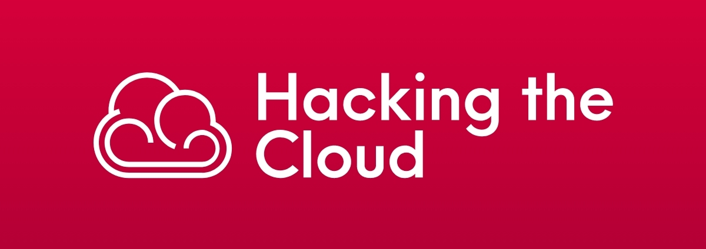

  

 

Hacking the cloud is an encyclopedia of the attacks/tactics/techniques that offensive security professionals can use on their next cloud exploitation adventure. The goal is to share this knowledge with the security community to better defend cloud environments.

All content on this site is created by volunteers. If you'd like to be one of them, you can contribute your knowledge by submitting a [Pull Request](https://github.com/Hacking-the-Cloud/hackingthe.cloud/pulls). We are open to content from any major cloud provider and will also accept cloud-related technologies as well (Docker, Terraform, K8s, etc.). Additionally you are encouraged to update/modify/improve existing pages as well.

Topics can include offensive techniques, tools, general knowledge related to cloud security, etc. **Defensive knowledge is also welcome!** At the end of the day the primary goal is to make the cloud safer, and defenders are welcome to submit content all the same.

Don't worry about submitting content in the wrong format or what section it should be a part of, we can always make improvements later :) When writing content: do try to credit the researcher who discovered it and link to their site/talk. 

## Contributing
Please review the [contributing guidelines](/CONTRIBUTING.md) to see how you can add to the site!

## Roadmap
Currently the site has some material on AWS, and very little for Azure or GCP. If you have experience in any of those areas you are welcome to submit content. Even something as small as fixing grammar mistakes or adding a screenshot is appreciated!
