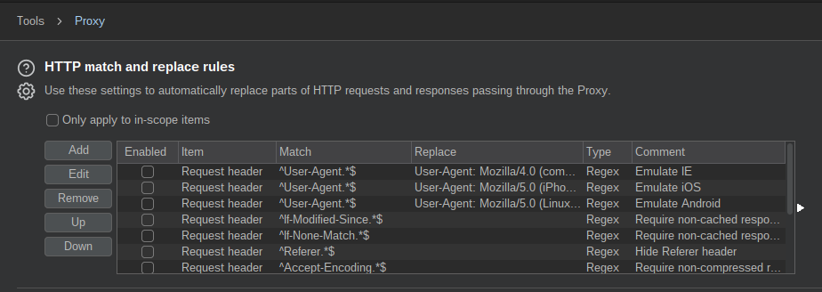
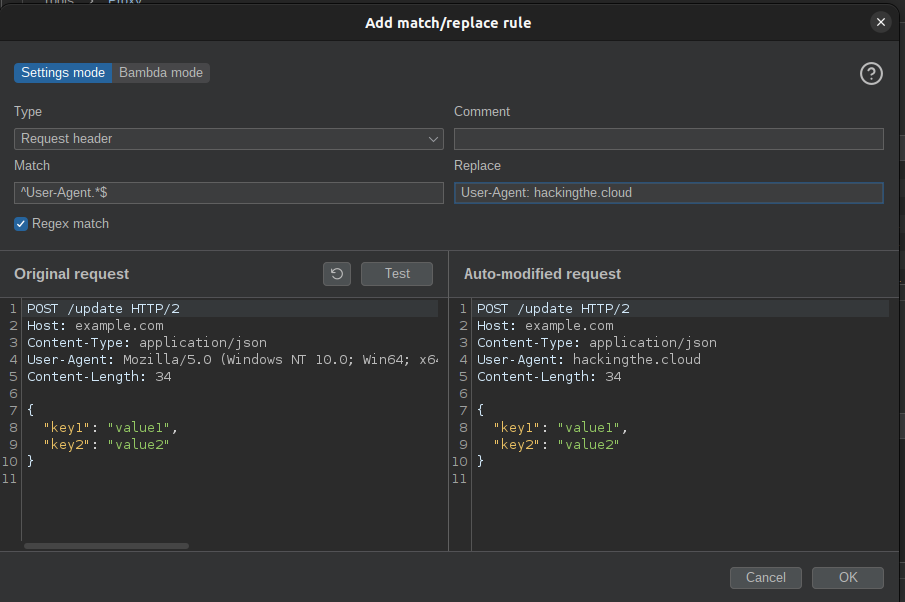
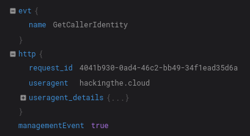

# Bypass GuardDuty Pentest Findings for the AWS CLI

!!! success "Thank You"
    Thank you to [@yobroda](https://x.com/itsyobroda) for notifying me that the previous method in this article was outdated and suggesting a more reliable, long-term solution.

As a cloud Penetration Tester or Red Teamer, we need to be aware of what artifacts we leave behind in the logs that we touch. One easy to overlook clue is the User-Agent value passed in AWS API requests. When using the AWS [CLI](https://aws.amazon.com/cli/) or [SDK](https://aws.amazon.com/tools/) to interact with AWS services, the User-Agent string is passed in the headers of the HTTP request. This string can be used to identify the tool or library making the request.

This can give away the operating system you are using and may raises suspicion from defenders. For example, say you steal credentials from a developer workstation running MacOS and suddenly start making requests from a Windows machine. This suspicious activity could be noticed by automation and an alarm could be raised.

This is where AWS [GuardDuty](https://aws.amazon.com/guardduty/) comes in. GuardDuty is a threat detection service that continuously monitors for malicious activity and unauthorized behavior to protect your AWS accounts and workloads. GuardDuty takes this idea a step further and has built-in detections for common penetration testing Linux distributions like Kali Linux, ParrotOS, and Pentoo Linux. If you make AWS API requests from one of these distributions, GuardDuty will trigger a [PenTest Finding](https://docs.aws.amazon.com/guardduty/latest/ug/guardduty_finding-types-iam.html#pentest-iam-kalilinux).

As you can imagine, this is not ideal. The good news is that the User-Agent string is entirely within our control. While this value is unfortunately something we cannot [natively](https://github.com/aws/aws-cli/issues/3990) configure with the AWS CLI, we can use external tooling to intercept our requests and modify them. In this article, we will explain how we can modify our User-Agent string when using the AWS CLI to avoid triggering GuardDuty alerts.

!!! Note
    In the following example we will use Burp Suite because it is freely available and commonly used. If you have an alternative suggestion, please open a pull request to add it.

## Burp Suite Setup and Usage

To begin, [download](https://portswigger.net/burp/communitydownload) and install Burp Suite Community Edition. With it running, navigate to the Proxy tab and click `Proxy settings`.

Next, scroll to `HTTP match and replace rules`:

<figure markdown>
  { loading=lazy }
</figure>

From here, click `Add` and enter the following values:

- Type: `Request header`
- Match: `^User-Agent.*$`
- Regex match: Should be checked
- Replace: This can be any string of your choosing. Ensure you preprend `User-Agent: ` to the beginning of the string. For a list of potential User-Agent values, you can refer to this list from [Pacu](https://github.com/RhinoSecurityLabs/pacu/blob/master/pacu/user_agents.txt).

Click `Test` to see an example of what your change would look like.

<figure markdown>
  { loading=lazy }
</figure>

To finish, click `OK`. To ensure your new rule is enabled, scroll to the bottom of your match and replace rules.

Next, we need to configure our AWS CLI to use Burp Suite as a proxy. This can be done by setting the `HTTP_PROXY` and `HTTPS_PROXY` environment variables. For example:

```bash
export HTTPS_PROXY=http://127.0.0.1:8080
export HTTP_PROXY=http://127.0.0.1:8080
```

With this setup, all of your AWS CLI requests will be routed to Burp Suite, however you will likely encounter the following error:

```
SSL validation failed for https://sts.us-east-1.amazonaws.com/ [SSL: CERTIFICATE_VERIFY_FAILED] certificate verify failed: self signed certificate in certificate chain (_ssl.c:1129)
```

This is because Burp Suite uses a self-signed certificate. There are multiple options to resolve this issue and I will defer to your professional discretion on which to use. You could, for example, [add](https://frichetten.com/blog/intercept-linux-cli-tool-traffic/) the self-signed certificate to your trusted certificates. Alternatively you could disable SSL verification with the AWS CLI using the `--no-verify-ssl` flag.

Regardless of the method you choose, after making a request to the AWS API you should see the User-Agent string you configured appear in the associated CloudTrail logs.

<figure markdown>
  { loading=lazy }
</figure>

With all of this in place, you can now make requests to the AWS API using the CLI without triggering GuardDuty alerts.
