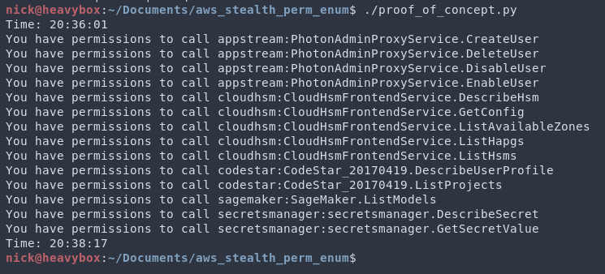

# [Deprecated] Enumerate Permissions without Logging to CloudTrail

-   :material-account:{ .lg .middle } __Original Research__

    ---

    <aside style="display:flex">
    
<a href="https://frichetten.com/blog/aws-api-enum-vuln/">Enumerate AWS API Permissions Without Logging to CloudTrail</a> by <a href="https://twitter.com/frichette_n">Nick Frichette</a>

    
</img>

    </aside>

-   :material-tools:{ .lg .middle } __Tools mentioned in this article__

    ---

    [aws_stealth_perm_enum](https://github.com/Frichetten/aws_stealth_perm_enum)

!!! Warning
    As of 5/18/2021, this technique has been resolved and fixed by AWS. Mutating the Content-Type header when making API requests no longer can be used to enumerate permissions of a role or user. This page is maintained for historical and inspiration purposes.

After compromising an IAM credential while attacking AWS, your next task will be to determine what permissions that credential has scoped to them.

Aside from guessing, enumerating these permissions would typically require a tool to brute force them like [enumerate-iam](https://github.com/andresriancho/enumerate-iam) (which is a fantastic tool). The problem of course is that this will generate a ton of CloudTrail logs and will alert any defender. This poses a challenge to us, how can we enumerate permissions in a stealthy manner?  

The good news is that there is a bug in the AWS API that affects 589 actions across 39 different AWS services. This bug is a result of a mishandling of the Content-Type header, and when that header is malformed in a specific way the results are not logged to CloudTrail. Based on the response codes/body we can determine if the role does or does not have permission to make that API call.

The following services are affected, although please note, that not all actions for these services can be enumerated.  

|     |     |
| --- | --- |
| application-autoscaling | appstream | 
| athena | autoscaling-plans | 
| aws-marketplace | cloudhsm | 
| codecommit | codepipeline | 
| codestar | comprehend | 
| cur | datapipeline | 
| dax | discovery | 
| forecast | gamelift | 
| health | identitystore | 
| kinesis | kinesisanalytics | 
| macie | mediastore | 
| mgh | mturk-requester | 
| opsworks-cm | personalize | 
| redshift-data | route53domains | 
| route53resolver | sagemaker | 
| secretsmanager | shield | 
| sms | snowball | 
| support | tagging | 
| textract | translate | 
| workmail |

!!! Note
    For an in depth explanation for the bug, please see the [original research](https://frichetten.com/blog/aws-api-enum-vuln/). In this article we will just discuss how to take advantage of it.

There are some conditions to the enumeration, and they are defined below.

1 - The AWS service uses the JSON 1.1 protocol.
2 - The API actions returns a unique error code depending on the permission set.
3 - The resource associated with that action is set to "*".

To perform the enumeration there is a script [here](https://github.com/Frichetten/aws_stealth_perm_enum). Setting the credentials as environment variables and then running the script will inform you what API permissions you have available to you.

<figure markdown>
  { loading=lazy }
</figure>
