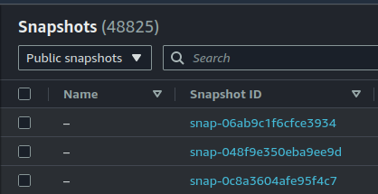

For EC2 instances, files and data are typically stored in [Elastic Block Store](https://docs.aws.amazon.com/AWSEC2/latest/UserGuide/AmazonEBS.html) (EBS) volumes. These virtual hard drives make it easy to attach and move data between your virtual machines. As an additional feature, you can create [snapshots](https://docs.aws.amazon.com/AWSEC2/latest/UserGuide/EBSSnapshots.html) of those volumes, which you can use for backups or replication. An important security consideration of these snapshots is that they can be (accidentally or otherwise) made public, accessible for anyone to access and steal the contents of the snapshot.

## Making them Public

EBS Snapshots have two availability settings, Private and Public. It is important to note that EBS does not utilize resource-based policies. If a snapshot is made public via the console or through Infrastructure as Code, it will be available to anyone with no additional controls.


## Finding Exposed Snapshots

A lot of instances of resource exposure (and subsequent [exploitation](https://hackingthe.cloud/aws/exploitation/Misconfigured_Resource-Based_Policies/)) in AWS require knowing the ARN of the resource. This provides some level of security-by-obscurity, as the attacker needs to find the ARN through some means (In some cases this can also apply to [vulnerabilities in AWS services](https://securitylabs.datadoghq.com/articles/appsync-vulnerability-disclosure/) themselves).

A somewhat unique trait of EBS snapshots is that, if they are set to public, the list of those EBS snapshots is publicly available through the AWS API. From the EC2 section in the AWS console, navigate to Elastic Block Store, Snapshots, and select `Public snapshots` from the drop down. This will show all publicly available EBS snapshots (you may have to scroll through to see an accurate count).



To pull this list in an easily consumable format you can use the following CLI command:

```
aws ec2 describe-snapshots --restorable-by-user-ids all
```

As of the time of this writing there are tens of thousands of snapshots exposed. As a bonus, it is possible to filter this list by account ID, allowing you to easily target specific accounts.

!!! Tip
    This can be an easy, free (in terms of detection) check to look out for when exploiting AWS environments. If you steal IAM credentials, you can [determine the account](https://hackingthe.cloud/aws/enumeration/get-account-id-from-keys/) they are tied to and check for exposed EBS snapshots.

To search for all public EBS snapshots associated with an AWS account, use the following command:

```
aws ec2 describe-snapshots --restorable-by-user-ids all --owner-ids 000000000000
```

## Identification

To find exposed EBS snapshots in your account you can use automated tooling such as [Prowler](https://github.com/prowler-cloud/prowler), an open source tool to audit for AWS security. The following command can be used with version 3.0 or higher.

```
./prowler -c ec2_ebs_public_snapshot
```

## Detection

When someone makes an EBS snapshot publicly accessible, CloudTrail generates an `ec2:ModifySnapshotAttribute` event with `createVolumePermission` set to `{"add": {"items": [{ "groups": "all" }]}}`. You can use Stratus Red Team's [aws.exfiltration.ec2-share-ebs-snapshot](https://stratus-red-team.cloud/attack-techniques/AWS/aws.exfiltration.ec2-share-ebs-snapshot/) to reproduce the issue and test your detections.

## Additional Resources

For additional information on the risks of exposed EBS snapshots, check out this [DEF CON 27 talk](https://www.youtube.com/watch?v=-LGR63yCTts), `Finding Secrets In Publicly Exposed EBS Volumes` by Ben Morris (slides available [here](https://media.defcon.org/DEF%20CON%2027/DEF%20CON%2027%20presentations/DEFCON-27-Ben-Morris-More-Keys-Than-A-Piano-Finding-Secrets-In-Publicly-Exposed-Ebs-Volumes.pdf)).

<iframe width="560" height="315" src="https://www.youtube-nocookie.com/embed/-LGR63yCTts" title="YouTube video player" frameborder="0" allow="accelerometer; autoplay; clipboard-write; encrypted-media; gyroscope; picture-in-picture" allowfullscreen></iframe>
