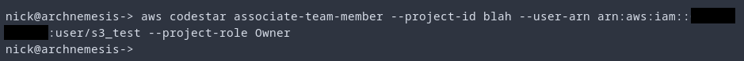
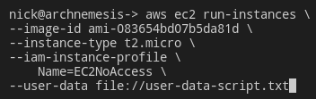

-   :material-account:{ .lg .middle } __Original Research__

    ---

    <aside style="display:flex">
    
<a href="https://rhinosecuritylabs.com/aws/aws-privilege-escalation-methods-mitigation/">AWS IAM Privilege Escalation – Methods and Mitigation</a> by <a href="https://twitter.com/SpenGietz">Spencer Gietzen</a>

    
</img>

    </aside>

-   :material-book:{ .lg .middle } __Additional Resources__

    ---

    - [AWS IAM Privilege Escalation Methods](https://github.com/RhinoSecurityLabs/AWS-IAM-Privilege-Escalation)
    - [Well, That Escalated Quickly: Privilege Escalation in AWS](https://bishopfox.com/blog/privilege-escalation-in-aws) by [Gerben Kleijn](https://bishopfox.com/authors/gerben-kleijn)

!!! Note
    If you'd like to get hands on experience exploiting these misconfigurations, check out [iam-vulnerable](https://github.com/BishopFox/iam-vulnerable) by [Seth Art](https://twitter.com/sethsec).

## codestar:CreateProject, codestar:AssociateTeamMember
With access to the [codestar:CreateProject](https://awscli.amazonaws.com/v2/documentation/api/latest/reference/codestar/create-project.html) and [codestar:AssociateTeamMember](https://awscli.amazonaws.com/v2/documentation/api/latest/reference/codestar/associate-team-member.html) permissions, an adversary can create a new [CodeStar](https://aws.amazon.com/codestar/) project and associate themselves as an Owner of the project.

This will attach a new policy to the user that provides access to a number of permissions for AWS services. This is most useful for further enumeration as it gives access to lambda:List*, iam:ListRoles, iam:ListUsers, and more.

<figure markdown>
  { loading=lazy }
</figure>

<figure markdown>
  { loading=lazy }
</figure>

## glue:UpdateDevEndpoint
With access to the [glue:UpdateDevEndpoint](https://awscli.amazonaws.com/v2/documentation/api/latest/reference/glue/update-dev-endpoint.html) permission, an adversary can update the existing SSH key associated with the glue endpoint. This will allow the adversary to SSH into the host and gain access to IAM credentials associated with the role attached to the glue endpoint. Though not required, it may be helpful to have the [glue:GetDevEndpoint](https://awscli.amazonaws.com/v2/documentation/api/latest/reference/glue/get-dev-endpoint.html) permission as well, if the existing endpoint cannot be identified via other means. 

## iam:AddUserToGroup
With access to the [iam:AddUserToGroup](https://awscli.amazonaws.com/v2/documentation/api/latest/reference/iam/add-user-to-group.html) permission, an adversary can add an IAM user they control to an existing group with more privileges. Although this is not required, it may be helpful to have other permissions in the IAM family to identify other groups and their privileges. 

## iam:AttachGroupPolicy
With access to the [iam:AttachGroupPolicy](https://awscli.amazonaws.com/v2/documentation/api/latest/reference/iam/attach-group-policy.html) permission, an adversary can attach an IAM policy to a group they are a member of. This potentially includes policies such as AdministratorAccess, which would provide them (surprise) administrator access to the AWS account.

## iam:AttachRolePolicy
With access to the [iam:AttachRolePolicy](https://awscli.amazonaws.com/v2/documentation/api/latest/reference/iam/attach-role-policy.html) permission, an adversary can attach an IAM policy to a role they have access to. This potentially includes policies such as AdministratorAccess, which would provide them administrator access to the AWS account.

## iam:AttachUserPolicy
With access to the [iam:AttachUserPolicy](https://awscli.amazonaws.com/v2/documentation/api/latest/reference/iam/attach-user-policy.html) permission, an adversary can attach an IAM policy to an IAM user they have access to. This potentially includes policies such as AdministratorAccess, which would provide them administrator access to the AWS account.

## iam:CreateAccessKey
With access to the [iam:CreateAccessKey](https://awscli.amazonaws.com/v2/documentation/api/latest/reference/iam/create-access-key.html) permission, an adversary can create an IAM Access Key and Secret Access Key for other users. This would allow them to create credentials for more privileged users and have access to their privileges.

<figure markdown>
  { loading=lazy }
</figure>

## iam:CreateLoginProfile
With access to the [iam:CreateLoginProfile](https://awscli.amazonaws.com/v2/documentation/api/latest/reference/iam/create-login-profile.html) permission, an adversary can create a password for a more privileged IAM user to login to the console as. Note: if a password is already set, you must use [iam:UpdateLoginProfile](https://hackingthe.cloud/aws/exploitation/iam_privilege_escalation/#iamupdateloginprofile) instead.

## iam:CreatePolicyVersion
With access to the [iam:CreatePolicyVersion](https://awscli.amazonaws.com/v2/documentation/api/latest/reference/iam/create-policy-version.html) permission, an adversary can create a new version of a existing policy with more privilege. If the adversary has access to the principal that policy is attached to, they can elevate their privileges.

## iam:DeleteRolePermissionsBoundary
With access to the [iam:DeleteRolePermissionsBoundary](https://docs.aws.amazon.com/cli/latest/reference/iam/delete-role-permissions-boundary.html) permission, an adversary can remove a permissions boundary from a role they have access to. This may increase the role's effective permissions if the permissions boundary was more restrictive than any of the role's identity-based policies. 

## iam:DeleteRolePolicy
With access to the [iam:DeleteRolePolicy](https://docs.aws.amazon.com/cli/latest/reference/iam/delete-role-policy.html) permission, an adversary can delete an inline policy from a role they have access to. This may increase the role's effective permissions if the policy contains explicit deny statements that any of the role's other policies allow.

## iam:DeleteUserPermissionsBoundary
With access to the [iam:DeleteUserPermissionsBoundary](https://docs.aws.amazon.com/cli/latest/reference/iam/delete-user-permissions-boundary.html) permission, an adversary can remove a permissions boundary from a user they have access to. This may increase the user's effective permissions if the permissions boundary was more restrictive than any of the role's identity-based policies. 

## iam:DeleteUserPolicy
With access to the [iam:DeleteUserPolicy](https://docs.aws.amazon.com/cli/latest/reference/iam/delete-user-policy.html) permission, an adversary can delete an inline policy from a user they have access to. This may increase the user's effective permissions if the policy contains explicit deny statements that any of the user's other policies allow.

## iam:DetachRolePolicy
With access to the [iam:DetachRolePolicy](https://docs.aws.amazon.com/cli/latest/reference/iam/detach-role-policy.html) permission, an adversary can remove a managed policy from a role they have access to. This may increase the role's effective permissions if the policy contains explicit deny statements that any of the role's other policies allow.

## iam:DetachUserPolicy
With access to the [iam:DetachUserPolicy](https://docs.aws.amazon.com/cli/latest/reference/iam/detach-user-policy.html) permission, an adversary can remove a managed policy from a user they have access to. This may increase the user's effective permissions if the policy contains explicit deny statements that any of the user's other policies allow.

## iam:PassRole, autoscaling:CreateAutoScalingGroup or autoscaling:UpdateAutoScalingGroup, autoscaling:CreateLaunchConfiguration,
With access to the [iam:PassRole](https://docs.aws.amazon.com/IAM/latest/UserGuide/reference_policies_examples_iam-passrole-service.html), [autoscaling:CreateLaunchConfiguration](https://docs.aws.amazon.com/autoscaling/ec2/APIReference/API_CreateLaunchConfiguration.html), [autoscaling:CreateAutoScalingGroup](https://docs.aws.amazon.com/autoscaling/ec2/APIReference/API_CreateAutoScalingGroup.html), and [autoscaling:UpdateAutoScalingGroup](https://docs.aws.amazon.com/autoscaling/ec2/APIReference/API_UpdateAutoScalingGroup.html) permissions, an adversary can create a launch configuration and leverage it in an autoscaling group to pass a more privileged role to it. This would allow an adversary to escalate privileges to that more privileged role.

## iam:PassRole, autoscaling:CreateAutoScalingGroup or autoscaling:UpdateAutoScalingGroup, ec2:CreateLaunchTemplate
With access to the [iam:PassRole](https://docs.aws.amazon.com/IAM/latest/UserGuide/reference_policies_examples_iam-passrole-service.html), [ec2:CreateLaunchTemplate](https://docs.aws.amazon.com/AWSEC2/latest/APIReference/API_CreateLaunchTemplate.html), [autoscaling:CreateAutoScalingGroup](https://docs.aws.amazon.com/autoscaling/ec2/APIReference/API_CreateAutoScalingGroup.html), and [autoscaling:UpdateAutoScalingGroup](https://docs.aws.amazon.com/autoscaling/ec2/APIReference/API_UpdateAutoScalingGroup.html) permissions, an adversary can create a launch template and leverage it in an autoscaling group to pass a more privileged role to it. This would allow an adversary to escalate privileges to that more privileged role.

## iam:PassRole, cloudformation:CreateStack
With access to the [iam:PassRole](https://docs.aws.amazon.com/IAM/latest/UserGuide/reference_policies_examples_iam-passrole-service.html) and [cloudformation:CreateStack](https://awscli.amazonaws.com/v2/documentation/api/latest/reference/cloudformation/create-stack.html) permissions, an adversary can create a new CloudFormation stack and pass a more privileged role to it. This would allow an adversary to escalate privileges to that more privileged role.

## iam:PassRole, codestar:CreateProject
With access to the [iam:PassRole](https://docs.aws.amazon.com/IAM/latest/UserGuide/reference_policies_examples_iam-passrole-service.html) and [codestar:CreateProject](https://awscli.amazonaws.com/v2/documentation/api/latest/reference/codestar/create-project.html) permissions, an adversary can create a new CodeStar project and pass a more privileged role to it. This would allow an adversary to escalate privileges to that more privileged role including that of an administrator.

## iam:PassRole, datapipeline:ActivatePipeline, datapipeline:CreatePipeline, datapipeline:PutPipelineDefinition
With access to the [iam:PassRole](https://docs.aws.amazon.com/IAM/latest/UserGuide/reference_policies_examples_iam-passrole-service.html), [datapipeline:ActivatePipeline](https://awscli.amazonaws.com/v2/documentation/api/latest/reference/datapipeline/activate-pipeline.html), [datapipeline:CreatePipeline](https://awscli.amazonaws.com/v2/documentation/api/latest/reference/datapipeline/create-pipeline.html), and [datapipeline:PutPipelineDefinition](https://awscli.amazonaws.com/v2/documentation/api/latest/reference/datapipeline/put-pipeline-definition.html) permissions, an adversary can create a new pipeline and pass in a more privileged role. It is worth noting that to do this the AWS account must already contain a role that can be assumed by DataPipeline and that role must have greater privileges (or at least different ones) than the principal the adversary controls.

## iam:PassRole, ec2:RunInstances
With access to the [iam:PassRole](https://docs.aws.amazon.com/IAM/latest/UserGuide/reference_policies_examples_iam-passrole-service.html) and [ec2:RunInstances](https://awscli.amazonaws.com/v2/documentation/api/latest/reference/ec2/run-instances.html) permissions, an adversary can create a new EC2 instance and pass a more privileged role to it.

This can be taken advantage of with the following one-liner:

<figure markdown>
  { loading=lazy }
</figure>

Some things to note: The instance profile must already exist, and (realistically) it must have greater permissions than the role you have access to. If you also have the ability to create a role, this can be leveraged (although you may as well set the trust policy of that role to one you control at that point). The role that is being passed must have a trust policy allowing the EC2 service to assume it. You cannot pass arbitrary roles to an EC2 instance.

A common misconception about this attack is that an adversary must have access to an existing SSH key, or be able to spawn an SSM session. This is not actually true, you can leverage [user data](https://hackingthe.cloud/aws/general-knowledge/introduction_user_data/) to perform an action on the host. One common example is to have the EC2 instance curl the metadata service, retrieve the IAM credentials, and then send them to an attacker controlled machine using curl.

Another (stealthier) example would be to perform all your API operations at once in the user-data script. This way you are not dinged with the IAM credential exfiltration finding (which can be [bypassed](https://hackingthe.cloud/aws/avoiding-detection/steal-keys-undetected/)).

## iam:PassRole, glue:CreateDevEndpoint
With access to the [iam:PassRole](https://docs.aws.amazon.com/IAM/latest/UserGuide/reference_policies_examples_iam-passrole-service.html) and [glue:CreateDevEndpoint](https://awscli.amazonaws.com/v2/documentation/api/latest/reference/glue/create-dev-endpoint.html) permissions, an adversary can create a new Glue development endpoint and pass in a more privileged role. It is worth noting that to do this the AWS account must already contain a role that can be assumed by Glue and that role must have greater privileges (or at least different ones) than the principal the adversary controls.

## iam:PassRole, glue:CreateJob
With access to the [iam:PassRole](https://docs.aws.amazon.com/IAM/latest/UserGuide/reference_policies_examples_iam-passrole-service.html) and [glue:CreateJob](https://awscli.amazonaws.com/v2/documentation/api/latest/reference/glue/create-job.html) permissions, an adversary can create a new Glue job and pass in a more privileged role. The AWS account must already contain a role that can be assumed by Glue and that role must have greater privileges (or at least different ones) than the principal the adversary controls. The [glue:StartJobRun](https://awscli.amazonaws.com/v2/documentation/api/latest/reference/glue/start-job-run.html) privilege would allow for the job to be run.

## iam:PassRole, glue:UpdateJob
With access to the [iam:PassRole](https://docs.aws.amazon.com/IAM/latest/UserGuide/reference_policies_examples_iam-passrole-service.html) and [glue:UpdateJob](https://awscli.amazonaws.com/v2/documentation/api/latest/reference/glue/update-job.html) permissions, an adversary can update the role and command associated with a Glue job. The AWS account must already contain a role that can be assumed by Glue and that role must have greater privileges (or at least different ones) than the principal the adversary controls. The [glue:StartJobRun](https://awscli.amazonaws.com/v2/documentation/api/latest/reference/glue/start-job-run.html) privilege or some pre-existing trigger could cause the job to run.

## iam:PassRole, lambda:AddPermission, lambda:CreateFunction
With access to the [iam:PassRole](https://docs.aws.amazon.com/IAM/latest/UserGuide/reference_policies_examples_iam-passrole-service.html), [lambda:AddPermission](https://awscli.amazonaws.com/v2/documentation/api/latest/reference/lambda/add-permission.html), and [lambda:CreateFunction](https://awscli.amazonaws.com/v2/documentation/api/latest/reference/lambda/create-function.html) permissions, an adversary can create a Lambda function with an existing role. This function could then by updated with lambda:AddPermission to allow another principal in another AWS account the permission to invoke it. It is worth noting that the AWS account must already contain a role that can be assumed by Lambda.

## iam:PassRole, lambda:CreateEventSourceMapping, lambda:CreateFunction
With access to the [iam:PassRole](https://docs.aws.amazon.com/IAM/latest/UserGuide/reference_policies_examples_iam-passrole-service.html), [lambda:CreateEventSourceMapping](https://awscli.amazonaws.com/v2/documentation/api/latest/reference/lambda/create-event-source-mapping.html), and [lambda:CreateFunction](https://awscli.amazonaws.com/v2/documentation/api/latest/reference/lambda/create-function.html) permissions, an adversary can create a Lambda function with an existing privileged role and associating it with a DynamoDB table. Then, when a new record is inserted into the table, the Lambda function will trigger with the privilege of the passed in role.

It is worth noting that the AWS account must already contain a role that can be assumed by Lambda. Additionally, while not required, it may be beneficial to have the [dynamodb:CreateTable](https://awscli.amazonaws.com/v2/documentation/api/latest/reference/dynamodb/create-table.html) and [dynamodb:PutItem](https://awscli.amazonaws.com/v2/documentation/api/latest/reference/dynamodb/put-item.html) permissions to trigger this yourself.

## iam:PassRole, lambda:CreateFunction, lambda:InvokeFunction
With access to the [iam:PassRole](https://docs.aws.amazon.com/IAM/latest/UserGuide/reference_policies_examples_iam-passrole-service.html), [lambda:CreateFunction](https://awscli.amazonaws.com/v2/documentation/api/latest/reference/lambda/create-function.html), and [lambda:InvokeFunction](https://awscli.amazonaws.com/v2/documentation/api/latest/reference/lambda/invoke.html) permissions, an adversary can create a new Lambda function and pass an existing role to it. They can then invoke the function allowing them access to the privileges of the role associated with the function. It is worth noting that unless the adversary can create a role, they must use an already existing role that can be assumed by Lambda.

## iam:PutGroupPolicy
With access to the [iam:PutGroupPolicy](https://awscli.amazonaws.com/v2/documentation/api/latest/reference/iam/put-group-policy.html) permission, an adversary can create an inline policy for a group they are in and give themselves administrator access to the AWS account.

## iam:PutRolePermissionsBoundary
With access to the [iam:PutRolePermissionsBoundary](https://docs.aws.amazon.com/cli/latest/reference/iam/put-role-permissions-boundary.html) permission, an adversary can update a permissions boundary attached to a role they have access to. This may increase the role's effective permissions if the permissions boundary was more restrictive than any of the role's identity-based policies. 

## iam:PutRolePolicy
With access to the [iam:PutRolePolicy](https://awscli.amazonaws.com/v2/documentation/api/latest/reference/iam/put-role-policy.html) permission, an adversary can create an inline policy for a role they have access to and give themselves administrator access to the AWS account.

## iam:PutUserPermissionsBoundary
With access to the [iam:PutUserPermissionsBoundary](https://docs.aws.amazon.com/cli/latest/reference/iam/put-user-permissions-boundary.html) permission, an adversary can update a permissions boundary attached to a user they have access to. This may increase the user's effective permissions if the permissions boundary was more restrictive than any of the role's identity-based policies. 

## iam:PutUserPolicy
With access to the [iam:PutUserPolicy](https://awscli.amazonaws.com/v2/documentation/api/latest/reference/iam/put-user-policy.html) permission, an adversary can create an inline policy for a user they have access to and give themselves administrator access to the AWS account.

## iam:SetDefaultPolicyVersion
With access to the [iam:SetDefaultPolicyVersion](https://awscli.amazonaws.com/v2/documentation/api/latest/reference/iam/set-default-policy-version.html) permission, an adversary can revert a policy associated with their principal to a previous version. This is useful for scenarios in which a previous version of a policy had more access than the current version.

## iam:UpdateAssumeRolePolicy
With access to the [iam:UpdateAssumeRolePolicy](https://awscli.amazonaws.com/v2/documentation/api/latest/reference/iam/update-assume-role-policy.html) permission, an adversary can modify the assume-role policy of a role, allowing them to assume it. This is useful to gain access to administrator roles, or other more privileged roles.

## iam:UpdateLoginProfile
With access to the [iam:UpdateLoginProfile](https://awscli.amazonaws.com/v2/documentation/api/latest/reference/iam/update-login-profile.html) permission, an adversary can change the password of an IAM user. This would allow them to log into the console as that user.

## lambda:UpdateFunctionCode
With access to the [lambda:UpdateFunctionCode](https://awscli.amazonaws.com/v2/documentation/api/latest/reference/lambda/update-function-code.html) permission, an adversary can modify an existing Lambda function's code. This would allow them to gain access to the privileges of the associated IAM role the next time the function is executed.

## lambda:UpdateFunctionConfiguration
With access to the [lambda:UpdateFunctionConfiguration](https://awscli.amazonaws.com/v2/documentation/api/latest/reference/lambda/update-function-configuration.html) permission, an adversary can modify an existing Lambda function's configuration to add a new Lambda Layer. This Layer would then override an existing library and allow an adversary to execute malicious code under the privilege of the role associated with the Lambda function.
