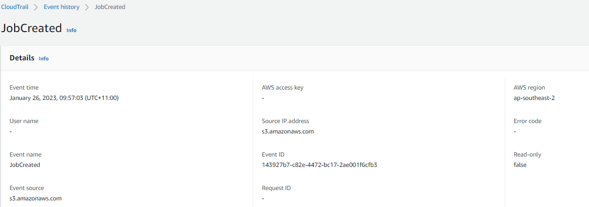

<div class="grid cards" markdown>
-   :material-book:{ .lg .middle } __Additional Resources__

    ---

    [Data exfiltration with native AWS S3 features](https://bleemb.medium.com/data-exfiltration-with-native-aws-s3-features-c94ae4d13436) by [Ben Leembnruggen](https://bleemb.medium.com/)
</div>

## Introduction 

[S3 data replication](https://docs.aws.amazon.com/AmazonS3/latest/userguide/replication.html) provides the ability to copy objects to another bucket, which can be useful from an enterprise logging, integration or security perspective. This can be configure between buckets in the same account, or an unrelated account. Where this feature could be abused is where a malicious actor could input a replication policy to copy objects to an attacker controlled bucket. Objects will continue to be replicated for as long as the policy in place, applying to all future objects placed into the bucket. Using S3 batch operations, attackers can also replicate objects already in the bucket, making it a convenient method for extracting all current and future objects uploaded to the impacted bucket.

---

## Required Configurations and Permissions

### Pre-requisites

For bucket replication to be enabled, the following [pre-requisites](https://docs.aws.amazon.com/AmazonS3/latest/userguide/replication.html) need to be in place:  

- The source bucket owner must have the source and destination AWS Regions enabled for their account. For the destination account, just the destination region needs to be enabled.  
- Both source and destination buckets must have versioning enabled.  
- If the source bucket has S3 Object Lock enabled, the destination buckets must also have S3 Object Lock enabled.  

### IAM Role

*Minimum Required IAM Permissions - Source Account*  

- `iam:CreateRole` (creating a new role)  
- `iam:CreatePolicy` & `iam:AttachRolePolicy` (creating a new policy) or `iam:PutRolePolicy` (modifying an existing policy)  
- `iam:UpdateAssumeRolePolicy`  

Like most things in AWS, the replication service requires a user supplied role to carry out the replication on your behalf.  To replicate all data (including existing objects), an example trust policy and permission set would look something like:

Trust Policy
``` json
{
    "Version": "2012-10-17",
    "Statement": [
        {
            "Effect": "Allow",
            "Principal": {
                "Service": [
                    "s3.amazonaws.com",
                    "batchoperations.s3.amazonaws.com"
                ]
            },
            "Action": "sts:AssumeRole"
        }
    ]
}
```

IAM Permissions
``` json 
{
    "Version": "2012-10-17",
    "Statement": [
        {
            "Effect": "Allow",
            "Action": [
                "s3:GetReplicationConfiguration",
                "s3:ListBucket",
                "s3:PutInventoryConfiguration",
                "s3:InitiateReplication"
            ],
            "Resource": "*"
        },
        {
            "Effect": "Allow",
            "Action": [
                "s3:GetObjectVersionForReplication",
                "s3:GetObjectVersionAcl",
                "s3:GetObjectVersionTagging"
            ],
            "Resource": "*"
        },
        {
            "Effect": "Allow",
            "Action": [
                "s3:ReplicateObject",
                "s3:ReplicateDelete",
                "s3:ReplicateTags"
            ],
            "Resource": "*"
        },
        {
         "Sid": "OnlyRequiredIfReplicatingEncryptedObjects",
         "Effect":"Allow",
         "Action":[
            "kms:Decrypt"
         ],
         "Condition":{
            "StringLike":{
               "kms:EncryptionContext:aws:s3:arn":[
                  "arn:aws:s3:::SOURCEBUCKET/*"
               ]
            }
         },
         "Resource":[
            "KEY ID IN SOURCE ACCOUNT CURRENTLY ENCRYPTING OBJECTS" 
         ]
      },
      {
        "Sid": "OnlyRequiredIfReplicatingEncryptedObjectsToo",
        "Effect":"Allow",
         "Action":[
            "kms:Encrypt"
         ],
         "Condition":{
            "StringLike":{
               "kms:EncryptionContext:aws:s3:arn":[
                  "arn:aws:s3:::DESTINATIONBUCKET/*"
               ]
            }
         },
         "Resource":[
            "KEY ID IN DESTINATION ACCOUNT TO BE SPECIFIED IN REPLICATION POLICY" 
         ]
      }
    ]
}

```
### KMS - If objects are encrypted

*Minimum Required IAM Permissions - Source Account*  

- `kms:PutKeyPolicy`  

Where a KMS policy is configured to only allow a subset of principals to access an encrypted S3 object, the key policy will need to be updated to allow the above replication role access to decrypt the S3 objects.


### Attacker Account Configuration

*Minimum Required IAM Permissions (Destination Account)*  

- `s3:PutBucketPolicy`  
- `kms:CreateKey`, `kms:PutKeyPolicy`  
- `s3:PutBucketVersioning`  

In order for a bucket to receive logs from another account, it requires a bucket policy explicitly allowing the replication of objects across. An example of this policy is below.

Destination Bucket Policy 
``` json 
{
   "Version":"2012-10-17",
   "Id":"",
   "Statement":[
      {
         "Sid":"Set permissions for objects",
         "Effect":"Allow",
         "Principal":{
            "AWS":"arn:aws:iam::SOURCE_ACCOUNT_ID:role/S3_REPLICATION_ROLE"
         },
         "Action":[
            "s3:ReplicateObject", 
            "s3:ReplicateDelete"],
         "Resource":"arn:aws:s3:::DESTINATION_BUCKET/*"
      },
      {
         "Sid":"Set permissions on bucket",
         "Effect":"Allow",
         "Principal":{
            "AWS":"arn:aws:iam::SOURCE_ACCOUNT_ID:role/S3_REPLICATION_ROLE"
         },
         "Action":[
            "s3:List*", 
            "s3:GetBucketVersioning", 
            "s3:PutBucketVersioning"],
         "Resource":"arn:aws:s3:::DESTINATION_BUCKET"
      }
   ]
}
```

If the S3 objects in the source account are encrypted, a key must be created in the destination account to encrypt the objects on replication.  Additionally, a pre-requisite of bucket replication is that [Bucket Versioning](https://docs.aws.amazon.com/AmazonS3/latest/userguide/Versioning.html) is enabled on the destination bucket.

### Configuring the replication

*Minimum Required IAM Permissions - Source Account*  

- `s3:PutBucketReplication`  
- `iam:PassRole`  
- `s3:CreateJob` & `s3:UpdateJobStatus` (Creating and starting a S3 batch replication job)  
- `s3:PutBucketVersioning` (Only if not already enabled)  

The final step is to configure the replication between the source and destination buckets.  Depending on whether you use the CLI or console, the steps can change slightly.  The full process for both options is documented by AWS [here](https://docs.aws.amazon.com/AmazonS3/latest/userguide/replication-walkthrough1.html). 

In line with the steps above, ensure that:  
- Specify your created S3 replication role  
- Replicate existing objects (Disabled by default)  
- Select Replicate KMS Encrypted objects if needed (Disabled by default)  
    - The Key ID should be the KMS key in the destination account.

--- 

## What defenders can look for

- Unknown `PutBucketReplication` or `JobCreated` events in the Cloudtrail Management trail. The `JobCreated` event is generated when an S3 Batch operation job has been created, indicating that all existing objects in a bucket are being replicated across, as opposed to only future S3 objects.

<figure markdown>
  { loading=lazy }
</figure>

- When an encrypted object is replicated, KMS `Decrypt`/`Encrypt` events will appear in a Cloudtrail Management trail, with a principalID and sts assumed role prefixed with 's3-replication'. These encryption events will reference a KMS key in another account - which may trigger certain data perimeter detections.

- Unknown `PutBucketVersioning` events (a pre-requisite of bucket replication) on existing S3 buckets, recorded by the Cloudtrail Management trail.
