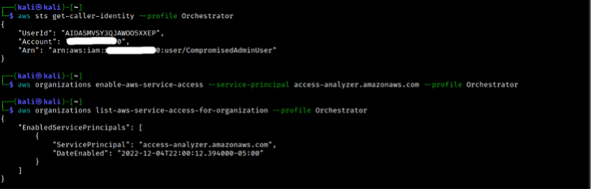

<div class="grid cards" markdown>

-   :material-account:{ .lg .middle } __Original Research__

    ---

    <aside style="display:flex">
    <p><a href="https://www.netspi.com/blog/technical/cloud-penetration-testing/pivoting-clouds-aws-organizations-part-1/">Pivoting AWS Organizations 1</a> & <a href="https://www.netspi.com/blog/technical/cloud-penetration-testing/pivoting-clouds-aws-organizations-part-2/">Pivoting AWS Organizations 2</a> by <a href="https://www.linkedin.com/in/webbinroot/">Scott Weston</a></p>
    <p></img></p>
    </aside>

</div>

Almost all mid-to-large sized AWS environments make use of [multi-account](https://docs.aws.amazon.com/whitepapers/latest/organizing-your-aws-environment/organizing-your-aws-environment.html) architecture. Using multiple AWS accounts offers a number of [benefits](https://docs.aws.amazon.com/whitepapers/latest/organizing-your-aws-environment/benefits-of-using-multiple-aws-accounts.html) and is considered a best practice. To help organize and manage those accounts, AWS offers a service called [AWS Organizations](https://docs.aws.amazon.com/organizations/latest/userguide/orgs_introduction.html).

Due to the ubiquity of AWS Organizations, it is important for Penetration Testers and Red Teamers to familiarize themselves with its default configuration. 

When an account creates an organization it becomes the management account of that organization. Each organization has one management account, and this account effectively "owns" the organization.

## Creating Member Accounts: Default OrganizationAccountAccessRole

When an account is created through AWS Organizations, it is considered a member of the organization (hence, member account). As a part of this account creation process, AWS Organizations will create a role in the member account called `OrganizationAccountAccessRole`. This role is created in [each member account](https://docs.aws.amazon.com/organizations/latest/userguide/orgs_manage_accounts_access.html).

By default, the `OrganizationAccountAccessRole` has the `AdministratorAccess` policy attached to it, giving the role complete control over the member account. In addition, the default trust policy on the role is as shown below where `000000000000` is the account ID of the management account.

```json
{
    "Version": "2012-10-17",
    "Statement": [
        {
            "Effect": "Allow",
            "Principal": {
                "AWS": "arn:aws:iam::000000000000:root"
            },
            "Action": "sts:AssumeRole"
        }
    ]
}
```

These things combined mean that, should an attacker compromise the management account, the default behavior of AWS Organizations provides a path to compromise every account in the organization as an administrator, assuming that the member account was created through AWS organizations (as opposed to invited). **For offensive security professionals, identifying paths into the management account can be an incredibly fruitful exercise, and may result in an entire organization compromise.**

For defensive security teams, it would be a good idea to ensure no infrastructure is deployed into the management account to reduce attack surface. Additionally, carefully controlling who has access to it and monitoring that access would also help to reduce risk.

[Scott Weston](https://www.linkedin.com/in/webbinroot/) has added a module to Pacu to brute force this role name or a list of role names. So if a management account is compromised, and the user wants to attempt to assume one to many role names on all accounts, they can run the following Pacu Module

```
Pacu (role:ManagementAccount) > run organizations__assume_role
[ Review the results to see if any of the following roles are assumed] 
```

## Inviting Pre-Existing Member Accounts: Trusted Access & Delegated Administration

When a pre-existing AWS account is **invited** to join an organization, it does not auto-generate a default role with AdministratorAccess like the account creation workflow. As a pentester, one can look into trusted access and delegated administration to see if there are any more avenues to pivot such that you can move from the compromised management account/delegated admin to another member account in the organization. Depending on the features available, this might allow for indirect access to other member accounts (ex. IAM Access Analyzer), or direct access with some setup (IAM Identity Center).

## Organization-Integrated Features

Many AWS services include specific features that have the capability to scope to the entire organization. For example, IAM Access Analyzer is a feature within the overall IAM service. Normally a user would just run Access Analyzer on their own AWS account to find roles with trust policies that reference outside AWS account sources. Because IAM Access Analyzer is an organization-integrated feature, if the target AWS account is part of an organization, a user can choose to scope Access Analyzer from their single account **to the organization** meaning Access Analyzer will check all AWS account roles in the organization and consider "untrusted" sources as any resource outside of the organization (as opposed to the single AWS account). IAM Access Analyzer is just one example, but there are a multitude of features that can do a similar scope increase to the organization that all behave differently. This might sound complicated, but from a UI perspective, this basically just means there is another option in the dropdown or radio buttons when kicking off the service that lets you choose "organization" instead of the specifc account you are in. A list of all these can be found [here](https://docs.aws.amazon.com/organizations/latest/userguide/orgs_integrate_services_list.html)

## Helpful Diagram


Trusted Access & Delegated Administration

## Trusted Access

These organization integrated features are in an "off" state by default. Trusted access is the act of the management account turning "on" the organization integrated features. For example, even if a member account is part of an organization, they will not be able to increase the scope of IAM Access Analyzer to the organization until the management account enables trusted access for IAM Access Analyzer for the organization. On a technical level, the act of turning "on" an organization-integrated feature via trusted access allows the feature to make roles in member accounts to carry out its tasks. There is an AWS CLI command the management account can run to enable one of these organization-integrated features and list those that are present as seen below:



!!! Note 
    Trusted access is enabled via the management account and allows IAM Access Analyzer to reach into all member accounts to achieve its objective.

## Delegated Administration

Delegated Administration is pretty much like trusted access, but is from the perspective of a member account. In delegated administration, the user allows one of the member accounts to execute an organization-integrated feature on the AWS organization, essentially "delegating" the "administration" of that feature to that member account. We would say that a member account is "a delegated administrator for service ABC (ex. IAM Access Analyzer)." The CLI command to see all delegated administrators in an organization is shown below. If you are a member account, and call this API, and your AWS account is listed in the output, than that is a good way to confirm you are in a delegated admin account. Note again that a delegated admin is **for a specific service** so rather than searching through every single feature to see what you are a delegated admin for, you can call the API shown below to see what specific feature you are a delegated admin for.


Besides the ability to run specific organization-integrated features, note that the member account also in general **gains access to numerous read-only APIs**. For example, note how [this](https://docs.aws.amazon.com/cli/latest/reference/organizations/list-accounts.html) CLI command states that a "delegated administrator" can run it. While a default member account can only see itself and the management account in an organization, a delegated administrator can potentially see all AWS accounts in the organization. 

As of late 2022, delegated administrators also potentially have the ability to manipulate SCPs (which are basically IAM policy filters at the organization level). See the attached blog article for a review of this avenue.

## IAM Access Analyzer (Indirect Route):

IAM Access Analyzer allows one to scan all roles in the organization. If an attacker compromises the managament account where trusted access is enabled for IAM Access Analyzer (or the attacker enables it depending on permissions), the attacker could run IAM Access Analyzer on the entire organization and review the results to see if there are any misconfigured roles they can pivot to. Note **the attacker NEVER directly got access to the member accounts and was constrained to the management account**. Rather the attacker just ran the organization-integrated feature which accesses the member accounts giving the attacker indirect access to the organization. See the blog post in references for images/walkthrough.

Now imagine an attacker compromises a member account. If the member account is a delegated administrator for IAM Access Analyzer, the attacker can perform a similar action of launching the feature and reviewing the results without ever directly accessing the member accounts. In addition, if a delegated administrator is compromised, the attacker can also see much more of the organization and what the structure looks like due to their read-only rights. See the blog post in references for images/walkthrough.

## IAM Identity Center (Direct Route)

IAM Identity center supports trusted access, and allows one to create a user entity, a permission set, and attach the user and permission set to an account in the organization. So, if an attacker compromises a management account, the attacker could enable trusted access for IAM Identity Center (assuming it is not already enabled). Then the attacker (if they have the necessary permissions), can create a user entity with a username/password and the attacker email, and create a permission set entity that is the equivalent of AdministratorAccess. The attacker can then attach the user and permissions to a member account in the organization through IAM Identity Center in the management account, and navigate to the IAM Identity Center login link. The attacker then can enter the users username/password and get access to the member account directly as Administrator Access. See the references section for the blog post with images/walkthrough/etc. 

## Automated Tools

To enumerate an organization for all the info discussed above, you can use the Pacu module shown below:

```
# Run Module
Pacu (Session: Keys) > run organizations__enum

# See Data Collected/Enumerated
Pacu (Session: Keys) > data organizations
```

Relevant pull requests can be found [here](https://github.com/RhinoSecurityLabs/pacu/pull/326) and [here](https://github.com/RhinoSecurityLabs/pacu/pull/335).
