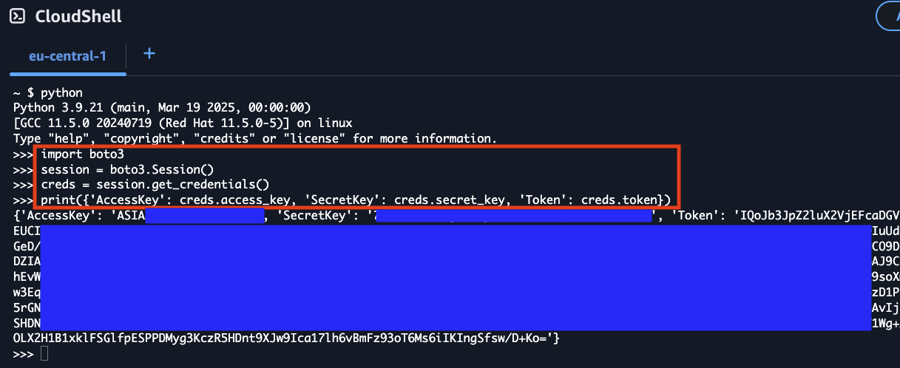

# Get IAM Credentials from a Console Session

<div class="grid cards" markdown>
-   :material-account:{ .lg .middle } __Original Research__

    ---

    <aside style="display:flex">
    <p><a href="https://blog.christophetd.fr/retrieving-aws-security-credentials-from-the-aws-console/">Retrieving AWS security credentials from the AWS consoletitle</a> by <a href="https://blog.christophetd.fr/">Christophe Tafani-Dereeper</a></p>
    <p></img></p>
    </aside>
</div>

When performing a penetration test or red team assessment, it is not uncommon to gain access to a developer's machine. This presents an opportunity for you to jump into AWS infrastructure via credentials on the system. For a myriad of reasons you may not have access to credentials in the `.aws` folder, but instead have access to their browser's session cookies (for example via cookies.sqlite in FireFox).

Gaining access to the Console is great, but it may not be ideal. You may want to use certain tools that would instead require IAM credentials.

To get around this, we can leverage CloudShell. CloudShell exposes IAM credentials via an undocumented endpoint on port 1338. After loading session cookies from the victim into your browser, you can navigate to CloudShell and issue the following commands to get IAM credentials.

```
[user@cloudshell]$ TOKEN=$(curl -X PUT localhost:1338/latest/api/token -H "X-aws-ec2-metadata-token-ttl-seconds: 60")

[user@cloudshell]$ curl localhost:1338/latest/meta-data/container/security-credentials -H "X-aws-ec2-metadata-token: $TOKEN"
```

Alternatively, you can run the following command, which returns credentials with a short TTL (roughly 15m).

```
[user@cloudshell]$ aws configure export-credentials --format env
```

## Using boto3 to Retrieve Credentials

Alternatively, you can use Python's boto3 library directly within CloudShell to programmatically retrieve the credentials. This method can be useful when you need to integrate credential extraction into a Python script or automation workflow.

```python
import boto3

session = boto3.Session()
creds = session.get_credentials()
print({
    'AccessKey': creds.access_key, 
    'SecretKey': creds.secret_key, 
    'Token': creds.token
})
```



This approach leverages boto3's automatic credential detection within the CloudShell environment, providing the same temporary credentials that are available through the metadata service endpoint. The credentials obtained this way will have the same TTL limitations as other methods described above.

## Extracting Credentials via Console Service Endpoints

The AWS Console itself exposes temporary credentials through essentially undocumented internal API endpoints. When you interact with AWS services in the Console, the browser fetches service scoped IAM credentials from service-specific endpoints to perform actions on your behalf.

### The `/tb/creds` Endpoint

Each AWS service in the Console has its own credential endpoint following the pattern:

```
https://{region}.console.aws.amazon.com/{service}/tb/creds
```

Examples:
- `https://us-east-1.console.aws.amazon.com/s3/tb/creds`
- `https://us-east-1.console.aws.amazon.com/ec2/tb/creds`
- `https://us-east-1.console.aws.amazon.com/lambda/tb/creds`
- `https://us-east-1.console.aws.amazon.com/console/tb/creds`

These endpoints return JSON containing temporary credentials:

```json
{
  "accessKeyId": "ASIAX...",
  "secretAccessKey": "...",
  "sessionToken": "...",
  "expiration": "2024-01-15T00:51:45.000Z"
}
```


*Each service endpoint returns credentials scoped to that specific service. The `/s3/tb/creds` endpoint returns credentials with S3 permissions, while `/ec2/tb/creds` returns EC2-scoped credentials. To obtain credentials for multiple services, you must request from each endpoint.*

### Manual Extraction via Browser DevTools

You can manually extract these credentials using your browser's Developer Tools:

1. Open the AWS Console and navigate to any service (e.g., S3)
2. Open Developer Tools (F12) and go to the **Network** tab
3. In the Console, perform an action that requires credentials (refresh the page or click on a resource)
4. Filter network requests by `tb/creds`


5. Click on the matching request and view the **Response** tab


### Automated Extraction with CLIer

[CLIer](https://github.com/AI-redteam/clier) is a browser extension that automates the extraction of these credentials. It works by intercepting `fetch()` and `XMLHttpRequest` calls to the `/tb/creds` endpoints as you browse the AWS Console.


**How it works:**

1. The extension injects JavaScript into AWS Console pages
2. It patches `window.fetch` and `XMLHttpRequest.prototype` to monitor network requests
3. When a request matches the `/{service}/tb/creds` pattern, it clones and parses the response
4. Credentials are stored locally and can be exported in multiple formats (Bash, PowerShell, AWS config, JSON, or QR code)

### Why This Works

The AWS Console is a single-page application that needs IAM credentials to make API calls on behalf of the user. Unlike traditional session cookies, these credentials:

- Are fetched dynamically via JavaScript when needed
- Exist only in the browser's JavaScript heap (not in localStorage, cookies, or IndexedDB)
- Have short TTLs (typically 15 minutes)
- Are scoped to specific services

This bypasses all controls that are generally used to restrict users from accessing STS creds. Every existing control can be in place and the console will still provide access to these creds.


### Detection Considerations

From a defensive perspective, this technique:

- Does not generate additional CloudTrail logs beyond normal Console usage
- Uses the same endpoints the Console uses legitimately
- Cannot be distinguished from normal Console activity at the API level

