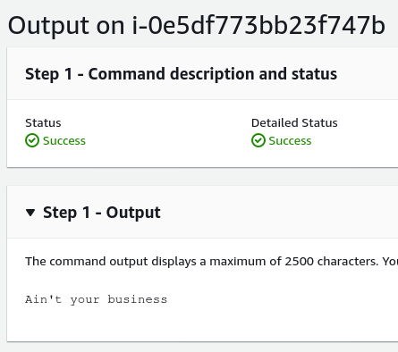

-   :material-account:{ .lg .middle } __Original Research__

    ---

    <aside style="display:flex">
    
<a href="https://frichetten.com/blog/ssm-agent-tomfoolery/">Intercept SSM Agent Communications</a> by <a href="https://twitter.com/frichette_n">Nick Frichette </a>

    
</img>

    </aside>

-   :material-tools:{ .lg .middle } __Tools mentioned in this article__

    ---

    [ssm-agent-research](https://github.com/Frichetten/ssm-agent-research)

The [SSM Agent](https://github.com/aws/amazon-ssm-agent) is responsible for allowing EC2 instances to communicate with SSM services. The agent authenticates with SSM via the IAM role and the credentials in the [Metadata Service](https://hackingthe.cloud/aws/general-knowledge/intro_metadata_service/). As a result, if you gain access to an EC2 instance or its IAM credentials you can spoof the agent and intercept EC2 Messages and SSM Sessions.

For an in depth explanation of how this works, please see the [original research](https://frichetten.com/blog/ssm-agent-tomfoolery/). 

!!! Warning
    The tools used in this page are proof of concept, and should not be used for serious use cases. If you create or find a more production-ready tool please open an [issue](https://github.com/Hacking-the-Cloud/hackingthe.cloud/issues).

### Intercept EC2 Messages
The normal operations of the SSM Agent is to poll for messages it has been sent. We can abuse this functionality by frequently polling ourselves. Doing so, will increase the likelihood (to a near guarantee) that we receive the messages before the real SSM agent does.

By abusing this functionality we can intercept the EC2 messages and response with our own output, allowing us to force a "Success" response.

Using the ssm-send-command-interception.py PoC:

<figure markdown>
  { loading=lazy }
</figure>

<figure markdown>
  { loading=lazy }
</figure>

### Intercept SSM Sessions
Normally the SSM Agent will spawn a WebSocket connection back to SSM. This first WebSocket is the control channel and is responsible for spawning the data channels (which actually process the information). Due to this setup, we can spawn our own control channel and intercept all incoming connections. This can allow us to intercept or modify the communications happening, and potentially allow us to intercept sensitive commands and credentials.

Using the ssm-session-interception.py PoC:

<figure markdown>
  { loading=lazy }
</figure>