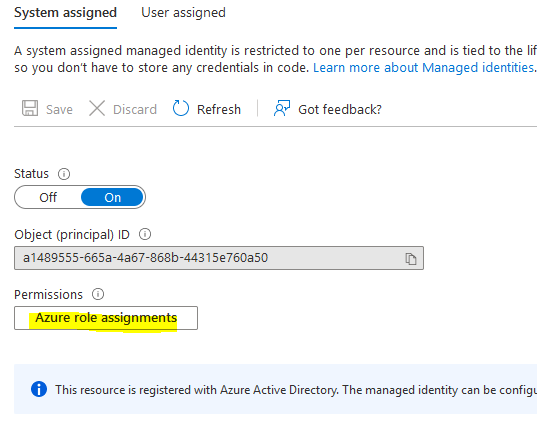

<div class="grid cards" markdown>
-   :material-account:{ .lg .middle } __Original Research__

    ---

    [Create an Azure Vulnerable Lab: Part #4 – Managed Identities](https://0xpwn.wordpress.com/2022/03/13/create-an-azure-vulnerable-lab-part-4-managed-identities/) by [Andrei Agape](https://tripla.dk/author/drag0nus/)
</div>

Using Managed Identities it is possible to grant a resource (such as VM/WebApp/Function/etc) access to other resource (such as Vaults/Storage Accounts/etc.) For example, if we want to give our web application access to a private storage account container without having to deal with how we safely store connection strings in config files or source code, we could use a managed identity.

    Compute Resource --> Managed Identity --> Assigned Role(s) --> Storage Account --> Container

A Managed Identity can be a System or User identity. A System identity is bound to the resource, but a User identity is independent.


## Setup Azure Managed Identity

First we enable the managed identity for the web application:


)

Once enabled, we are given the possibility to configure the roles assigned for this identity (i.e: permissions granted to the service that we enabled the identity for).



Lastly, we assign one or more roles (which is a set of permissions) for that identity. A role can be assigned at Subscription level, Resource group, Storage Account, Vault or SQL and it propagates “downwards” in the Azure architecture layer.

The default Owner, owning the resource, and Contributor, read/write content of the resource, roles have the most permissions.


Under each role, we can see in details what permissions are included. Azure also allows the user to configure custom roles in the case that the built-in ones are not suitable for your needs.


Similarly, to see who has permissions granted for a given resource, we can check under the Access Control (IAM) -> View access to this resource.


So in our case, we should see under the Storage Account that the web application has Reader and Data Access:


## Next steps

Now that we have the basics of how Managed Identity works, let’s see how can we exploit this. Since the web application has access to the storage account, and we compromised the web application, we should also be able to gain access to the storage account as well. Simply put, we get the same permissions that compromised resource has assignred to it. Based on how poorly the Identity roles are assigned, it could even be the case that the permissions are assigned at the Subscription level, effectively granting us access to all the resources within the subscription!


While in our case it appears that the permissions are proper (we are limiting access only to the Storage Account that we need access to) and limit the roles to Reader and Data Access (instead of Contributor or Owner), there is still a caveat that allows us to exploit the access privileges.
The web app only requires permissions to access the "images" container, however the identity access has been misconfigured and allows the application read permissions for all keys on the storage account. Thus granting the attacker the ability to access any container within the same account. 


## Exploiting Azure Managed Identity

Utilising command injection on the web app, we are able to make a curl request to the $IDENTITY_ENDPOINT URL stored in the environment variables and get an Access token and Account ID (clientId in the response) which can be used to authenticate to Azure.
```bash
curl "$IDENTITY_ENDPOINT?resource=https://management.azure.com/&api-version=2017-09-01" -H secret:$IDENTITY_HEADER
```


Using the Azure Powershell module, we can connect to Azure with the access token: 
```powershell
PS> Install-Module -Name Az -Repository PSGallery -Force
PS> Connect-AzAccount -AccessToken <access_token> -AccountId <client_id>
```

Once the connection has been established, you will be able to see the details for the tenant, subscription and other details the compromised managed identity has access to - using the Get-AzResource Azure Powershell cmdlet, we can check which resources inside the subscription we can access:


To list the roles assigned to the managed identity, we can use the Azure Powershell cmdlet Get-AzRoleAssignment. This cmdlet requires and additional token from the Graph API which we can get from the https://graph.microsoft.com/ endpoint, additionally it requires the permission to list roles and permissions for identities which the compromised Managed Identity does not have.

However, you can still try to access the Storage Account keys without these permissions and see if they are successful. For that you can use the Get-AzStorageAccountKey cmdlet with the Resource Group Name and Account Name that was found in the previous step.

Get storage account keys:

```powershell
>Get-AzStorageAccountKey -ResourceGroupName "0xpwnlab" -AccountName "0xpwnstorageacc"
 
KeyName Value                       Permissions CreationTime
------- -----                       ----------- ----------
key1    L175hccq[...]lH9DJ==        Full 3/12/20...
key2    vcZiPzJp[...]ZkKvA==        Full 3/12/20...
```

[http://aka.ms/storage-explorer](http://aka.ms/storage-explorer)


If the above command returns two keys, then it means that our identity had permissions to list them. 
Assuming this is the case - let’s use these keys in Azure Storage Explorer and see if there are other containers stored on the same account. 

In the Azure Storage Explorer, we click the connect icon and select storage account or service.


On the second step, this time we select the Account name and key option:


For the Account name we use the name that we enumerated in the Get-AzResource step, and for the key; either of the two returned keys will work:


Once we connect, on the left side menu we should find a new storage account, we see 2 containers: the images container used by the web app, but also another one containing the flag. 


And that’s it! 
We have just seen how utilising a command injection into a web app, we discovered that it had a managed identity associated to it. After we got the JWT access token, we connected to Azure using the Azure Powershell CLI and enumerated the resources that we have access to. 
The improper permissions set for the Managed Identity allowed us to read the access key for the whole Storage Account and discover another private container that was not referenced anywhere, containing the flag for sensitive information. 
