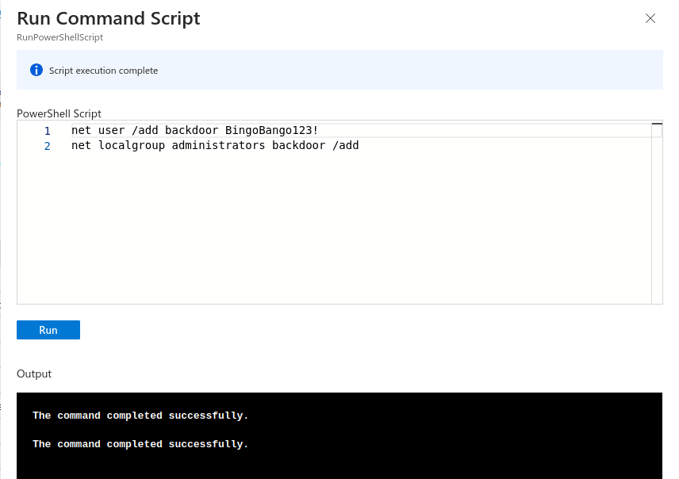
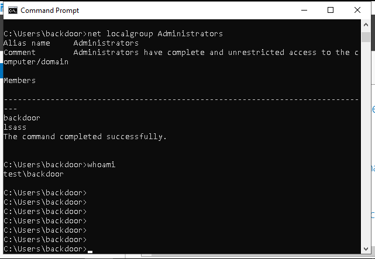

<div class="grid cards" markdown>
-   :material-account:{ .lg .middle } __Original Research__

    ---

    [Azure Run Command for Dummies](https://cloud.google.com/blog/topics/threat-intelligence/azure-run-command-dummies/) by [Adrien Bataille, Anders Vejlby, Jared Scott Wilson, Nader Zaveri](https://cloud.google.com/)
</div>

## Technique

**MITRE:** Execution > Cloud Administration Command

[Run Command](https://learn.microsoft.com/en-us/azure/virtual-machines/run-command-overview) is an operation within Azure that allows administrators to run scripts on Windows and Linux virtual machines via the:

- Azure Portal,
- Azure CLI, and
- PowerShell

Once configured the script is run via the virtual machine agent installed on the virtual machine.

A script ran via Run Command runs with the following privleges:

- `System` on Windows, and as 
- `root` on Linux

In order to use this functionality an identity must have the following role assigned to it: `Microsoft.Compute/virtualMachines/runCommands/action`

This example focuses on the abuse of Run Commands against Windows hosts, however, the same methodology can be used to target Linux based virtual machines.

The script that this example will utilise is as follows:

```
net user /add backdoor BingoBango123!
net localgroup administrators backdoor /add

```

This script:

- Creates a new user named `backdoor`, then
- Adds the user to the local `Administrator` group

This example will use the Azure Portal to create and run the aforementioned script. More information on running these commands via the Azure CLI or PowerShell can be found within the relevant Microsoft [documentation](https://learn.microsoft.com/en-us/azure/virtual-machines/run-command-overview).

Browsing to the virtual machine, we can select the Run Command option, enter our script then execute it, as depicted in the following screenshot:



Once the script has executed, we can authenticate to the virtual machine with our new credentials and check on it's status, as depicted in the following screenshot:



Here we can see that the script has successfully executed, and the `backdoor` user has been added to the local `Administrator` group.

## Detection

The following operation name can be used to audit and alert on Run Commands being used within a tenant: `Microsoft.Compute/virtualMachines/runCommand/action`

## Further reading

- https://learn.microsoft.com/en-us/azure/virtual-machines/windows/run-command
- https://learn.microsoft.com/en-us/azure/virtual-machines/linux/run-command