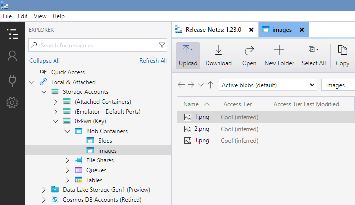

-   :material-account:{ .lg .middle } __Original Research__

    ---

    [0xPwN Blog - Create an Azure Vulnerable Lab: Part #3 – Soft Deleted Blobs](https://0xpwn.wordpress.com/2022/03/09/create-an-azure-vulnerable-lab-part-3-soft-deleted-blobs/) by [Andrei Agape](https://tripla.dk/author/drag0nus/)

In this tutorial we will see how data that has been deleted from a private Storage Account Container can still be a risk in some cases. Even if we know the full path of resources uploaded to a private container, Azure requires authentication to be accessed. To provide access we can choose between:

- A shared access signature (SAS) – is a URI that grants restricted access to an Azure Storage container. Use it when you want to grant access to storage account resources for a specific time range without sharing your storage account key.
- A connection string includes the authorization information required for your application to access data in an Azure Storage account at runtime using Shared Key authorization.
- Managed Identities

For the sake of this tutorial, we will pretend to be a developer that uses the connection string and saves it in a config file/source code deployed to Azure. Additionally, the web application deployed has a command injection vulnerability. 
We can find the connection string of a Storage Account in the Azure portal as shown below:

Now, the problem here is that we are giving access to the whole storage account by passing the connection string into the web app. Azure supports granular access for specific containers, for a limited amount of time, or event for a specific file within the container! But for convenience (or lack of knowledge), a developer might deploy the connection string for the entire storage account. Don’t be that developer.

The second part of this tutorial is about recovering deleted blobs. By default, when creating a storage container using the Portal, the Soft Deletion is enabled with 7 days retention time. Now image that you got access to a storage account with tens of containers, and someone at some point mistakenly uploaded an SSH key to one of these containers and than deleted it without being aware of the 7 day retention day “feature”. 

## Exploiting Soft Deleted Blobs
Now, to exploit this vulnerability we navigate to the web application vulnerable to command injection and start poking around. Listing the files in the current directory, we can find among other the source code in the app.py:

Listing the contents of this file, we can see there is a connection string stored inside (our placeholder has been replaced at runtime with the actual value of the container):

Inside the Microsoft Azure Container Explorer, we specify that we want to connect to a storage account

And that we want to use a Connection String

And we paste the value of the conn_str variable that we found in the source code, and connect:

On the left side menu, a new storage account should show up. Navigate to the Blob Containers -> images and open it:

At first glance, it seems that nothing of interest is stored here. Remember the flag that we accidentally uploaded? Change the view to Active and soft deleted blobs:

And voila! Right click -> Undelete

