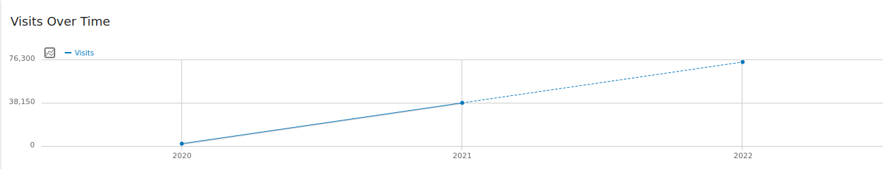
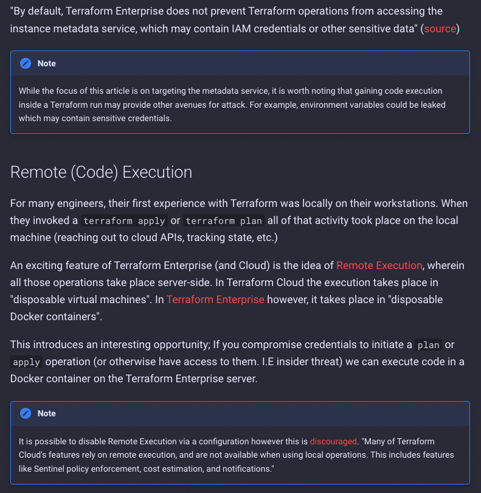
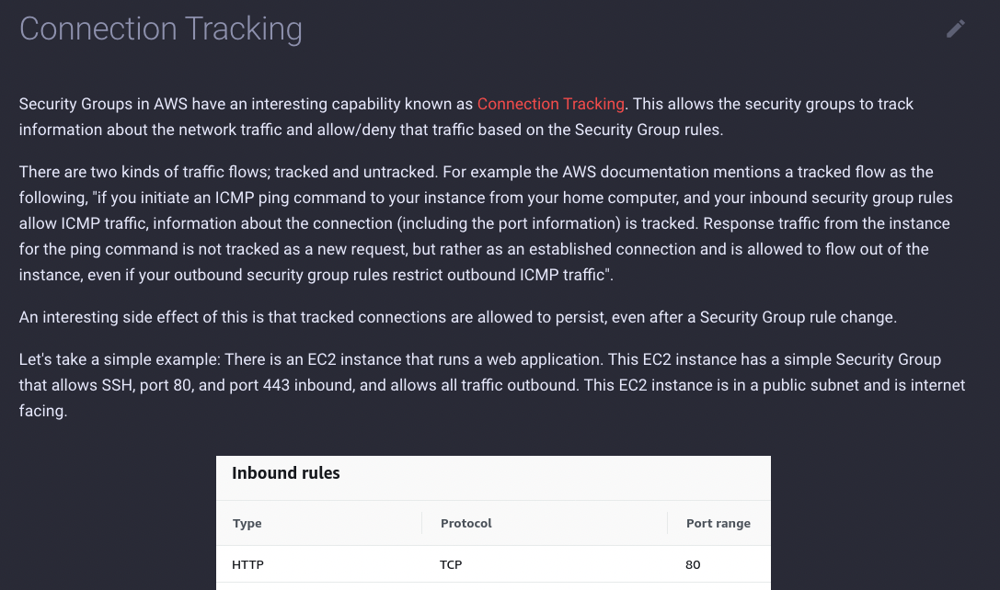
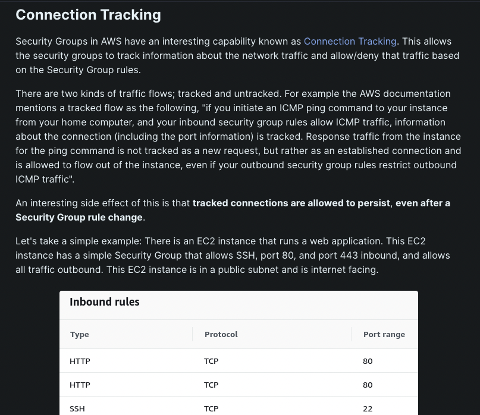
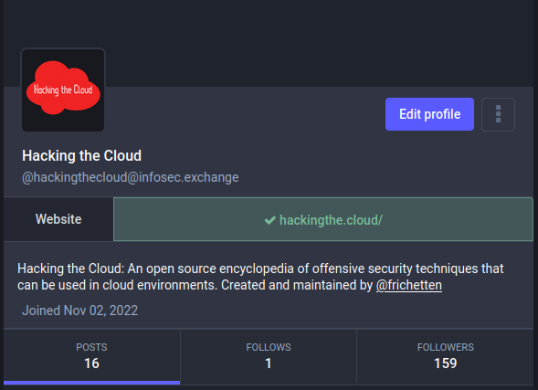

<aside markdown style="display:flex">
  
</img>

  __Nick Frichette__ · @frichette_n · <a href="https://twitter.com/Frichette_n">:fontawesome-brands-twitter:{ .twitter }</a>
   
  
    :octicons-calendar-24: December 14, 2022
  
</aside>
---

2022 is coming to a close and it's time to look back on the year. For Hacking the Cloud, 2022 has been a year of steady improvements. We've consistently had new content and new techniques added to the catalog throughout the year. We also expanded the type of content we offer with a full-blown, custom, [CTF](https://hackingthe.cloud/aws/capture_the_flag/cicdont/)! With all that in mind, here are some accomplishments for the site this year, along with some noteworthy updates.

## Numbers

I think the best way to view how well the site is doing is to see some numbers. Here are some fun statistics. All data was pulled ~6PM Central, December 13th. In 2022, Hacking the Cloud has:

- 625 stars gained on GitHub
- 225 commits committed
- 73,925 visits
- 124,278 page views
- 6,408 average monthly visitors (excluding December)
- 9,763 average monthly visitors in the past quarter!

November in particular was a high traffic month, presumably because of multiple articles being released and gaining traction on Google's [Discover](https://developers.google.com/search/docs/appearance/google-discover).

Compared to 2021, visitor count has increased over `94%`! (Note: 2022 is not over, hence the dotted line for 2022)

We have also reached 17 [contributors](https://github.com/Hacking-the-Cloud/hackingthe.cloud/graphs/contributors) officially on GitHub! I want to personally thank every single one of you who took the time to contribute to the site. Especially for Azure and GCP which I have no knowledge of. You all make this possible and I appreciate your contributions deeply.

## Most Popular Articles

Some more numbers; this time the most popular articles along with page views:

1. [Steal EC2 Metadata Credentials via SSRF](https://hackingthe.cloud/aws/exploitation/ec2-metadata-ssrf/) - 10,963 page views!
2. [CI/CDon't](https://hackingthe.cloud/aws/capture_the_flag/cicdont/) - 5,842 page views.
3. [AWS Organizations Defaults](https://hackingthe.cloud/aws/general-knowledge/aws_organizations_defaults/) - 5,325 page views.
4. [Connection Tracking](https://hackingthe.cloud/aws/general-knowledge/connection-tracking/) - 5,209 page views.
5. [Using Stolen IAM Credentials](https://hackingthe.cloud/aws/general-knowledge/using_stolen_iam_credentials/) - 5,043 page views.

Once again, the [Steal EC2 Metadata Credentials via SSRF](https://hackingthe.cloud/aws/exploitation/ec2-metadata-ssrf/) article was the number one most popular page on the site! I think this is mostly attributed to high SEO ranking, along with it being a crucial security topic. 

[CI/CDon't](https://hackingthe.cloud/aws/capture_the_flag/cicdont/) was a surprise runner up, but a happy surprise. I made this CTF specifically for Hacking the Cloud to cover some important security topics. I'm hoping that view count is indicative that folks enjoyed it and perhaps a few played it themselves.

[Using Stolen IAM Credentials](https://hackingthe.cloud/aws/general-knowledge/using_stolen_iam_credentials/) ranking in the top 5 was another happy surprise. This article deviates from the standard type of article we would normally host. Typically each page of Hacking the Cloud is dedicated to an individual technique. This article was an attempt to create a "playbook" that would explain how an attacker should operate in a certain situation, along with OPSEC considerations. Considering that this article has been viewed so much, I definitely plan to continue this type of content. Perhaps with accompanying video content?

## RSS Feeds!

If you want to be the first to know when a new technique has been added to Hacking the Cloud, I have good news for you! We now have two RSS feeds thanks to the [mkdocs-rss-plugin](https://guts.github.io/mkdocs-rss-plugin/). The [created](https://hackingthe.cloud/feed_rss_created.xml) feed (also linked in the footer) is the recommended feed to follow if you'd like to be notified when a new article has been added. We also have an [updated](https://hackingthe.cloud/feed_rss_updated.xml) feed, in case you want a notification every time a page is changed (not recommended but nobody is stopping you).

Please note, I've been a little wary about adding RSS support to Hacking the Cloud out of fear that something will go wrong. So far, testing has been positive, but I apologize in advance if something goes haywire and you get spammed with notifications.

## Plagiarism

Last month, I was made aware that another site was copying entire articles from Hacking the Cloud and publishing them on their own site. You can see some examples below.

Hacking the Cloud |  Copy
:----------------:|:------:
 | 
 | 

As you can imagine, I was pretty unhappy with this for a number of reasons. Writing content for Hacking the Cloud takes a significant time investment. Setting up test infrastructure, getting screenshots, validating logs, ensuring everything written is 100% accurate (and fixing it when things slip through) is a huge endeavor. It is deflating and frustrating when another site claims they have more content, only for you to find a non-insignificant portion of that content was copied and pasted from your work and the work of people who took time to contribute to your project. 

Furthermore, it is even more upsetting when that site has a banner seeking company sponsorships and subscription plans, potentially profiting off of work done for Hacking the Cloud (I should mention, when asked about this, the site owner told me the site does not make money).

I am 100% supportive of citing other researchers. It's why Hacking the Cloud has links to original research, additional resources, and references at the top of each article, front and center. However, there is a huge difference between citing someone, or crediting someone, and copying the entire article, word-for-word.

To that site owner's credit, when I raised these concerns with them they were quick to remove the plagiarized content. To my knowledge this has not been a problem since, and I don't hold any ill-will towards them.

!!! warning "Feb 2024 Update"
    It has been brought to my attention that HackTricks Cloud is still engaging in blatant plagiarism of a variety of different sources, including plagiarizing Hacking the Cloud content. Please see [this](https://x.com/Frichette_n/status/1753070869109481725?s=20) this Twitter thread for some examples. Please see [this](https://x.com/Frichette_n/status/1753803942377517492?s=20) thread for more examples. I recommend avoiding their training course because of this. Copying and pasting blog posts and referencing those as training materials does not inspire confidence.

As a result of this incident, however, I have added additional language to our existing [Plagiarism Policy](https://github.com/Hacking-the-Cloud/hackingthe.cloud/blob/main/CONTRIBUTING.md#plagiarism-policy) to further enforce that we will not accept plagiarized content on Hacking the Cloud. Additionally, I have added additional guarantees that I will remove links/references at the author's request (including situations that don't involve plagiarism).

Hacking the Cloud uses the [MIT License](https://github.com/Hacking-the-Cloud/hackingthe.cloud/blob/main/LICENSE) which, in retrospect, was a big mistake. When this decision was made, I was not considering the potential for someone to copy content from the site and potentially monetizing it. I have spent some time looking into this, but I am not a lawyer, I don't know a thing about copyright, and I have not had much luck finding resources on how we can better protect the site's content. If you have any experience in this domain, I would love to [hear](https://github.com/Hacking-the-Cloud/hackingthe.cloud/discussions/categories/general) from you.

## Mastodon

In a bit of an experiment, Hacking the Cloud now has its own [Mastodon](https://infosec.exchange/@hackingthecloud) account! My goal with this account is to try something new. In the short term, I'd like to add a GitHub action to post to the account when a new article is published, along with posting release notes for the site.

Long term, I'd like to cover broader cloud security news, and highlight interesting research or findings. I'm considering hooking it up to the RSS feeds of some well known blogs and sharing cloud security news that way. Feel free to give the account a follow if you're interested.

<figure markdown>
  { loading=lazy }
</figure>

## Plans for the Future

Aside from continuing to add to the catalog of AWS attack techniques, I have three initiatives for Hacking the Cloud in 2023. The first, as mentioned previously, will be to add what I will loosely call "playbooks"; step by step guides demonstrating some path along the exploit chain. With this type of content, I think there is an opportunity to showcase how individual techniques can be chained together and demonstrate how an attacker can operate in a cloud environment.

The second major initiative is to begin adding Kubernetes attacks to the mix. While not strictly cloud-specific (I'm running a kubernetes cluster 5 feet from where I'm sitting. And, no, I haven't broken into us-east-1.... yet.), it is undeniable that Kubernetes is a massive part of many organizations' security posture. Things may get a bit blurred if anything is specific to the cloud provider's implementation of Kubernetes but we'll cross that bridge when we get to it.

And finally, I'd like to add more resources to the site related to real world attacks. Currently, I'm planning to add references to individual techniques if they were seen in the wild and where. This way, we can get an understanding of attack trends and prioritize defenses based on real-world usage.

## Conclusion

I hope you had a good 2022 and have an even better 2023. May every vulnerability you find be a critical! Happy holidays!
