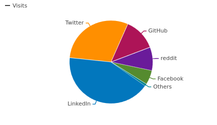

<aside markdown style="display:flex">
  
</img>

  __Nick Frichette__ · @frichette_n · <a href="https://twitter.com/Frichette_n">:fontawesome-brands-twitter:{ .twitter }</a> <a href="https://fosstodon.org/@frichetten">:fontawesome-brands-mastodon:{ .mastodon }</a>
   
  
    :octicons-calendar-24: December 20, 2023
  
</aside>
---

2023 is coming to a close and it’s time to look back on the year. This was the third year that Hacking the Cloud has been operating, sharing techniques on attacking and defending cloud environments. We’ve added a number of new articles to the site and updated old ones. With all this in mind, here are some accomplishments for the site this year.

## Numbers

Here are some fun stats. All data was pulled ~6PM central, December 19th. In 2023, Hacking the Cloud has:

- 457 stars gained on GitHub (1389 total)
- 128 commits committed
- 96,031 visits
- 187,542 pageviews
- 8,238 average monthly visitors (excluding December)
- And a partridge in a pear tree

Compared to 2023, the visitor count has increased 29.9%, pageviews 50.9%, and average monthly visitors 28.6%!

The number of total [contributors](https://github.com/Hacking-the-Cloud/hackingthe.cloud/graphs/contributors) to the site has also increased to 25 (up from 17). A major thank you to everyone who has contributed to building Hacking the Cloud. From the smallest fix of a typo, to writing entire articles, everything helps make the site a better source for cloud security information. All our contributors make this site possible and I appreciate their efforts deeply.

## Most popular articles

An area that I’m always interested in are our most popular articles. What topics are cloud security professionals interested in learning about? What articles are being shared in Jira tickets to be fixed? Here are the top 5 most popular articles:

1. [Steal EC2 Metadata Credentials via SSRF](https://hackingthe.cloud/aws/exploitation/ec2-metadata-ssrf/) - 16,234 pageviews!
2. [AWS Organizations Defaults & Pivoting](https://hackingthe.cloud/aws/general-knowledge/aws_organizations_defaults/) - 15,343 pageviews.
3. [Abusing Managed Identities](https://hackingthe.cloud/azure/abusing-managed-identities/) - 5,703 pageviews.
4. [Using Stolen IAM Credentials](https://hackingthe.cloud/aws/general-knowledge/using_stolen_iam_credentials/) - 5,594 pageviews.
5. [Connection Tracking](https://hackingthe.cloud/aws/general-knowledge/connection-tracking/) - 4,869 pageviews.

For the third year running, “[Steal EC2 Metadata Credentials via SSRF](https://hackingthe.cloud/aws/exploitation/ec2-metadata-ssrf/)” is our most popular article, but unlike previous years it’s not by a landslide. This article, and by extension, this technique, is a cornerstone of AWS security. Stealing IAM credentials from the instance metadata service via SSRF has provided many penetration testers and red teamers the initial access they needed in an environment. Starting next year however, AWS has [announced](https://aws.amazon.com/blogs/aws/amazon-ec2-instance-metadata-service-imdsv2-by-default/) that IMDSv2 will be the only option going forward. Will this mean that this beloved technique will be a thing of the past? I guess we’ll have to check the stats next year.

In second place, and very close to first, we have “[AWS Organizations Defaults & Pivoting](https://hackingthe.cloud/aws/general-knowledge/aws_organizations_defaults/)”. I think this rise in viewership can be attested to a growing understanding amongst offensive security professionals that cross-account trust is a huge lateral movement opportunity that can be taken advantage of. This article touches on the `OrganizationAccountAccessRole`, one of my favorite roles in AWS which potentially can be abused to take over every AWS account in an organization. A major thank you to [Scott Weston](https://www.linkedin.com/in/webbinroot/) for all his efforts in expanding on the article and adding more content.

In third place, we have the first non-AWS article to ever make a top 5 (and I’m pretty sure a top 10), “[Abusing Managed Identities](https://hackingthe.cloud/azure/abusing-managed-identities/)”. In this article Andrei Agape describes how you can take advantage of a managed identity to access other Azure resources. As an exclusively AWS person, I’m excited to see more interest in other cloud providers. If you aren’t an AWS person and want to share some knowledge about cloud security, feel free to open a [pull request](https://github.com/Hacking-the-Cloud/hackingthe.cloud/pulls) and share your knowledge with others!

## Most popular social networks

If you’re interested in learning more about cloud security, you may also be interested in discussing with like-minded people. Social media can make that a lot easier. Here are the top social media websites with content that linked to Hacking the Cloud articles that got clicks.

<figure markdown="1">

</figure>

1. LinkedIn - 42% of links
2. Twitter - 30% of links
3. GitHub - 13% of links
4. Reddit - 9% of links
5. Facebook - 6% of links
6. Others - <1%

LinkedIn reigns supreme this year with 42% of all social media links. Perhaps, aside from all the hustle culture, there may be a thriving community of cloud security professionals there.

In what may be a surprise to some (but not others), it looks like the InfoSec flight from Twitter might have some data backing it up. Twitter made up only 30% of links in 2023, down from 40% in 2022. 

For my Mastodon fans, I wouldn’t worry about not showing up on the leaderboards. Because of the distributed nature of the network, there isn’t a very easy way to track it. Personally, I’ve found a number of technical people interested in chatting about tech. If you are on the woolly site you can even follow Hacking the Cloud on [Mastodon](https://infosec.exchange/@hackingthecloud)!

## Thank you!

Again, I want to say thank you to everyone who has shared the site’s content, contributed to making it better, or even for just saying a kind word. Hacking the Cloud has been a passion project for years now, trying to make cloud security information more accessible for the community. Thank you all for an amazing 2023, and I look forward to 2024!
