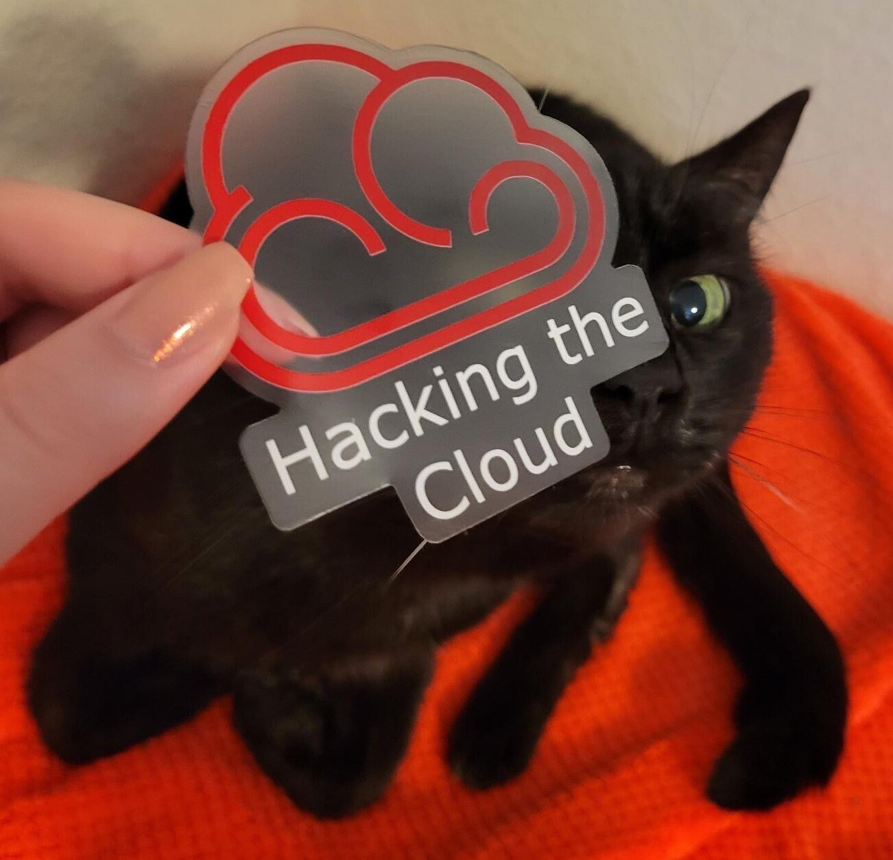
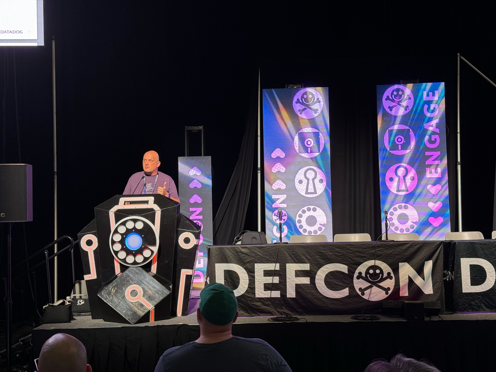
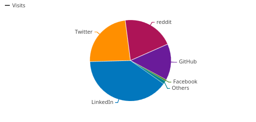

<aside markdown style="display:flex">
  
</img>

  __Nick Frichette__ · @frichette_n · <a href="https://twitter.com/Frichette_n">:fontawesome-brands-twitter:{ .twitter }</a> <a href="https://fosstodon.org/@frichetten">:fontawesome-brands-mastodon:{ .mastodon }</a> <a href="https://bsky.app/profile/frichetten.com">:fontawesome-brands-bluesky:{ .bluesky }</a>
   
  
    :octicons-calendar-24: December 23, 2024
  
</aside>
---

2024 is coming to a close, and it’s been an incredible year for cloud security and Hacking the Cloud alike. When I started this project in 2020, the landscape of cloud attack techniques felt sparse—”SSRF to the metadata service” was almost the only widely recognized vector. Since then, the community has driven innovation, uncovering new techniques, developing defenses, and sharing insights. This year has been no exception.

As I look back on 2024 I wanted to share not just stats on the project but a more holistic view of all that’s happened this year. If you’re just interested in the site’s numbers you can jump to that [here](#numbers).

## 2024 Highlights

### fwd:cloudsec US and EU

There are many cloud security conferences, and many of them are great, but there is one that holds an incredibly special place in my heart–[fwd:cloudsec](https://fwdcloudsec.org/). The conference hosts some of the brightest minds in cloud security and is a place for folks to gather, share ideas, and revel in our amazing community.

This year, fwd:cloudsec was hosted in Washington D.C and featured a number of great talks. Here are just a few examples:

- [GCPwn: A Pentesting Tool For GCP](https://www.youtube.com/watch?v=opvv9h3Qe0s&list=PLCPCP1pNWD7PoUaDtU_T9XJSJ6d7cSfjl&index=6) - Scott Weston
- [Freeing Identity From Infrastructure](https://www.youtube.com/watch?v=xifpJbTepCs&list=PLCPCP1pNWD7PoUaDtU_T9XJSJ6d7cSfjl&index=11) - Ian Ferguson
- [Open-Sourcing AWS Pentest Methodology](https://www.youtube.com/watch?v=q51Fe_B6qY4&list=PLCPCP1pNWD7PoUaDtU_T9XJSJ6d7cSfjl&index=14) - Lizzie Moratti
- [Discover the AWS Account ID of any S3 bucket](https://www.youtube.com/watch?v=5uIALSU1MyE&list=PLCPCP1pNWD7PoUaDtU_T9XJSJ6d7cSfjl&index=24) - Sam Cox
- [Hacking clouds using the power of the sun](https://www.youtube.com/watch?v=vj4RW39KICA&list=PLCPCP1pNWD7PoUaDtU_T9XJSJ6d7cSfjl&index=28) - Ian McKay
- [LUCR-3: Cloud Clepto & SaaS-y Scattered Spider Shenanigans](https://www.youtube.com/watch?v=dFktwwpjR90&list=PLCPCP1pNWD7PoUaDtU_T9XJSJ6d7cSfjl&index=30) - Ian Ahl
- [Get into AWS security research as a n00bcake](https://www.youtube.com/watch?v=jEFGzLbG1r4&list=PLCPCP1pNWD7PoUaDtU_T9XJSJ6d7cSfjl&index=41) - Daniel Grzelak

In a sign that cloud security continues to expand, this year [fwd:cloudsec](https://fwdcloudsec.org/conference/europe/) went international! The first conference outside the US was hosted in the beautiful city of Brussels, Belgium. It was an incredible experience that helped bring the same cloudsec goodness to the global stage. Recommended talks from Brussels include (but really you should watch all of them):

- [How to 10X Your Cloud Security (Without the Series D)](https://www.youtube.com/watch?v=DgWLWtFbO_o&list=PLCPCP1pNWD7Og_iduC9DzLo-9fH389_1y) - Rami McCarthy
- [Hidden in Plain Sight: (Ab)using Entra's AUs](https://www.youtube.com/watch?v=Uoqu9r_-0sg&list=PLCPCP1pNWD7Og_iduC9DzLo-9fH389_1y&index=3) - Katie Knowles
- [Staying Sneaky in Microsoft Azure](https://www.youtube.com/watch?v=khhGDEoGuxc&list=PLCPCP1pNWD7Og_iduC9DzLo-9fH389_1y&index=6) - Christian Philipov

If you attended either of these conferences you may have gotten the first batch of Hacking the Cloud stickers! 

These were a fun distraction that we’ll likely continue–perhaps with limited edition variants for future events? 

### My 2024

Hacking the Cloud has always been (and will continue to be) an independent resource for cloud security techniques. However, if you’ll indulge my selfishness, I’d like to share a bit about my year. 2024 has been jam packed. 

On the conference circuit, I was fortunate to speak at both fwd:cloudsec events this year. I’ve said enough of how much I love fwd:cloudsec so I’ll refrain from doing so here.

This year I achieved something that I never thought I would–I spoke on the main stage at DEF CON. 

To say it was an incredible experience would be an understatement. I originally started doing security research as a hobby project. To think that those early projects would one day lead to me speaking on the biggest stage in security is beyond my own wildest dreams. It felt incredibly rewarding and I am so honored to have been given the privilege to speak.

I want to profusely thank [@TechEmiiily](https://x.com/TechEmiiily) for being the best goon a new speaker could hope for. I also want to thank [Rich Mogull](https://bsky.app/profile/rmogull.com) for his help in welcoming me to the stage as well. If you didn’t know (I sure didn’t) Rich has been a DEF CON goon for many years and purely by coincidence he was around when I was preparing to go on stage.

In addition, I spoke at Black Hat USA and the DEF CON Cloud Village. [Mike Ruth](https://x.com/MF_Ruth) and the team do a fantastic job running the village and I highly recommend it if you find yourself at hacker summer camp. 

With all the conference talks I’ve done this year, in addition to all the work travel, I’m probably going to take a short break from the conference circuit. I need some time to recharge and decide on a new focus for my research.

Speaking of which, I also shared a ton of research this year with some highlights including:

- [Non-Production Endpoints as an Attack Surface in AWS](https://securitylabs.datadoghq.com/articles/non-production-endpoints-as-an-attack-surface-in-aws/)
- [Amplified exposure: How AWS flaws made Amplify IAM roles vulnerable to takeover](https://securitylabs.datadoghq.com/articles/amplified-exposure-how-aws-flaws-made-amplify-iam-roles-vulnerable-to-takeover/)
- [Hidden Among the Clouds: A Look at Undocumented AWS APIs](https://www.youtube.com/watch?v=f7AuDxlYCzE)

### Awseye

Without a doubt, to me, one of the most exciting things to come out this year was [Awseye](https://awseye.com/). This self-proclaimed “shodan of AWS” can be used to enumerate large numbers of AWS resources through a variety of methods. I’m really excited for this tool to get in the hands of researchers, penetration testers, and red teamers as I think it helps close a long-running gap in tooling. 

There are many ways to enumerate resources in cloud environments, but you’re unlikely to have the time to actually use all those methods. Awseye helps make those options available and enables security teams to identify when resources may be inadvertently exposed. 

### OIDC is great... except when it's not

[Open ID Connect](https://docs.aws.amazon.com/IAM/latest/UserGuide/id_roles_providers_create_oidc.html) (OIDC) is a method to establish trust between an identity provider and an AWS account. This OIDC, you can enable an entity to assume a role in your account and take action. This is great for helping discourage the use of long lived IAM credentials, but as we’ve seen, it has not always gone well.

Misconfigured OIDC to AWS trusts could permit anyone the ability to assume the role. We’ve seen this with [GitHub](https://securitylabs.datadoghq.com/articles/exploring-github-to-aws-keyless-authentication-flaws/), [Terraform](https://hacktodef.com/addressed-aws-defaults-risks-oidc-terraform-and-anonymous-to-administratoraccess), [GitLab](https://hackingthe.cloud/aws/exploitation/Misconfigured_Resource-Based_Policies/exploiting_misconfigured_gitlab_oidc_aws_iam_roles/), and AWS’ own [Cognito](https://securitylabs.datadoghq.com/articles/amplified-exposure-how-aws-flaws-made-amplify-iam-roles-vulnerable-to-takeover/). 

If you’re an aspiring cloud security researcher, OIDC misconfigurations are most likely the easiest place to get started. There are so many technologies that use this and basically any one of them could be affected.

### Attackers love AI

Historically, when an adversary compromises an AWS environment they will do one of three things: Spin up compute resources for crypto-mining, encrypt everything in sight and extort the owner for ransomware, or use the account to send spam email and text messages. In 2024, adversaries have a new fun way to monetize cloud compromise: AI. This is something we’ve been seeing heavily but largely publicized thanks to reporting from [Permiso](https://permiso.io/blog/exploiting-hosted-models) and [sysdig](https://sysdig.com/blog/llmjacking-stolen-cloud-credentials-used-in-new-ai-attack/). 

Threat actors are using their compromised access to spin up AI resources and then sell access to those resources for use by others. It’s an interesting look at how threat actors are willing to do just about anything to make a buck.

## Hacking the Cloud's 2024

With all that out of the way, let’s talk a bit about how Hacking the Cloud is doing. All data was gathered as of ~5PM central on December 22. 

### Numbers

In 2024, Hacking the Cloud has:

- 376 stars gained on GitHub (1,765 total)
- 208 commits committed
- 100,396 visits
- 186,483 pageviews
- 8,544 average monthly visitors (excluding December)
- And a partridge in a pear tree

The number of total [contributors](https://github.com/Hacking-the-Cloud/hackingthe.cloud/graphs/contributors) to the site has also increased to 33 (up from 25). A major thank you to everyone who has contributed to building Hacking the Cloud. From the smallest fix of a typo, to writing entire articles, everything helps make the site a better source for cloud security information. All our contributors make this site possible and I appreciate their efforts deeply.

### Most popular articles

An area that I’m always interested in are our most popular articles. What topics are cloud security professionals interested in learning about? What articles are being shared in Jira tickets to be fixed? Here are the top 5 most popular articles:

- [AWS Organizations Defaults & Pivoting](https://hackingthe.cloud/aws/general-knowledge/aws_organizations_defaults/) - 14,831 pageviews!
- [Steal EC2 Metadata Credentials via SSRF](https://hackingthe.cloud/aws/exploitation/ec2-metadata-ssrf/) - 13,503 pageviews.
- [Misconfigured Resource-Based Policies](https://hackingthe.cloud/aws/exploitation/Misconfigured_Resource-Based_Policies/) - 7,254 pageviews.
- [Abusing Managed Identities](https://hackingthe.cloud/azure/abusing-managed-identities/) - 6,148 pageviews.
- [Using Stolen IAM Credentials](https://hackingthe.cloud/aws/general-knowledge/using_stolen_iam_credentials/) - 5,062 pageviews.

The surprise here is that for the first time ever, “[Steal EC2 Metadata Credentials via SSRF](https://hackingthe.cloud/aws/exploitation/ec2-metadata-ssrf/)” is **not** the number one most popular article. It’s only fallen from first to second, but I think this is the start of the technique falling out of fashion. 

AWS has taken a [number](https://blog.christophetd.fr/imdsv2-enforcement/) of steps to discourage the use of IMDSv1 and it appears they are starting to work. In some ways it’s sad. As I mentioned above, SSRF to the metadata service was the original cloud hacking technique. Over time we may see it phased out completely.

Outside of this, the new addition this year is that “[Misconfigured Resource-Based Policies](https://hackingthe.cloud/aws/exploitation/Misconfigured_Resource-Based_Policies/)” has jumped into third place. Resource-based policy misconfigurations are an ever present topic in cloud exploitation and it isn’t a terrible surprise that they would be near the top. 

### Most popular social networks

If you’re interested in learning more about cloud security, you may also be interested in discussing with like-minded people. Social media can make that a lot easier. Here are the top social media websites with content that linked to Hacking the Cloud articles that got clicks.

1. LinkedIn - 40% of visits (-2% from last year)
2. Twitter - 23% of visits (-7% from last year)
3. Reddit - 20% of visits (+11% from last year)
4. GitHub - 14% of visits (+1% from last year)
5. Facebook - 1% of visits (-5% from last year)

In general the trends that were established last year are continuing: LinkedIn is still far and away the largest source of visits from social media, although it has waned a small amount. 

Twitter continues to decline, down 7 percent from last year. Reddit got a surprise bump this year by 11% and it’s not clear what may have caused that. 

For our friends in Bluesky, worry not, we currently do not track that data at all. Hopefully it will be ready for next year’s social media break down.

## Thank you!

Thank you to everyone who contributed, shared, and engaged with Hacking the Cloud this year. Your support fuels this project. I’m excited for what 2025 holds—stay tuned for more cloud security insights, and if you’re passionate about cloud research, consider contributing!