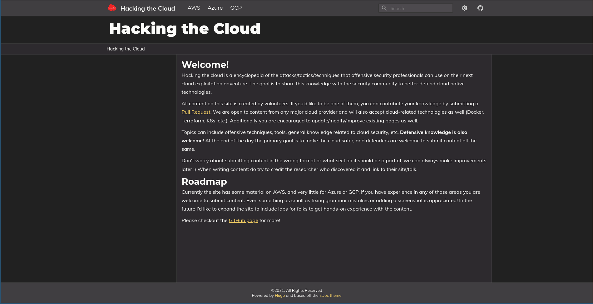

<aside markdown style="display:flex">
  
</img>

  __Nick Frichette__ · @frichette_n · <a href="https://twitter.com/Frichette_n">:fontawesome-brands-twitter:{ .twitter }</a>
   
  
    :octicons-calendar-24: December 6, 2021
  
</aside>
---
Whoa! Things look a little different? You're not imagining it.

<figure markdown>
  { loading=lazy }
  <figcaption>The old look.</figcaption>
</figure>

Hacking The Cloud now uses [Material for MkDocs](https://squidfunk.github.io/mkdocs-material/) to render the beautiful HTML you see before you.

## Why the Change?
When Hacking The Cloud was first started in mid-2020, I was primarily focused on getting the project off the ground and wasn't particularly interested in the formatting or appearance. This resulted in the choice to use a familiar technology ([Hugo](https://gohugo.io/)) and finding a freely available theme for it ([zDoc](https://github.com/zzossig/hugo-theme-zdoc)).

This helped get the project up and running quickly and allowed me to work on getting the first few pages created. Over time, however, small changes were need. Increased font size, changes to the navigation layout, CSS tweaks, etc. Recently more time has been spent making sure things looked okay rather than actually creating content.

__To be clear, the zDoc theme is excellent__, there were just some changes needed that made the theme difficult to use for our purposes. These needs, combined with the appearance that the theme is no longer actively maintained, had caused me to look for something different.

## Why Material for MkDocs?
For the past several months I've been looking for a suitable replacement. My list of requirements was high. Additionally, I was looking for something simple, easy to use, and wouldn't have me constantly thinking, "does this look okay on mobile?".

By pure luck, I found what I was looking for. [Kinnaird McQuade](https://twitter.com/kmcquade3) happened to [retweet](https://twitter.com/kmcquade3/status/1465024645409738760) an announcement from the Material for MkDocs project, and I was hooked. It looked great, supported Markdown, had admonitions, code blocks, produced static HTML, client-side search, and just about everything else I was looking for. 

More than that, it's fun and easy to work with.

If you'd like to support Material for MkDocs you can join me in [sponsoring](https://squidfunk.github.io/mkdocs-material/insiders/#how-to-become-a-sponsor) the project.

## What Does This Mean for You?
Honestly, not a whole lot. Hacking the Cloud will now look a lot better on desktop and mobile. This will free up time and resources to focus on what actually matters, the content.

For folks interested in contributing, you are only a [pull request](https://github.com/Hacking-the-Cloud/hackingthe.cloud/pulls) away! Our [contributing guide](https://github.com/Hacking-the-Cloud/hackingthe.cloud#contributing) has everything you need to get up and running. If you have any questions or ideas feel free to start a conversation on our [discussions](https://github.com/Hacking-the-Cloud/hackingthe.cloud/discussions) page.
